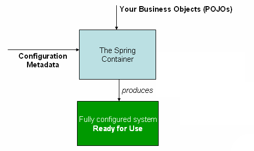

# Spring Framework Documentation

- Spring Framework 6.1.6 공식 문서를 한글로 번역 및 재구성한 자료입니다. 해당 자료 내용을 사용할 경우에는 출처를 남겨주세요. 그리고 유용하다고 생각하시면, 스타 부탁드려요. 🥲
- 번역은 Claude Opus/ChatGPT4를 사용했고, 어색한 부분은 직접 손을 봤습니다.
- 오역이 있을 수 있기 때문에, 이 페이지는 참고만 하시고, 실제 프로그래밍에서는 직접 [영어](https://docs.spring.io/spring-framework/reference/)로 참고해주세요.
- 구성상 불필요하다고 생각하는 부분은 제외했습니다.
- 여러 설명을 공식 문서 외에도 추가했습니다. 문서를 읽다가 추가 설명이 있으면 좋겠다고 생각한 부분에 대해서 추가했고, 최근에는 Spring Boot를 많이 쓰기 때문에 관련된 설명을 추가한 부분도 있습니다.
- 기본적인 예제 코드 구성은 `Java` 파일을 통해 진행했습니다. `XML` 기반으로 파일 설정은 하는 부분 영어로는 번역을 했지만, 제가 만든 예제 코드는 모두 `Java` 기반입니다. 레거시 코드를 운영하는 회사도 있을 거란 생각에 `XML`기반 설정도 알면 좋겠다고 생각은 합니다만, 제가 예제 코드를 만들 마음은 들지 않네요. `XML`기반 설정에 대해서 잘 아시는 분이 도와주시면 감사하겠습니다. 🥺
- `curl`을 통해 요청을 보낼 때는 윈도우의 `cmd`를 사용했습니다. Postman으로 연습을 해도 괜찮다 싶어요.
- View단을 기본적으로는 Thymeleaf를 활용했습니다. 솔직히 개인 개발하면 Restful하게 스프링에서 작성하고, React를 이용해서 View단에서 개발을 주로 개발을 하지만, 설명의 편의상 Thymeleaf를 사용했습니다. JSP로 예제가 필요한 분은 직접 만들어보시면 좋을 거라 생각합니다. 😊
- 목차는 영어로 구성했습니다. 핵심 개념을 한글로 바꾸는 게 더 이상하다고 생각합니다.
- 일단 Appendix 부분은 대충 읽어봐서 필수는 아닌 것 같아서 제외했는데, 나중에 필요에 따라서 제가 작업을 할 수도 있고 안 할 수도 있습니다.
- 추후 목표는 static한 사이트로 배포해서 공식 문서처럼 만들어보고 싶은데, 일단 계획만 하고 있습니다.
- 예제 코드를 돌려보고 싶은 분들은 프로젝트를 `git clone`하고, 아래의 `application.properties` 구성을 참조해서 `application.properties`를 추가해주세요.

```properties
spring.application.name=springDocumentation
spring.datasource.url=jdbc=jdbc:postgresql://127.0.0.1:5432/spring_documentation
spring.datasource.username=***
spring.datasource.password=***
```

## 목차

- Core Technologies

  > - [The IoC Container - Introduction to the Spring IoC Container and Beans](#the-ioc-container---introduction-to-the-spring-ioc-container-and-beans)
  > - [The IoC Container - Container Overview](#the-ioc-container---container-overview)
  > - [The IoC Container - Bean Overview](#the-ioc-container---bean-overview)
  > - [The IoC Container - Dependencies](#the-ioc-container---dependencies)
  > - [The IoC Container - Dependencies - Dependency Injection](#the-ioc-container---dependencies---dependency-injection)
  > - [The IoC Container - Dependencies - Dependencies and Configuration in Detail](#the-ioc-container---dependencies---dependencies-and-configuration-in-detail)
  > - [The IoC Container - Dependencies - Using depends-on](#the-ioc-container---dependencies---using-depends-on)
  > - [The IoC Container - Dependencies - Lazy-initialized Beans](#the-ioc-container---dependencies---lazy-initialized-beans)
  > - [The IoC Container - Dependencies - Autowiring Collaborators](#the-ioc-container---dependencies---autowiring-collaborators)
  > - [The IoC Container - Dependencies - Method Injection](#the-ioc-container---dependencies---method-injection)
  > - [The IoC Container - Bean Scopes](#the-ioc-container---bean-scopes)
  > - [The IoC Container - Customizing the Nature of a Bean](#the-ioc-container---customizing-the-nature-of-a-bean)
  > - [The IoC Container - Bean Definition Inheritance](#the-ioc-container---bean-definition-inheritance)
  > - [The IoC Container - Container Extension Points](#the-ioc-container---container-extension-points)
  > - [The IoC Container - Annotation-based Container Configuration](#the-ioc-container---annotation-based-container-configuration)
  > - [The IoC Container - Annotation-based Container Configuration - Using @Autowired](#the-ioc-container---annotation-based-container-configuration---using-autowired)
  > - [The IoC Container - Annotation-based Container Configuration - Fine-tuning Annotation-based Autowiring with @Primary](#the-ioc-container---annotation-based-container-configuration---fine-tuning-annotation-based-autowiring-with-primary)
  > - [The IoC Container - Annotation-based Container Configuration - Fine-tuning Annotation-based Autowiring with Qualifiers](#the-ioc-container---annotation-based-container-configuration---fine-tuning-annotation-based-autowiring-with-qualifiers)
  > - [The IoC Container - Annotation-based Container Configuration - Using Generics as Autowiring Qualifiers](#the-ioc-container---annotation-based-container-configuration---using-generics-as-autowiring-qualifiers)
  > - [The IoC Container - Annotation-based Container Configuration - Using CustomAutowireConfigurer](#the-ioc-container---annotation-based-container-configuration---using-customautowireconfigurer)
  > - [The IoC Container - Annotation-based Container Configuration - Injection with @Resource](#the-ioc-container---annotation-based-container-configuration---injection-with-resource)
  > - [The IoC Container - Annotation-based Container Configuration - Using @Value](#the-ioc-container---annotation-based-container-configuration---using-value)
  > - [The IoC Container - Annotation-based Container Configuration - Using @PostConstruct and @PreDestroy](#the-ioc-container---annotation-based-container-configuration---using-postconstruct-and-predestroy)
  > - [The IoC Container - Classpath Scanning and Managed Components](#the-ioc-container---classpath-scanning-and-managed-components)
  > - [The IoC Container - Using JSR 330 Standard Annotations](#the-ioc-container---using-jsr-330-standard-annotations)
  > - [The IoC Container - Java-based Container Configuration](#the-ioc-container---java-based-container-configuration)
  > - [The IoC Container - Java-based Container Configuration - Basic Concepts: @Bean and @Configuration](#the-ioc-container---java-based-container-configuration---basic-concepts-bean-and-configuration)
  > - [The IoC Container - Java-based Container Configuration - Instantiating the Spring Container by Using AnnotationConfigApplicationContext](#the-ioc-container---java-based-container-configuration---instantiating-the-spring-container-by-using-annotationconfigapplicationcontext)
  > - [The IoC Container - Java-based Container Configuration - Using the @Bean Annotation](#the-ioc-container---java-based-container-configuration---using-the-bean-annotation)
  > - [The IoC Container - Java-based Container Configuration - Using the @Configuration annotation](#the-ioc-container---java-based-container-configuration---using-the-configuration-annotation)
  > - [The IoC Container - Java-based Container Configuration - Composing Java-based Configurations](#the-ioc-container---java-based-container-configuration---composing-java-based-configurations)
  > - [The IoC Container - Environment Abstraction](#the-ioc-container---environment-abstraction)
  > - [The IoC Container - Registering a LoadTimeWeaver](#the-ioc-container---registering-a-loadtimeweaver)
  > - [The IoC Container - Additional Capabilities of the ApplicationContext](#the-ioc-container---additional-capabilities-of-the-applicationcontext)
  > - [The IoC Container - The BeanFactory API](#the-ioc-container---the-beanfactory-api)
  > - [Resources](#resources)
  > - [Validation, Data Binding, and Type Conversion](#validation-data-binding-and-type-conversion)
  > - [Validation, Data Binding, and Type Conversion - Validation by Using Spring’s Validator Interface](#validation-data-binding-and-type-conversion)
  > - [Validation, Data Binding, and Type Conversion - Data Binding](#validation-data-binding-and-type-conversion---data-binding)
  > - [Validation, Data Binding, and Type Conversion - Resolving Codes to Error Messages](#validation-data-binding-and-type-conversion---resolving-codes-to-error-messages)
  > - [Validation, Data Binding, and Type Conversion - Spring Type Conversion](#validation-data-binding-and-type-conversion---spring-type-conversion)
  > - [Validation, Data Binding, and Type Conversion - Spring Field Formatting](#validation-data-binding-and-type-conversion---spring-field-formatting)
  > - [Validation, Data Binding, and Type Conversion - Configuring a Global Date and Time Format](#validation-data-binding-and-type-conversion---configuring-a-global-date-and-time-format)
  > - [Validation, Data Binding, and Type Conversion - Java Bean Validation](#validation-data-binding-and-type-conversion---java-bean-validation)
  > - [Spring Expression Language (SpEL)](#spring-expression-language-spel)
  > - [Spring Expression Language (SpEL) - Evaluation](#spring-expression-language-spel---evaluation)
  > - [Spring Expression Language (SpEL) - Expressions in Bean Definitions](#spring-expression-language-spel---expressions-in-bean-definitions)
  > - [Spring Expression Language (SpEL) - Language Reference](#spring-expression-language-spel---language-reference)
  > - [Spring Expression Language (SpEL) - Language Reference - Literal Expressions](#spring-expression-language-spel---language-reference---literal-expressions)
  > - [Spring Expression Language (SpEL) - Language Reference - Properties, Arrays, Lists, Maps, and Indexers](#spring-expression-language-spel---language-reference---properties-arrays-lists-maps-and-indexers)
  > - [Spring Expression Language (SpEL) - Language Reference - Inline Lists](#spring-expression-language-spel---language-reference---inline-lists)
  > - [Spring Expression Language (SpEL) - Language Reference - Inline Maps](#spring-expression-language-spel---language-reference---inline-maps)
  > - [Spring Expression Language (SpEL) - Language Reference - Array Construction](#spring-expression-language-spel---language-reference---array-construction)
  > - [Spring Expression Language (SpEL) - Language Reference - Methods](#spring-expression-language-spel---language-reference---methods)
  > - [Spring Expression Language (SpEL) - Language Reference - Operators](#spring-expression-language-spel---language-reference---operators)
  > - [Spring Expression Language (SpEL) - Language Reference - Types](#spring-expression-language-spel---language-reference---types)
  > - [Spring Expression Language (SpEL) - Language Reference - Constructors](#spring-expression-language-spel---language-reference---constructors)
  > - [Spring Expression Language (SpEL) - Language Reference - Variables](#spring-expression-language-spel---language-reference---variables)
  > - [Spring Expression Language (SpEL) - Language Reference - Functions](#spring-expression-language-spel---language-reference---functions)
  > - [Spring Expression Language (SpEL) - Language Reference - Bean References](#spring-expression-language-spel---language-reference---bean-references)
  > - [Spring Expression Language (SpEL) - Language Reference - Ternary Operator (If-Then-Else)](#spring-expression-language-spel---language-reference---ternary-operator-if-then-else)
  > - [Spring Expression Language (SpEL) - Language Reference - The Elvis Operator](#spring-expression-language-spel---language-reference---ternary-operator-if-then-else)
  > - [Spring Expression Language (SpEL) - Language Reference - Safe Navigation Operator](#spring-expression-language-spel---language-reference---safe-navigation-operator)
  > - [Spring Expression Language (SpEL) - Language Reference - Collection Selection](#spring-expression-language-spel---language-reference---collection-selection)
  > - [Spring Expression Language (SpEL) - Language Reference - Collection Projection](#spring-expression-language-spel---language-reference---collection-projection)
  > - [Spring Expression Language (SpEL) - Language Reference - Expression Templating](#spring-expression-language-spel---language-reference---expression-templating)
  > - [Spring Expression Language (SpEL) - Classes Used in the Examples](#spring-expression-language-spel---classes-used-in-the-examples)
  > - [Aspect Oriented Programming with Spring](#aspect-oriented-programming-with-spring)
  > - [Aspect Oriented Programming with Spring - AOP Concepts](#aspect-oriented-programming-with-spring---aop-concepts)
  > - [Aspect Oriented Programming with Spring - Spring AOP Capabilities and Goals](#aspect-oriented-programming-with-spring---spring-aop-capabilities-and-goals)
  > - [Aspect Oriented Programming with Spring - AOP Proxies](#aspect-oriented-programming-with-spring---aop-proxies)
  > - [Aspect Oriented Programming with Spring - @AspectJ support](#aspect-oriented-programming-with-spring---aspectj-support)
  > - [Aspect Oriented Programming with Spring - Enabling @AspectJ Support](#aspect-oriented-programming-with-spring---enabling-aspectj-support)
  > - [Aspect Oriented Programming with Spring - Enabling @AspectJ Support - Declaring an Aspect](#aspect-oriented-programming-with-spring---enabling-aspectj-support---declaring-an-aspect)
  > - [Aspect Oriented Programming with Spring - Enabling @AspectJ Support - Declaring a Pointcut](#aspect-oriented-programming-with-spring---enabling-aspectj-support---declaring-a-pointcut)
  > - [Aspect Oriented Programming with Spring - Enabling @AspectJ Support - Declaring Advice](#aspect-oriented-programming-with-spring---enabling-aspectj-support---declaring-advice)
  > - [Aspect Oriented Programming with Spring - Enabling @AspectJ Support - Introductions](#aspect-oriented-programming-with-spring---enabling-aspectj-support---introductions)
  > - [Aspect Oriented Programming with Spring - Enabling @AspectJ Support - Aspect Instantiation Models](#aspect-oriented-programming-with-spring---enabling-aspectj-support---aspect-instantiation-models)
  > - [Aspect Oriented Programming with Spring - Enabling @AspectJ Support - An AOP Example](#aspect-oriented-programming-with-spring---enabling-aspectj-support---an-aop-example)
  > - [Aspect Oriented Programming with Spring - Schema-based AOP Support](#aspect-oriented-programming-with-spring---schema-based-aop-support)
  > - [Aspect Oriented Programming with Spring - Choosing which AOP Declaration Style to Use](#aspect-oriented-programming-with-spring---choosing-which-aop-declaration-style-to-use)
  > - [Aspect Oriented Programming with Spring - Mixing Aspect Types](#aspect-oriented-programming-with-spring---mixing-aspect-types)
  > - [Aspect Oriented Programming with Spring - Proxying Mechanisms](#aspect-oriented-programming-with-spring---proxying-mechanisms)
  > - [Aspect Oriented Programming with Spring - Programmatic Creation of @AspectJ Proxies](#aspect-oriented-programming-with-spring---programmatic-creation-of-aspectj-proxies)
  > - [Aspect Oriented Programming with Spring - Using AspectJ with Spring Applications](#aspect-oriented-programming-with-spring---using-aspectj-with-spring-applications)
  > - [Spring AOP APIs](#spring-aop-apis)
  > - [Spring AOP APIs - Pointcut API in Spring](#spring-aop-apis---pointcut-api-in-spring)
  > - [Spring AOP APIs - Advice API in Spring](#spring-aop-apis---advice-api-in-spring)
  > - [Spring AOP APIs - The Advisor API in Spring](#spring-aop-apis---the-advisor-api-in-spring)
  > - [Spring AOP APIs - Using the ProxyFactoryBean to Create AOP Proxies](#spring-aop-apis---using-the-proxyfactorybean-to-create-aop-proxies)
  > - [Spring AOP APIs - Concise Proxy Definitions](#spring-aop-apis---concise-proxy-definitions)
  > - [Spring AOP APIs - Creating AOP Proxies Programmatically with the ProxyFactory](#spring-aop-apis---creating-aop-proxies-programmatically-with-the-proxyfactory)
  > - [Spring AOP APIs - Manipulating Advised Objects](#spring-aop-apis---manipulating-advised-objects)
  > - [Spring AOP APIs - Using the "auto-proxy" facility](#spring-aop-apis---using-the-auto-proxy-facility)
  > - [Spring AOP APIs - Using TargetSource Implementations](#spring-aop-apis---using-targetsource-implementations)
  > - [Spring AOP APIs - Defining New Advice Types](#spring-aop-apis---defining-new-advice-types)
  > - [Null-safety](#null-safety)
  > - [Data Buffers and Codecs](#data-buffers-and-codecs)
  > - [Logging](#logging)
  > - [Ahead of Time Optimizations](#ahead-of-time-optimizations)

- Testing

  > - [Introduction to Spring Testing](#introduction-to-spring-testing)
  > - [Unit Testing](#unit-testing)
  > - [Integration Testing](#integration-testing)
  > - [JDBC Testing Support](#jdbc-testing-support)
  > - [Spring TestContext Framework](#spring-testcontext-framework)
  > - [Spring TestContext Framework - Key Abstractions](#spring-testcontext-framework---key-abstractions)
  > - [Spring TestContext Framework - Bootstrapping the TestContext Framework](#spring-testcontext-framework---bootstrapping-the-testcontext-framework)
  > - [Spring TestContext Framework - TestExecutionListener Configuration](#spring-testcontext-framework---testexecutionlistener-configuration)
  > - [Spring TestContext Framework - Application Events](#spring-testcontext-framework---application-events)
  > - [Spring TestContext Framework - Test Execution Events](#spring-testcontext-framework---test-execution-events)
  > - [Spring TestContext Framework - Context Management](#spring-testcontext-framework---context-management)
  > - [Spring TestContext Framework - Context Management - Context Configuration with XML resources](#spring-testcontext-framework---context-management---context-configuration-with-xml-resources)
  > - [Spring TestContext Framework - Context Management - Context Configuration with Groovy Scripts](#spring-testcontext-framework---context-management---context-configuration-with-groovy-scripts)
  > - [Spring TestContext Framework - Context Management - Context Configuration with Component Classes](#spring-testcontext-framework---context-management---context-configuration-with-component-classes)
  > - [Spring TestContext Framework - Context Management - Mixing XML, Groovy Scripts, and Component Classes](#spring-testcontext-framework---context-management---mixing-xml-groovy-scripts-and-component-classes)
  > - [Spring TestContext Framework - Context Management - Configuration Configuration with Context Customizers](#spring-testcontext-framework---context-management---configuration-configuration-with-context-customizers)
  > - [Spring TestContext Framework - Context Management - Context Configuration with Context Initializers](#spring-testcontext-framework---context-management---configuration-configuration-with-context-customizers)
  > - [Spring TestContext Framework - Context Management - Context Configuration Inheritance](#spring-testcontext-framework---context-management---context-configuration-inheritance)
  > - [Spring TestContext Framework - Context Management - Context Configuration with Environment Profiles](#spring-testcontext-framework---context-management---context-configuration-with-environment-profiles)
  > - [Spring TestContext Framework - Context Management - Context Configuration with Test Property Sources](#spring-testcontext-framework---context-management---context-configuration-with-test-property-sources)
  > - [Spring TestContext Framework - Context Management - Context Configuration with Dynamic Property Sources](#spring-testcontext-framework---context-management---context-configuration-with-dynamic-property-sources)
  > - [Spring TestContext Framework - Context Management - Loading a WebApplicationContext](#spring-testcontext-framework---context-management---loading-a-webapplicationcontext)
  > - [Spring TestContext Framework - Context Management - Working with Web Mocks](#spring-testcontext-framework---context-management---working-with-web-mocks)
  > - [Spring TestContext Framework - Context Management - Context Caching](#spring-testcontext-framework---context-management---context-caching)
  > - [Spring TestContext Framework - Context Management - Context Failure Threshold](#spring-testcontext-framework---context-management---context-failure-threshold)
  > - [Spring TestContext Framework - Context Management - Context Hierarchies](#spring-testcontext-framework---context-management---context-hierarchies)
  > - [Spring TestContext Framework - Dependency Injection of Test Fixtures](#spring-testcontext-framework---dependency-injection-of-test-fixtures)
  > - [Spring TestContext Framework - Testing Request- and Session-scoped Beans](#spring-testcontext-framework---testing-request--and-session-scoped-beans)
  > - [Spring TestContext Framework - Transaction Management](#spring-testcontext-framework---transaction-management)
  > - [Spring TestContext Framework - Executing SQL Scripts](#spring-testcontext-framework---executing-sql-scripts)
  > - [Spring TestContext Framework - Parallel Test Execution](#spring-testcontext-framework---parallel-test-execution)
  > - [Spring TestContext Framework - TestContext Framework Support Classes](#spring-testcontext-framework---testcontext-framework-support-classes)
  > - [Spring TestContext Framework - Ahead of Time Support for Tests](#spring-testcontext-framework---ahead-of-time-support-for-tests)
  > - [WebTestClient](#webtestclient)
  > - [MockMvc](#mockmvc)
  > - [MockMvc - Overview](#mockmvc---overview)
  > - [MockMvc - Static Imports](#mockmvc---static-imports)
  > - [MockMvc - Setup Choices](#mockmvc---setup-choices)
  > - [MockMvc - Setup Features](#mockmvc---setup-features)
  > - [MockMvc - Performing Requests](#mockmvc---performing-requests)
  > - [MockMvc - Defining Expectations](#mockmvc---defining-expectations)
  > - [MockMvc - Async Requests](#mockmvc---async-requests)
  > - [MockMvc - Streaming Responses](#mockmvc---streaming-responses)
  > - [MockMvc - Filter Registrations](#mockmvc---filter-registrations)
  > - [MockMvc - MockMvc vs End-to-End Tests](#mockmvc---mockmvc-vs-end-to-end-tests)
  > - [MockMvc - Further Examples](#mockmvc---further-examples)
  > - [MockMvc - HtmlUnit Integration](#mockmvc---htmlunit-integration)
  > - [MockMvc - HtmlUnit Integration - Why HtmlUnit Integration?](#mockmvc---htmlunit-integration---why-htmlunit-integration)
  > - [MockMvc - HtmlUnit Integration - MockMvc and HtmlUnit](#mockmvc---htmlunit-integration---mockmvc-and-htmlunit)
  > - [MockMvc - HtmlUnit Integration - MockMvc and WebDriver](#mockmvc---htmlunit-integration---mockmvc-and-webdriver)
  > - [MockMvc - HtmlUnit Integration - MockMvc and Geb](#mockmvc---htmlunit-integration---mockmvc-and-geb)
  > - [Testing Client Applications](#testing-client-applications)

- Data Access

  > - [Transaction Management](#transaction-management)
  > - [Transaction Management - Advantages of the Spring Framework’s Transaction Support Model](#transaction-management---advantages-of-the-spring-frameworks-transaction-support-model)
  > - [Transaction Management - Understanding the Spring Framework Transaction Abstraction](#transaction-management---understanding-the-spring-framework-transaction-abstraction)
  > - [Transaction Management - Synchronizing Resources with Transactions](#transaction-management---synchronizing-resources-with-transactions)
  > - [Transaction Management - Declarative Transaction Management](#transaction-management---declarative-transaction-management)
  > - [Transaction Management - Declarative Transaction Management - Understanding the Spring Framework’s Declarative Transaction Implementation](#transaction-management---understanding-the-spring-framework-transaction-abstraction)
  > - [Transaction Management - Declarative Transaction Management - Example of Declarative Transaction Implementation](#transaction-management---declarative-transaction-management---example-of-declarative-transaction-implementation)
  > - [Transaction Management - Declarative Transaction Management - Rolling Back a Declarative Transaction](#transaction-management---declarative-transaction-management---rolling-back-a-declarative-transaction)
  > - [Transaction Management - Declarative Transaction Management - Configuring Different Transactional Semantics for Different Beans](#transaction-management---declarative-transaction-management---configuring-different-transactional-semantics-for-different-beans)
  > - [Transaction Management - Declarative Transaction Management - <tx:advice/> Settings](#transaction-management---declarative-transaction-management---txadvice-settings)
  > - [Transaction Management - Declarative Transaction Management - Using @Transactional](#transaction-management---declarative-transaction-management---using-transactional)
  > - [Transaction Management - Declarative Transaction Management - Transaction Propagation](#transaction-management---declarative-transaction-management---transaction-propagation)
  > - [Transaction Management - Declarative Transaction Management - Advising Transactional Operations](#transaction-management---declarative-transaction-management---advising-transactional-operations)
  > - [Transaction Management - Declarative Transaction Management - Using @Transactional with AspectJ](#transaction-management---declarative-transaction-management---using-transactional-with-aspectj)
  > - [Transaction Management - Programmatic Transaction Management](#transaction-management---programmatic-transaction-management)
  > - [Transaction Management - Choosing Between Programmatic and Declarative Transaction Management](#transaction-management---choosing-between-programmatic-and-declarative-transaction-management)
  > - [Transaction Management - Transaction-bound Events](#transaction-management---transaction-bound-events)
  > - [Transaction Management - Application server-specific integration](#transaction-management---application-server-specific-integration)
  > - [Transaction Management - Solutions to Common Problems](#transaction-management---solutions-to-common-problems)
  > - [Transaction Management - Further Resources](#transaction-management---further-resources)
  > - [DAO Support](#dao-support)
  > - [Data Access with JDBC](#data-access-with-jdbc)
  > - [Data Access with JDBC - Choosing an Approach for JDBC Database Access](#data-access-with-jdbc---choosing-an-approach-for-jdbc-database-access)
  > - [Data Access with JDBC - Package Hierarchy](#data-access-with-jdbc---package-hierarchy)
  > - [Data Access with JDBC - Using the JDBC Core Classes to Control Basic JDBC Processing and Error Handling](#data-access-with-jdbc---using-the-jdbc-core-classes-to-control-basic-jdbc-processing-and-error-handling)
  > - [Data Access with JDBC - Controlling Database Connections](#data-access-with-jdbc---controlling-database-connections)
  > - [Data Access with JDBC - JDBC Batch Operations](#data-access-with-jdbc---jdbc-batch-operations)
  > - [Data Access with JDBC - Simplifying JDBC Operations with the SimpleJdbc Classes](#data-access-with-jdbc---simplifying-jdbc-operations-with-the-simplejdbc-classes)
  > - [Data Access with JDBC - Modeling JDBC Operations as Java Objects](#data-access-with-jdbc---modeling-jdbc-operations-as-java-objects)
  > - [Data Access with JDBC - Common Problems with Parameter and Data Value Handling](#data-access-with-jdbc---common-problems-with-parameter-and-data-value-handling)
  > - [Data Access with JDBC - Embedded Database Support](#data-access-with-jdbc---embedded-database-support)
  > - [Data Access with JDBC - Initializing a DataSource](#data-access-with-jdbc---initializing-a-datasource)
  > - [Data Access with R2DBC](#data-access-with-r2dbc)
  > - [Object Relational Mapping (ORM) Data Access](#object-relational-mapping-orm-data-access)
  > - [Object Relational Mapping (ORM) Data Access - Introduction to ORM with Spring](#object-relational-mapping-orm-data-access---introduction-to-orm-with-spring)
  > - [Object Relational Mapping (ORM) Data Access - General ORM Integration Considerations](#object-relational-mapping-orm-data-access---general-orm-integration-considerations)
  > - [Object Relational Mapping (ORM) Data Access - Hibernate](#object-relational-mapping-orm-data-access---hibernate)
  > - [Object Relational Mapping (ORM) Data Access - JPA](#object-relational-mapping-orm-data-access---jpa)
  > - [Marshalling XML by Using Object-XML Mappers](#marshalling-xml-by-using-object-xml-mappers)

- Web on Servlet Stack

  > - [Spring Web MVC - DispatcherServlet](#spring-web-mvc---dispatcherservlet)
  > - [Spring Web MVC - DispatcherServlet - Context Hierarchy](#spring-web-mvc---dispatcherservlet---context-hierarchy)
  > - [Spring Web MVC - DispatcherServlet - Special Bean Types](#spring-web-mvc---dispatcherservlet---special-bean-types)
  > - [Spring Web MVC - DispatcherServlet - Web MVC Config](#spring-web-mvc---dispatcherservlet---web-mvc-config)
  > - [Spring Web MVC - DispatcherServlet - Servlet Config](#spring-web-mvc---dispatcherservlet---servlet-config)
  > - [Spring Web MVC - DispatcherServlet - Processing](#spring-web-mvc---dispatcherservlet---processing)
  > - [Spring Web MVC - DispatcherServlet - Path Matching](#spring-web-mvc---mvc-config---path-matching)
  > - [Spring Web MVC - DispatcherServlet - Interception](#spring-web-mvc---dispatcherservlet---interception)
  > - [Spring Web MVC - DispatcherServlet - Exceptions](#spring-web-mvc---dispatcherservlet---exceptions)
  > - [Spring Web MVC - DispatcherServlet - View Resolution](#spring-web-mvc---dispatcherservlet---view-resolution)
  > - [Spring Web MVC - DispatcherServlet - Locale](#spring-web-mvc---dispatcherservlet---locale)
  > - [Spring Web MVC - DispatcherServlet - Themes](#spring-web-mvc---dispatcherservlet---themes)
  > - [Spring Web MVC - DispatcherServlet - Multipart Resolver](#spring-web-mvc---dispatcherservlet---multipart-resolver)
  > - [Spring Web MVC - DispatcherServlet - Logging](#spring-web-mvc---dispatcherservlet---logging)
  > - [Spring Web MVC - Filters](#spring-web-mvc---filters)
  > - [Spring Web MVC - Annotated Controllers](#spring-web-mvc---annotated-controllers)
  > - [Spring Web MVC - Annotated Controllers - Declaration](#spring-web-mvc---annotated-controllers---declaration)
  > - [Spring Web MVC - Annotated Controllers - Mapping Requests](#spring-web-mvc---annotated-controllers---mapping-requests)
  > - [Spring Web MVC - Annotated Controllers - Handler Methods](#spring-web-mvc---annotated-controllers---handler-methods)
  > - [Spring Web MVC - Annotated Controllers - Handler Methods - Method Arguments](#spring-web-mvc---annotated-controllers---handler-methods---method-arguments)
  > - [Spring Web MVC - Annotated Controllers - Handler Methods - Return Values](#spring-web-mvc---annotated-controllers---handler-methods---return-values)
  > - [Spring Web MVC - Annotated Controllers - Handler Methods - Type Conversion](#spring-web-mvc---annotated-controllers---handler-methods---type-conversion)
  > - [Spring Web MVC - Annotated Controllers - Handler Methods - Matrix Variables](#spring-web-mvc---annotated-controllers---handler-methods---matrix-variables)
  > - [Spring Web MVC - Annotated Controllers - Handler Methods - @RequestParam](#spring-web-mvc---annotated-controllers---handler-methods---requestparam)
  > - [Spring Web MVC - Annotated Controllers - Handler Methods - @RequestHeader](#spring-web-mvc---annotated-controllers---handler-methods---requestheader)
  > - [Spring Web MVC - Annotated Controllers - Handler Methods - @CookieValue](#spring-web-mvc---annotated-controllers---handler-methods---cookievalue)
  > - [Spring Web MVC - Annotated Controllers - Handler Methods - @ModelAttribute](#spring-web-mvc---annotated-controllers---handler-methods---modelattribute)
  > - [Spring Web MVC - Annotated Controllers - Handler Methods - @SessionAttributes](#spring-web-mvc---annotated-controllers---handler-methods---sessionattributes)
  > - [Spring Web MVC - Annotated Controllers - Handler Methods - @SessionAttribute](#spring-web-mvc---annotated-controllers---handler-methods---sessionattribute)
  > - [Spring Web MVC - Annotated Controllers - Handler Methods - @RequestAttribute](#spring-web-mvc---annotated-controllers---handler-methods---requestattribute)
  > - [Spring Web MVC - Annotated Controllers - Handler Methods - Redirect Attributes](#spring-web-mvc---annotated-controllers---handler-methods---redirect-attributes)
  > - [Spring Web MVC - Annotated Controllers - Handler Methods - Flash Attributes](#spring-web-mvc---annotated-controllers---handler-methods---flash-attributes)
  > - [Spring Web MVC - Annotated Controllers - Handler Methods - Multipart](#spring-web-mvc---annotated-controllers---handler-methods---multipart)
  > - [Spring Web MVC - Annotated Controllers - Handler Methods - @RequestBody](#spring-web-mvc---annotated-controllers---handler-methods---responsebody)
  > - [Spring Web MVC - Annotated Controllers - Handler Methods - HttpEntity](#spring-web-mvc---annotated-controllers---handler-methods---httpentity)
  > - [Spring Web MVC - Annotated Controllers - Handler Methods - @ResponseBody](#spring-web-mvc---annotated-controllers---handler-methods---responsebody)
  > - [Spring Web MVC - Annotated Controllers - Handler Methods - ResponseEntity](#spring-web-mvc---annotated-controllers---handler-methods---responseentity)
  > - [Spring Web MVC - Annotated Controllers - Handler Methods - Jackson JSON](#spring-web-mvc---annotated-controllers---handler-methods---jackson-json)
  > - [Spring Web MVC - Annotated Controllers - Model](#spring-web-mvc---annotated-controllers---model)
  > - [Spring Web MVC - Annotated Controllers - @InitBinder](#spring-web-mvc---annotated-controllers---initbinder)
  > - [Spring Web MVC - Annotated Controllers - Validation](#spring-web-mvc---annotated-controllers---validation)
  > - [Spring Web MVC - Annotated Controllers - Exceptions](#spring-web-mvc---annotated-controllers---exceptions)
  > - [Spring Web MVC - Annotated Controllers - Controller Advice](#spring-web-mvc---annotated-controllers---controller-advice)
  > - [Spring Web MVC - Functional Endpoints](#spring-web-mvc---functional-endpoints)
  > - [Spring Web MVC - URI Links](#spring-web-mvc---uri-links)
  > - [Spring Web MVC - Asynchronous Requests](#spring-web-mvc---asynchronous-requests)
  > - [Spring Web MVC - CORS](#spring-web-mvc---cors)
  > - [Spring Web MVC - Error Responses](#spring-web-mvc---error-responses)
  > - [Spring Web MVC - Web Security](#spring-web-mvc---web-security)
  > - [Spring Web MVC - HTTP Caching](#spring-web-mvc---http-caching)
  > - [Spring Web MVC - View Technologies](#spring-web-mvc---view-technologies)
  > - [Spring Web MVC - View Technologies - Thymeleaf](#spring-web-mvc---view-technologies---thymeleaf)
  > - [Spring Web MVC - View Technologies - FreeMarker](#spring-web-mvc---view-technologies---freemarker)
  > - [Spring Web MVC - View Technologies - Groovy Markup](#spring-web-mvc---view-technologies---groovy-markup)
  > - [Spring Web MVC - View Technologies - Script Views](#spring-web-mvc---view-technologies---script-views)
  > - [Spring Web MVC - View Technologies - JSP and JSTL](#spring-web-mvc---view-technologies---jsp-and-jstl)
  > - [Spring Web MVC - View Technologies - RSS and Atom](#spring-web-mvc---view-technologies---rss-and-atom)
  > - [Spring Web MVC - View Technologies - PDF and Excel](#spring-web-mvc---view-technologies---pdf-and-excel)
  > - [Spring Web MVC - View Technologies - Jackson](#spring-web-mvc---view-technologies---jackson)
  > - [Spring Web MVC - View Technologies - XML Marshalling](#spring-web-mvc---view-technologies---xml-marshalling)
  > - [Spring Web MVC - View Technologies - XSLT Views](#spring-web-mvc---view-technologies---xslt-views)
  > - [Spring Web MVC - MVC Config](#spring-web-mvc---mvc-config)
  > - [Spring Web MVC - MVC Config - Enable MVC Configuration](#spring-web-mvc---mvc-config---enable-mvc-configuration)
  > - [Spring Web MVC - MVC Config - MVC Config API](#spring-web-mvc---mvc-config---mvc-config-api)
  > - [Spring Web MVC - MVC Config - Type Conversion](#validation-data-binding-and-type-conversion)
  > - [Spring Web MVC - MVC Config - Validation](#spring-web-mvc---mvc-config---validation)
  > - [Spring Web MVC - MVC Config - Interceptors](#spring-web-mvc---mvc-config---interceptors)
  > - [Spring Web MVC - MVC Config - Content Types](#spring-web-mvc---mvc-config---content-types)
  > - [Spring Web MVC - MVC Config - Message Converters](#spring-web-mvc---mvc-config---message-converters)
  > - [Spring Web MVC - MVC Config - View Controllers](#spring-web-mvc---mvc-config---view-controllers)
  > - [Spring Web MVC - MVC Config - View Resolvers](#spring-web-mvc---mvc-config---view-resolvers)
  > - [Spring Web MVC - MVC Config - Static Resources](#spring-web-mvc---mvc-config---static-resources)
  > - [Spring Web MVC - MVC Config - Default Servlet](#spring-web-mvc---mvc-config---default-servlet)
  > - [Spring Web MVC - MVC Config - Path Matching](#spring-web-mvc---mvc-config---path-matching)
  > - [Spring Web MVC - MVC Config - Advanced Java Config](#spring-web-mvc---mvc-config---advanced-java-config)
  > - [Spring Web MVC - MVC Config - Advanced XML Config](#spring-web-mvc---mvc-config---advanced-xml-config)
  > - [Spring Web MVC - HTTP/2](#spring-web-mvc---http2)
  > - [REST Clients](#rest-clients)
  > - [Testing](#testing)
  > - [WebSockets](#websockets)
  > - [WebSockets - WebSocket API](#websockets---websocket-api)
  > - [WebSockets - SockJS Fallback](#websockets---sockjs-fallback)
  > - [WebSockets - STOMP](#websockets---stomp)
  > - [WebSockets - STOMP - Overview](#websockets---stomp---overview)
  > - [WebSockets - STOMP - Benefits](#websockets---stomp---benefits)
  > - [WebSockets - STOMP - Enable STOMP](#websockets---stomp---enable-stomp)
  > - [WebSockets - STOMP - WebSocket Transport](#websockets---stomp---websocket-transport)
  > - [WebSockets - STOMP - Flow of Messages](#websockets---stomp---flow-of-messages)
  > - [WebSockets - STOMP - Annotated Controllers](#spring-web-mvc---annotated-controllers)
  > - [WebSockets - STOMP - Sending Messages](#websockets---stomp---sending-messages)
  > - [WebSockets - STOMP - Simple Broker](#websockets---stomp---simple-broker)
  > - [WebSockets - STOMP - External Broker](#websockets---stomp---external-broker)
  > - [WebSockets - STOMP - Connecting to a Broker](#websockets---stomp---connecting-to-a-broker)
  > - [WebSockets - STOMP - Dots as Separators](#websockets---stomp---dots-as-separators)
  > - [WebSockets - STOMP - Authentication](#websockets---stomp---authentication)
  > - [WebSockets - STOMP - Token Authentication](#websockets---stomp---token-authentication)
  > - [WebSockets - STOMP - Authorization](#websockets---stomp---authorization)
  > - [WebSockets - STOMP - User Destinations](#websockets---stomp---user-destinations)
  > - [WebSockets - STOMP - Order of Messages](#websockets---stomp---order-of-messages)
  > - [WebSockets - STOMP - Events](#websockets---stomp---events)
  > - [WebSockets - STOMP - Interception](#websockets---stomp---interception)
  > - [WebSockets - STOMP - WebSocket Scope](#websockets---stomp---websocket-scope)
  > - [WebSockets - STOMP - STOMP Client](#websockets---stomp---stomp-client)
  > - [WebSockets - STOMP - WebSocket Scope](#websockets---stomp---websocket-scope)
  > - [WebSockets - STOMP - Performance](#websockets---stomp---performance)
  > - [WebSockets - STOMP - Monitoring](#websockets---stomp---monitoring)
  > - [WebSockets - STOMP - Testing](#websockets---stomp---testing)
  > - [Other Web Frameworks](#other-web-frameworks)

- Web on Reactive Stack

  > - Spring WebFlux
  > - Spring WebFlux - Overview
  > - Spring WebFlux - Reactive Core
  > - Spring WebFlux - DispatcherHandler
  > - Spring WebFlux - Annotated Controllers
  > - Spring WebFlux - Annotated Controllers - @Controller
  > - Spring WebFlux - Annotated Controllers - Mapping Requests
  > - Spring WebFlux - Annotated Controllers - Handler Methods
  > - Spring WebFlux - Annotated Controllers - Handler Methods - Method Arguments
  > - Spring WebFlux - Annotated Controllers - Handler Methods - Return Values
  > - Spring WebFlux - Annotated Controllers - Handler Methods - Type Conversion
  > - Spring WebFlux - Annotated Controllers - Handler Methods - Matrix Variables
  > - Spring WebFlux - Annotated Controllers - Handler Methods - @RequestParam
  > - Spring WebFlux - Annotated Controllers - Handler Methods - @RequestHeader
  > - Spring WebFlux - Annotated Controllers - Handler Methods - @CookieValue
  > - Spring WebFlux - Annotated Controllers - Handler Methods - @ModelAttribute
  > - Spring WebFlux - Annotated Controllers - Handler Methods - @SessionAttributes
  > - Spring WebFlux - Annotated Controllers - Handler Methods - @SessionAttribute
  > - Spring WebFlux - Annotated Controllers - Handler Methods - @RequestAttribute
  > - Spring WebFlux - Annotated Controllers - Handler Methods - Multipart Content
  > - Spring WebFlux - Annotated Controllers - Handler Methods - @RequestBody
  > - Spring WebFlux - Annotated Controllers - Handler Methods - HttpEntity
  > - Spring WebFlux - Annotated Controllers - Handler Methods - @ResponseBody
  > - Spring WebFlux - Annotated Controllers - Handler Methods - ResponseEntity
  > - Spring WebFlux - Annotated Controllers - Handler Methods - Jackson JSON
  > - Spring WebFlux - Annotated Controllers - Model
  > - Spring WebFlux - Annotated Controllers - DataBinder
  > - Spring WebFlux - Annotated Controllers - Validation
  > - Spring WebFlux - Annotated Controllers - Exceptions
  > - Spring WebFlux - Annotated Controllers - Controller Advice
  > - Spring WebFlux - Functional Endpoints
  > - Spring WebFlux - URI Links
  > - Spring WebFlux - CORS
  > - Spring WebFlux - Error Responses
  > - Spring WebFlux - Web Security
  > - Spring WebFlux - HTTP Caching
  > - Spring WebFlux - View Technologies
  > - Spring WebFlux - WebFlux Config
  > - Spring WebFlux - HTTP/2
  > - WebClient
  > - WebClient - Configuration
  > - WebClient - retrieve()
  > - WebClient - Exchange
  > - WebClient - Request Body
  > - WebClient - Filters
  > - WebClient - Attributes
  > - WebClient - Context
  > - WebClient - Synchronous Use
  > - WebClient - Testing
  > - HTTP Interface Client
  > - WebSockets
  > - Testing
  > - RSocket
  > - Reactive Libraries

- Integration

  > - REST Clients
  > - JMS (Java Message Service)
  > - JMS (Java Message Service) - Using Spring JMS
  > - JMS (Java Message Service) - Sending a Message
  > - JMS (Java Message Service) - Receiving a Message
  > - JMS (Java Message Service) - Support for JCA Message Endpoints
  > - JMS (Java Message Service) - Annotation-driven Listener Endpoints
  > - JMS (Java Message Service) - JMS Namespace Support
  > - JMX
  > - JMX - Exporting Your Beans to JMX
  > - JMX - Controlling the Management Interface of Your Beans
  > - JMX - Controlling ObjectName Instances for Your Beans
  > - JMX - Using JSR-160 Connectors
  > - JMX - Accessing MBeans through Proxies
  > - JMX - Notifications
  > - JMX - Further Resources
  > - Email
  > - Task Execution and Scheduling
  > - Cache Abstraction
  > - Cache Abstraction - Understanding the Cache Abstraction
  > - Declarative Annotation-based Caching
  > - Cache Abstraction - JCache (JSR-107) Annotations
  > - Cache Abstraction - Declarative XML-based Caching
  > - Cache Abstraction - Configuring the Cache Storage
  > - Cache Abstraction - Plugging-in Different Back-end Caches
  > - Cache Abstraction - How can I Set the TTL/TTI/Eviction policy/XXX feature?
  > - Observability Support
  > - JVM Checkpoint Restore
  > - CDS

## The IoC Container - Introduction to the Spring IoC Container and Beans

- 이 장에서는 스프링 프레임워크의 제어 반전(Inversion of Control, IoC) 원칙 구현에 대해 다룸. 의존성 주입(Dependency Injection, DI)은 IoC의 특수한 형태로, 객체가 생성자 인자, 팩토리 메서드에 대한 인자 또는 객체 인스턴스가 생성되거나 팩토리 메서드에서 반환된 후 객체 인스턴스에 설정된 프로퍼티를 통해서만 의존성(함께 작동하는 다른 객체)을 정의함. 그런 다음 IoC 컨테이너는 빈을 생성할 때 해당 의존성을 주입함. 이 프로세스는 근본적으로 빈 자체가 클래스의 직접 생성이나 서비스 로케이터 패턴과 같은 메커니즘을 사용하여 의존성의 인스턴스화 또는 위치를 제어하는 것과는 반대(따라서 제어 반전이라는 이름)임.

- `org.springframework.beans`와 `org.springframework.context` 패키지는 스프링 프레임워크의 IoC 컨테이너의 기반. `BeanFactory` 인터페이스는 모든 유형의 객체를 관리할 수 있는 고급 구성 메커니즘을 제공함. `ApplicationContext`는 `BeanFactory`의 하위 인터페이스. 다음과 같은 기능이 추가됨.

  > - 스프링의 AOP 기능과 더 쉬운 통합
  > - 메시지 리소스 처리(국제화에 사용)
  > - 이벤트 발행
  > - 웹 애플리케이션에서 사용할 `WebApplicationContext`와 같은 애플리케이션 계층 특정 컨텍스트

- 간단히 말해, `BeanFactory`는 구성 프레임워크와 기본 기능을 제공하고, `ApplicationContext`는 더 많은 엔터프라이즈 특화 기능을 추가함. `ApplicationContext`는 `BeanFactory`의 완전한 상위 집합이며, 이 장에서 스프링 IoC 컨테이너에 대한 설명에서 독점적으로 사용됨. `BeanFactory` 대신 `ApplicationContext`를 사용하는 방법에 대한 자세한 내용은 BeanFactory API를 다루는 섹션을 참조할 것.

- 스프링에서 애플리케이션의 중추를 형성하고 스프링 IoC 컨테이너에 의해 관리되는 객체를 빈(bean)이라고 함. 빈은 스프링 IoC 컨테이너에 의해 인스턴스화되고 조립되며 관리되는 객체. 그렇지 않으면 빈은 단순히 애플리케이션의 많은 객체 중 하나일 뿐임. 빈과 빈 사이의 의존성은 컨테이너에서 사용하는 구성 메타데이터에 반영됨.

## The IoC Container - Container Overview

- `org.springframework.context.ApplicationContext` 인터페이스는 스프링 IoC 컨테이너를 나타내며 빈의 인스턴스화, 구성 및 조립을 담당함. 컨테이너는 구성 메타데이터를 읽어 어떤 객체를 인스턴스화하고 구성하고 조립할 것인지에 대한 지침을 얻음. 구성 메타데이터는 XML, 자바 애노테이션 또는 자바 코드로 표현됨. 이를 통해 애플리케이션을 구성하는 객체와 해당 객체 간의 풍부한 상호 의존성을 표현할 수 있음.

- 스프링에서는 `ApplicationContext` 인터페이스의 몇 가지 구현체를 제공함. 독립 실행형 애플리케이션에서는 `ClassPathXmlApplicationContext` 또는 `FileSystemXmlApplicationContext`의 인스턴스를 생성하는 것이 일반적임. XML이 구성 메타데이터를 정의하는 전통적인 형식이었지만, 이러한 추가 메타데이터 형식에 대한 지원을 선언적으로 활성화하기 위해 소량의 XML 구성을 제공하여 컨테이너에 자바 애노테이션이나 코드를 메타데이터 형식으로 사용하도록 지시할 수 있음.

- 대부분의 애플리케이션 시나리오에서는 스프링 IoC 컨테이너의 인스턴스를 하나 이상 인스턴스화하기 위해 명시적인 사용자 코드가 필요하지 않음. 예를 들어, 웹 애플리케이션 시나리오에서는 애플리케이션의 `web.xml` 파일에 있는 단순한 8줄 정도의 상용구 웹 디스크립터 XML로 일반적으로 충분함(웹 애플리케이션에 대한 편리한 `ApplicationContext` 인스턴스화 참조). 이클립스 기반 개발 환경인 Spring Tools for Eclipse를 사용하는 경우, 몇 번의 마우스 클릭이나 키 입력으로 쉽게 이 상용구 구성을 만들 수 있음.

- 다음 다이어그램은 스프링이 작동하는 방식에 대한 상위 수준의 보기를 보여줌. 애플리케이션 클래스는 구성 메타데이터와 결합되어 `ApplicationContext`가 생성되고 초기화된 후 완전히 구성되고 실행 가능한 시스템 또는 애플리케이션을 갖추게 됨.



### Configuration Metadata

- 앞의 다이어그램에서 볼 수 있듯이 스프링 IoC 컨테이너는 일종의 구성 메타데이터를 사용함. 이 구성 메타데이터는 애플리케이션 개발자인 여러분이 스프링 컨테이너에게 애플리케이션의 객체를 인스턴스화하고 구성하고 조립하는 방법을 알려주는 것을 나타냄.
- 구성 메타데이터는 전통적으로 간단하고 직관적인 XML 형식으로 제공되며, 이 장의 대부분은 이를 사용하여 스프링 IoC 컨테이너의 주요 개념과 기능을 전달함. 최근에는 Java 형식으로 `@Configuration`을 사용하여 나타내는 경우가 많음.

> ##### Note
>
> - XML 기반 메타데이터는 허용되는 유일한 형식의 구성 메타데이터가 아님. 스프링 IoC 컨테이너 자체는 이 구성 메타데이터가 실제로 작성되는 형식과 완전히 분리되어 있음. 요즘에는 많은 개발자들이 스프링 애플리케이션에 자바 기반 구성을 선택함.

- 스프링 컨테이너에서 다른 형식의 메타데이터를 사용하는 방법에 대한 정보는 다음을 참조할 것.

  > - **애노테이션 기반 구성**: 애노테이션 기반 구성 메타데이터를 사용하여 빈을 정의함.
  > - **자바 기반 구성**: XML 파일 대신 자바를 사용하여 애플리케이션 클래스 외부에서 빈을 정의함. 이러한 기능을 사용하려면 `@Configuration`, `@Bean`, `@Import` 및 `@DependsOn` 애노테이션을 참조할 것.

- 스프링 구성은 컨테이너가 관리해야 하는 하나 이상의 빈 정의로 구성됨. XML 기반 구성 메타데이터는 최상위 `<beans/>` 요소 내에 `<bean/>` 요소로 이러한 빈을 구성함. 자바 구성은 일반적으로 `@Configuration` 클래스 내에서 `@Bean` 애노테이션이 붙은 메서드를 사용함.

- 이러한 빈 정의는 애플리케이션을 구성하는 실제 객체에 해당함. 일반적으로 서비스 계층 객체, 리포지토리나 데이터 액세스 객체(DAO)와 같은 영속성 계층 객체, 웹 컨트롤러와 같은 프레젠테이션 객체, JPA EntityManagerFactory, JMS 큐 등과 같은 인프라 객체를 정의함. 일반적으로 컨테이너에서 세분화된 도메인 객체를 구성하지는 않음. 도메인 객체를 생성하고 로드하는 것은 보통 리포지토리와 비즈니스 로직의 책임이기 때문임.

- 다음 예제는 XML 기반 구성 메타데이터의 기본 구조를 보여줌.

```xml
<?xml version="1.0" encoding="UTF-8"?>
<beans xmlns="http://www.springframework.org/schema/beans"
	xmlns:xsi="http://www.w3.org/2001/XMLSchema-instance"
	xsi:schemaLocation="http://www.springframework.org/schema/beans
		https://www.springframework.org/schema/beans/spring-beans.xsd">

    <!-- id 속성은 개별 빈 정의를 식별하는 문자열 -->
    <!-- class 속성은 빈의 유형을 정의하고 완전한 클래스 이름을 사용함 -->
	<bean id="..." class="...">
		<!-- 이 bean을 위한 collaborators 및 configuration이 포함됨 -->
	</bean>

	<bean id="..." class="...">
		<!-- 이 bean을 위한 collaborators 및 configuration이 포함됨 -->
	</bean>

	<!-- 더 많은 빈 정의가 여기에 위치함 -->

</beans>
```

- 다음 예제는 Java 기반 구성 메타데이터의 기본 구조를 보여줌. XML 기반 설정에서의 `id`의 역할은 여기서는 메소드 이름이 하고, `class`역할은 메서드의 반환 타입이 수행함.

```java
@Configuration
public class IoCContainerConfig {
    @Bean
    public MyBean1 myBean1() {
        return new MyBean1();
        // 필요한 경우 collaborators 및 configuration 설정
    }

    @Bean
    public MyBean2 myBean2() {
        return new MyBean2();
        // 필요한 경우 collaborators 및 configuration 설정
    }
}
```

- id 속성의 값은 협력하는 객체를 참조하는 데 사용할 수 있음. 이 예제에는 협력하는 객체를 참조하는 XML이 표시되지 않음. 자세한 내용은 의존성을 참조할 것.

### Instantiating a Container

- 컨테이너에 제공되는 위치 경로는 컨테이너가 로컬 파일 시스템, Java CLASSPATH 등과 같은 다양한 외부 리소스에서 구성 메타데이터를 로드할 수 있도록 하는 리소스 문자열.

```java
ApplicationContext context = new ClassPathXmlApplicationContext("services.xml", "daos.xml");
```

> ##### Note
>
> - Spring의 IoC 컨테이너에 대해 알아본 후에는 URI 구문으로 정의된 위치에서 `InputStream`을 읽기 위한 편리한 메커니즘을 제공하는 Spring의 Resource 추상화(Resources에 설명된 대로)에 대해 더 알고 싶을 수 있음. 특히 Resource 경로는 Application Contexts and Resource Paths에 설명된 대로 애플리케이션 컨텍스트를 구성하는 데 사용됨.

- 다음 예제는 서비스 계층 객체(`services.xml`) 구성 파일을 보여줌.

```xml
<?xml version="1.0" encoding="UTF-8"?>
<beans xmlns="http://www.springframework.org/schema/beans"
	xmlns:xsi="http://www.w3.org/2001/XMLSchema-instance"
	xsi:schemaLocation="http://www.springframework.org/schema/beans
		https://www.springframework.org/schema/beans/spring-beans.xsd">

	<!-- services -->

	<bean id="petStore" class="org.springframework.samples.jpetstore.services.PetStoreServiceImpl">
		<property name="accountDao" ref="accountDao"/>
		<property name="itemDao" ref="itemDao"/>
		<!-- bean을 위한 추가적인 collaborators와 configuration이 여기 위치함 -->
	</bean>

	<!-- 서비스 계층을 위한 빈 정의들이 여기 위치함 -->

</beans>
```

- 다음 예제는 위에서의 `services.xml`을 Java 파일 형태로 바꾼 것을 보여줌. `<property>` 에서 `name`은 설정하려는 속성명을 나타내고, `ref`는 참조할 빈의 `id`를 나타냄.

```java
@Configuration
public class AppConfig {

    @Bean
    public PetStoreServiceImpl petStore(AccountDao accountDao, ItemDao itemDao) {
        PetStoreServiceImpl petStore = new PetStoreServiceImpl();
        petStore.setAccountDao(accountDao);
        petStore.setItemDao(itemDao);
        return petStore;
    }

    @Bean
    public AccountDao accountDao() {
        return new AccountDaoImpl(); // 실제 구현체를 반환
    }

    @Bean
    public ItemDao itemDao() {
        return new ItemDaoImpl(); // 실제 구현체를 반환
    }
}
```

- 다음 예제는 데이터 액세스 객체 `daos.xml` 파일을 보여줌.

```xml
<?xml version="1.0" encoding="UTF-8"?>
<beans xmlns="http://www.springframework.org/schema/beans"
	xmlns:xsi="http://www.w3.org/2001/XMLSchema-instance"
	xsi:schemaLocation="http://www.springframework.org/schema/beans
		https://www.springframework.org/schema/beans/spring-beans.xsd">

	<bean id="accountDao"
		class="org.springframework.samples.jpetstore.dao.jpa.JpaAccountDao">
		<!-- bean을 위한 추가적인 collaborators와 configuration이 여기 위치함 -->
	</bean>

	<bean id="itemDao" class="org.springframework.samples.jpetstore.dao.jpa.JpaItemDao">
		<!-- bean을 위한 추가적인 collaborators와 configuration이 여기 위치함 -->
	</bean>

	<!-- 데이터 엑세스를 위한 빈 정의들이 여기 위치함 -->
</beans>
```

- 앞의 예에서 서비스 계층은 `PetStoreServiceImpl` 클래스와 `JpaAccountDao` 및 `JpaItemDao` 유형(JPA Object-Relational Mapping 표준 기반)의 두 가지 데이터 액세스 객체로 구성됨. `property name` 요소는 JavaBean 속성의 이름을 나타내고 `ref` 요소는 다른 빈 정의의 이름을 나타냄. `id`와 `ref` 요소 간의 이러한 연결은 협력하는 객체 간의 의존성을 나타넴. 객체의 의존성 구성에 대한 자세한 내용은 Dependencies를 참조할 것.

### Composing XML-based Configuration Metadata

- 빈 정의가 여러 XML 파일에 걸쳐 있는 것이 유용할 수 있음. 종종 각 개별 XML 구성 파일은 아키텍처의 논리적 계층 또는 모듈을 나타냄.
- 이전 섹션에서 보여준 것처럼 애플리케이션 컨텍스트 생성자를 사용하여 이러한 모든 XML 조각에서 빈 정의를 로드할 수 있음. 이 생성자는 여러 Resource 위치를 사용함. 또는 `<import/>` 요소를 한 번 이상 사용하여 다른 파일에서 빈 정의를 로드할 수 있음. 다음 예제는 이를 수행하는 방법을 보여줌.

```xml
<beans>
	<import resource="services.xml"/>
	<import resource="resources/messageSource.xml"/>
	<import resource="/resources/themeSource.xml"/>

	<bean id="bean1" class="..."/>
	<bean id="bean2" class="..."/>
</beans>
```

- 다음 예제는 위에서의 xml 설정을 Java 기반 설정으로 바꾼 것을 보여줌.

```java
@Configuration
@ImportResource({
    "classpath:services.xml",
    "classpath:resources/messageSource.xml",
    "classpath:/resources/themeSource.xml"
})
public class AppConfig {

    @Bean
    public Bean1 bean1() {
        return new Bean1();
    }

    @Bean
    public Bean2 bean2() {
        return new Bean2();
    }
}
```

- 앞의 예에서 외부 빈 정의는 `services.xml`, `messageSource.xml` 및 `themeSource.xml`의 세 파일에서 로드됨. 모든 위치 경로는 가져오기를 수행하는 정의 파일을 기준으로 하므로 `services.xml`은 가져오기를 수행하는 파일과 동일한 디렉터리 또는 클래스 경로 위치에 있어야 하며, `messageSource.xml`과 `themeSource.xml`은 가져오기 파일 위치 아래의 리소스 위치에 있어야 함. 보시다시피 선행 슬래시는 무시됨. 그러나 이러한 경로는 상대 경로이므로 슬래시를 사용하지 않는 것이 더 좋은 형식임. 가져오는 파일의 내용은 최상위 `<beans/>` 요소를 포함하여 Spring 스키마에 따라 유효한 XML 빈 정의여야 함.

> ##### Note
>
> - 상대 경로 "../"를 사용하여 상위 디렉터리의 파일을 참조하는 것은 가능하지만 권장되지 않음. 이렇게 하면 현재 애플리케이션 외부에 있는 파일에 대한 종속성이 생성됨. 특히 런타임 해결 프로세스가 "가장 가까운" 클래스 경로 루트를 선택한 다음 해당 상위 디렉터리를 살펴보는 classpath: URL(예: `classpath:../services.xml`)에는 이 참조가 권장되지 않음. 클래스 경로 구성이 변경되면 잘못된 디렉터리가 선택될 수 있음.
> - 항상 상대 경로 대신 정규화된 리소스 위치를 사용할 수 있음. 예를 들어 `file:C:/config/services.xml` 또는 `classpath:/config/services.xml`을 사용할 수 있음. 그러나 애플리케이션의 구성을 특정 절대 위치에 연결하고 있음을 명심해야 함. 일반적으로 런타임에 JVM 시스템 속성에 대해 해석되는 "${…}" 플레이스홀더를 통해 이러한 절대 위치에 대한 간접 참조를 유지하는 것이 좋음.

- 네임스페이스 자체는 가져오기 지시문 기능을 제공함. 일반 빈 정의 이상의 추가 구성 기능은 Spring에서 제공하는 XML 네임스페이스 선택 항목에서 사용할 수 있음. 예를 들어 `context` 및 `util` 네임스페이스가 있음.

### The Groovy Bean Definition DSL

- 외부화된 구성 메타데이터의 추가 예로, 빈 정의는 Grails 프레임워크에서 알려진 대로 Spring의 Groovy Bean Definition DSL로도 표현할 수 있음. 일반적으로 이러한 구성은 다음 예제에 표시된 구조를 가진 ".groovy" 파일에 있음

```groovy
beans {
	dataSource(BasicDataSource) {
		driverClassName = "org.hsqldb.jdbcDriver"
		url = "jdbc:hsqldb:mem:grailsDB"
		username = "sa"
		password = ""
		settings = [mynew:"setting"]
	}
	sessionFactory(SessionFactory) {
		dataSource = dataSource
	}
	myService(MyService) {
		nestedBean = { AnotherBean bean ->
			dataSource = dataSource
		}
	}
}
```

- 이 구성 스타일은 XML 빈 정의와 거의 동등하며 Spring의 XML 구성 네임스페이스도 지원함. 또한 `importBeans` 지시문을 통해 XML 빈 정의 파일을 가져올 수 있음.

### Using the Container

- `ApplicationContext`는 서로 다른 빈과 그 종속성의 레지스트리를 유지할 수 있는 고급 팩토리를 위한 인터페이스. `T getBean(String name, Class<T> requiredType)` 메서드를 사용하면 빈의 인스턴스를 검색할 수 있음.
- `ApplicationContext`를 사용하면 다음 예제와 같이 빈 정의를 읽고 액세스할 수 있음.

```java
// bean을 생성하고 환경을 설정함
ApplicationContext context = new ClassPathXmlApplicationContext("services.xml", "daos.xml");

// 환경설정된 인스턴스를 가져옴
PetStoreService service = context.getBean("petStore", PetStoreService.class);

// 환경설정된 인스턴스를 사용함
List<String> userList = service.getUsernameList();
```

- Groovy 구성에서 부트스트래핑은 매우 유사해 보임. Groovy를 인식하지만 XML 빈 정의도 이해하는 다른 컨텍스트 구현 클래스가 있음. 다음 예제는 Groovy 구성을 보여줌.

```java
ApplicationContext context = new GenericGroovyApplicationContext("services.groovy", "daos.groovy");
```

- 가장 유연한 변형은 대신해서 읽어주는 역할을 하는 것(예를 들어, XML 파일을 읽어주는 `XmlBeanDefinitionReader`가 있음)과 결합된 `GenericApplicationContext`.

```java
GenericApplicationContext context = new GenericApplicationContext();
new XmlBeanDefinitionReader(context).loadBeanDefinitions("services.xml", "daos.xml");
context.refresh();
```

- 다음 예제와 같이 Groovy 파일에는 `GroovyBeanDefinitionReader`를 사용할 수도 있음.

```java
GenericApplicationContext context = new GenericApplicationContext();
new GroovyBeanDefinitionReader(context).loadBeanDefinitions("services.groovy", "daos.groovy");
context.refresh();
```

- 동일한 `ApplicationContext`에서 이러한 `XmlBeanDefinitionReader`이나 ` GroovyBeanDefinitionReader`같이 대신 설정을 읽어는 것들과 혼합하고 일치시켜 다양한 구성 소스에서 빈 정의를 읽을 수 있음.
- 그런 다음 `getBean`을 사용하여 빈의 인스턴스를 검색할 수 있음. `ApplicationContext` 인터페이스에는 빈을 검색하기 위한 몇 가지 다른 메서드가 있지만, 이상적으로는 애플리케이션 코드에서 절대 사용해서는 안 됨. 실제로 애플리케이션 코드에는 `getBean()` 메서드에 대한 호출이 전혀 없어야 하며 Spring API에 대한 종속성도 전혀 없어야 함. 예를 들어 Spring과 웹 프레임워크의 통합은 컨트롤러 및 JSF 관리 빈과 같은 다양한 웹 프레임워크 구성 요소에 대한 종속성 주입을 제공하므로 메타데이터(예: 자동 연결 주석)를 통해 특정 빈에 대한 종속성을 선언할 수 있음.

## The IoC Container - Bean Overview

- Spring IoC 컨테이너는 하나 이상의 빈을 관리함. 이러한 빈은 컨테이너에 제공하는 구성 메타데이터(예: XML `<bean/>` 정의 형식)를 사용하여 생성됨.
- 컨테이너 내에서 이러한 빈 정의는 `BeanDefinition` 객체로 표현되며, 여기에는 (다른 정보 중에서) 다음과 같은 메타데이터가 포함됨.
  > - **패키지 한정 클래스 이름**: 일반적으로 정의되는 빈의 실제 구현 클래스.
  > - 빈이 컨테이너에서 동작해야 하는 방식(범위, 라이프사이클 콜백 등)을 명시하는 빈 동작 구성 요소.
  > - 빈이 작업을 수행하는 데 필요한 다른 빈에 대한 참조. 이러한 참조를 협력자 또는 의존성이라고도 함.
  > - 새로 생성된 객체에 설정할 기타 구성 설정. 예를 들어, 연결 풀을 관리하는 빈에서 사용할 풀의 크기 제한 또는 연결 수를 설정함.
- 이 메타데이터는 각 빈 정의를 구성하는 일련의 속성으로 변환됨. 다음 표에서는 이러한 속성에 대해 설명함.

| Property                 | 설명이 포함된 위치       |
| ------------------------ | ------------------------ |
| Class                    | Instantiating Beans      |
| Name                     | Naming Beans             |
| Scope                    | Bean Scopes              |
| Constructor arguments    | Dependency Injection     |
| Properties               | Dependency Injection     |
| Autowiring mode          | Autowiring Collaborators |
| Lazy initialization mode | Lazy-initialized Beans   |
| Initialization method    | Initialization Callbacks |
| Destruction method       | Destruction Callbacks    |

- 특정 빈을 생성하는 방법에 대한 정보가 포함된 빈 정의 외에도 `ApplicationContext` 구현을 통해 컨테이너 외부에서 (사용자가) 생성한 기존 객체의 등록이 허용됨. 이는 `getBeanFactory()` 메서드를 통해 `ApplicationContext`의 `BeanFactory`에 액세스하여 수행되며, 이 메서드는 `DefaultListableBeanFactory` 구현을 반환함. `DefaultListableBeanFactory`는 `registerSingleton(..)` 및 `registerBeanDefinition(..)` 메서드를 통해 이 등록을 지원함. 그러나 일반적인 애플리케이션은 일반 빈 정의 메타데이터를 통해 정의된 빈으로만 작동함.

> ##### Note
>
> - 빈 메타데이터와 수동으로 제공된 싱글톤 인스턴스는 컨테이너가 자동 연결 및 기타 내성적 단계에서 올바르게 추론할 수 있도록 가능한 한 빨리 등록해야 합니다. 기존 메타데이터와 기존 싱글톤 인스턴스를 재정의하는 것은 어느 정도 지원되지만, 런타임에 새 빈을 등록하는 것(팩토리에 대한 실시간 액세스와 동시에)은 공식적으로 지원되지 않으며 동시 액세스 예외, 빈 컨테이너의 불일치 상태 또는 둘 다로 이어질 수 있습니다.

### Naming Beans

모든 빈에는 하나 이상의 식별자가 있습니다. 이러한 식별자는 빈을 호스팅하는 컨테이너 내에서 고유해야 합니다. 빈은 일반적으로 하나의 식별자만 가집니다. 그러나 둘 이상 필요한 경우 추가 식별자를 별칭으로 간주할 수 있습니다.
XML 기반 구성 메타데이터에서는 id 속성, name 속성 또는 둘 다를 사용하여 빈 식별자를 지정합니다. id 속성을 사용하면 정확히 하나의 ID를 지정할 수 있습니다. 일반적으로 이러한 이름은 영숫자('myBean', 'someService' 등)이지만 특수 문자도 포함할 수 있습니다. 빈에 대한 다른 별칭을 도입하려면 name 속성에서 쉼표(,), 세미콜론(;) 또는 공백으로 구분하여 지정할 수도 있습니다. id 속성은 xsd:string 유형으로 정의되어 있지만 XML 파서가 아닌 컨테이너에 의해 빈 ID의 고유성이 적용됩니다.
빈에 이름이나 ID를 제공할 필요는 없습니다. 이름이나 ID를 명시적으로 제공하지 않으면 컨테이너가 해당 빈에 대해 고유한 이름을 생성합니다. 그러나 ref 요소를 사용하거나 Service Locator 스타일 조회를 통해 이름으로 해당 빈을 참조하려면 이름을 제공해야 합니다. 이름을 제공하지 않는 동기는 내부 빈 및 자동 연결 협력자 사용과 관련이 있습니다.

### Aliasing a Bean outside the Bean Definition

모든 빈에는 하나 이상의 식별자가 있습니다. 이러한 식별자는 빈을 호스팅하는 컨테이너 내에서 고유해야 합니다. 빈은 일반적으로 하나의 식별자만 가집니다. 그러나 둘 이상 필요한 경우 추가 식별자를 별칭으로 간주할 수 있습니다.
XML 기반 구성 메타데이터에서는 id 속성, name 속성 또는 둘 다를 사용하여 빈 식별자를 지정합니다. id 속성을 사용하면 정확히 하나의 ID를 지정할 수 있습니다. 일반적으로 이러한 이름은 영숫자('myBean', 'someService' 등)이지만 특수 문자도 포함할 수 있습니다. 빈에 대한 다른 별칭을 도입하려면 name 속성에서 쉼표(,), 세미콜론(;) 또는 공백으로 구분하여 지정할 수도 있습니다. id 속성은 xsd:string 유형으로 정의되어 있지만 XML 파서가 아닌 컨테이너에 의해 빈 ID의 고유성이 적용됩니다.
빈에 이름이나 ID를 제공할 필요는 없습니다. 이름이나 ID를 명시적으로 제공하지 않으면 컨테이너가 해당 빈에 대해 고유한 이름을 생성합니다. 그러나 ref 요소를 사용하거나 Service Locator 스타일 조회를 통해 이름으로 해당 빈을 참조하려면 이름을 제공해야 합니다. 이름을 제공하지 않는 동기는 내부 빈 및 자동 연결 협력자 사용과 관련이 있습니다.

> ##### Bean Naming Conventions
>
> - 관례적으로 빈을 명명할 때 인스턴스 필드 이름에 대한 표준 Java 규칙을 사용합니다. 즉, 빈 이름은 소문자로 시작하고 그 다음부터는 카멜 케이스를 사용합니다. 이러한 이름의 예로는 accountManager, accountService, userDao, loginController 등이 있습니다.
> - 일관되게 빈의 이름을 지정하면 구성을 더 쉽게 읽고 이해할 수 있습니다. 또한 Spring AOP를 사용하는 경우 이름으로 관련된 빈 집합에 어드바이스를 적용할 때 많은 도움이 됩니다.

> ##### Note
>
> - 클래스 경로에서 컴포넌트 스캐닝을 사용하면 Spring은 앞에서 설명한 규칙에 따라 이름 없는 컴포넌트에 대한 빈 이름을 생성합니다. 기본적으로 간단한 클래스 이름을 사용하고 첫 글자를 소문자로 변경합니다. 그러나 (드문 경우지만) 특별한 경우에 문자가 둘 이상이고 첫 번째와 두 번째 문자가 모두 대문자인 경우 원래 대소문자가 유지됩니다. 이는 Spring이 여기에서 사용하는 java.beans.Introspector.decapitalize에서 정의한 것과 동일한 규칙입니다.

### Instantiating Beans

- 빈 정의 자체에서 id 속성으로 지정된 최대 하나의 이름과 name 속성의 다른 이름을 조합하여 빈에 둘 이상의 이름을 제공할 수 있습니다. 이러한 이름은 동일한 빈에 대한 동등한 별칭일 수 있으며 애플리케이션의 각 구성 요소가 해당 구성 요소 자체에 특정한 빈 이름을 사용하여 공통 종속성을 참조할 수 있도록 하는 등 일부 상황에 유용합니다.
- 그러나 빈이 실제로 정의된 위치에 모든 별칭을 지정하는 것이 항상 적절한 것은 아닙니다. 때로는 다른 곳에 정의된 빈에 대한 별칭을 도입하는 것이 바람직합니다. 이는 구성이 각 하위 시스템 간에 분할되고 각 하위 시스템에 자체 객체 정의 집합이 있는 대규모 시스템에서 일반적인 경우입니다. XML 기반 구성 메타데이터에서는 <alias/> 요소를 사용하여 이를 수행할 수 있습니다. 다음 예제에서는 이를 수행하는 방법을 보여줍니다:

```xml
<alias name="fromName" alias="toName"/>
```

- 이 경우 이 별칭 정의를 사용한 후 fromName이라는 이름의 빈(동일한 컨테이너 내)을 toName으로 참조할 수도 있습니다.
- 예를 들어, 하위 시스템 A의 구성 메타데이터는 DataSource를 subsystemA-dataSource라는 이름으로 참조할 수 있습니다. 하위 시스템 B의 구성 메타데이터는 DataSource를 subsystemB-dataSource라는 이름으로 참조할 수 있습니다. 이 두 하위 시스템을 사용하는 메인 애플리케이션을 구성할 때 메인 애플리케이션은 DataSource를 myApp-dataSource라는 이름으로 참조합니다. 세 가지 이름이 모두 동일한 객체를 참조하도록 하려면 다음과 같은 별칭 정의를 구성 메타데이터에 추가할 수 있습니다:

```xml
<alias name="myApp-dataSource" alias="subsystemA-dataSource"/>
<alias name="myApp-dataSource" alias="subsystemB-dataSource"/>
```

- 이제 각 구성 요소와 메인 애플리케이션은 고유하고 충돌하지 않는 이름을 통해 dataSource를 참조할 수 있습니다(효과적으로 네임스페이스를 생성). 그러나 실제로는 동일한 빈을 참조합니다.

> ##### Java-configuration
>
> - Java Configuration을 사용하는 경우 @Bean 주석을 사용하여 별칭을 제공할 수 있습니다. 자세한 내용은 @Bean 주석 사용을 참조하십시오.

### Instantiation with a Constructor

### Instantiation with a Static Factory Method

### Instantiation by Using an Instance Factory Method

### Determining a Bean’s Runtime Type

## The IoC Container - Dependencies

- 일반적인 엔터프라이즈 애플리케이션은 단일 객체(또는 Spring에서는 빈(bean)이라고 부름)로 구성되지 않음. 가장 간단한 애플리케이션조차도 최종 사용자가 일관된 애플리케이션으로 보는 것을 표현하기 위해 함께 작동하는 몇 개의 객체를 가지고 있음. 다음 섹션에서는 독립적으로 존재하는 여러 개의 빈 정의를 정의하는 것에서부터 객체들이 목표를 달성하기 위해 협력하는 완전히 실현된 애플리케이션으로 나아가는 방법을 설명함.

### Section Summary

- Dependency Injection
- Dependencies and Configuration in Detail
- Using depends-on
- Lazy-initialized Beans
- Autowiring Collaborators
- Method Injection

## The IoC Container - Dependencies - Dependency Injection

- 의존성 주입(DI)은 객체가 생성자 인수(Constructor Argument), 팩토리 메서드에 대한 인수(Argument) 또는 객체 인스턴스가 생성되거나 팩토리 메서드에서 반환된 후 객체 인스턴스에 설정된 속성을 통해서만 의존성(협력하는 다른 객체)을 정의하는 프로세스. 그런 다음 컨테이너는 빈을 생성할 때 이러한 의존성을 주입함. 이 프로세스는 기본적으로 빈 자체가 클래스의 직접 생성이나 Service Locator 패턴을 사용하여 의존성의 인스턴스화 또는 위치를 제어하는 것과는 반대됨(따라서 Inversion of Control이라는 이름이 붙었음).
- **`Service Locator` 패턴**: 의존성을 관리하는 디자인 패턴 중 하나. 이 패턴에서는 응용 프로그램이 실행 중인 중앙 레지스트리를 사용하여 서비스 또는 객체를 검색할 수 있음. 이렇게 하면 클라이언트 객체는 필요한 서비스의 구체적인 구현에 대해 알 필요 없이 서비스를 사용할 수 있음. `Service Locator` 패턴의 단점은 의존성이 명시적이지 않고, 실행 시점까지 서비스가 사용 가능한지 알 수 없다는 것. 이는 오류 발생 가능성을 높이고, 코드의 테스트를 더 어렵게 만듦.

```java
import java.util.HashMap;
import java.util.Map;

interface Service {
    void execute();
}

class ServiceA implements Service {
    public void execute() {
        System.out.println("Executing Service A");
    }
}

class ServiceB implements Service {
    public void execute() {
        System.out.println("Executing Service B");
    }
}

class ServiceLocator {
    private static Map<String, Service> services = new HashMap<>();

    static {
        services.put("serviceA", new ServiceA());
        services.put("serviceB", new ServiceB());
    }

    public static Service getService(String serviceName) {
        return services.get(serviceName);
    }
}

public class Client {
    public static void main(String[] args) {
        Service service = ServiceLocator.getService("serviceA");
        service.execute();
    }
}
```

- DI 원칙을 사용하면 코드가 더 깔끔해지고, 객체에 의존성을 제공할 때 결합도를 더 효과적으로 분리할 수 있음. 객체는 의존성을 찾거나 의존성의 위치 또는 클래스를 알지 못함. 그 결과, 클래스는 특히 의존성이 인터페이스나 추상 기본 클래스에 있을 때 테스트하기가 더 쉬워짐. 이를 통해 단위 테스트에서 스텁이나 모의 구현을 사용할 수 있음.
- DI에는 두 가지 주요 변형이 있음. 생성자 기반 의존성 주입과 세터 기반 의존성 주입이 있음.

### Constructor-based Dependency Injection

- 생성자 기반 DI는 컨테이너가 각각 의존성을 나타내는 여러 인수와 함께 생성자를 호출하여 수행됨. 정적 팩토리 메서드를 특정 인수와 함께 호출하여 빈을 생성하는 것은 거의 동일하며, 이 논의에서는 생성자에 대한 인수와 정적 팩토리 메서드에 대한 인수를 유사하게 처리함. 다음 예제는 생성자 주입으로만 의존성을 주입할 수 있는 클래스를 보여줌.

```java
// SimpleMovieLister는 MovieFinder에 대한 의존성을 가지고 있음
private final MovieFinder movieFinder;

// Spring 컨테이너가 MovieFinder를 주입할 수 있도록 하는 생성자
public SimpleMovieLister(MovieFinder movieFinder) {
	this.movieFinder = movieFinder;
}
```

### Constructor Argument Resolution

- 생성자 인수 해결은 인수의 유형을 사용하여 일치시킴. 빈 정의의 생성자 인수에 잠재적인 모호성이 없는 경우, 빈 정의에서 생성자 인수를 정의한 순서는 빈이 인스턴스화될 때 해당 인수가 적절한 생성자에 제공되는 순서.

```java
package x.y;

public class ThingOne {

	public ThingOne(ThingTwo thingTwo, ThingThree thingThree) {
		// ...
	}
}
```

- `ThingTwo`와 `ThingThree` 클래스가 상속으로 관련되지 않았다고 가정하면 잠재적인 모호성이 존재하지 않음. 따라서 다음 구성은 잘 작동하며, <constructor-arg/> 요소에 생성자 인수 인덱스나 유형을 명시적으로 지정할 필요가 없음.

```xml
<beans>
	<bean id="beanOne" class="x.y.ThingOne">
		<constructor-arg ref="beanTwo"/>
		<constructor-arg ref="beanThree"/>
	</bean>

	<bean id="beanTwo" class="x.y.ThingTwo"/>

	<bean id="beanThree" class="x.y.ThingThree"/>
</beans>
```

다른 빈을 참조할 때는 유형을 알 수 있으므로 일치가 가능합니다(앞의 예제에서와 같이). <value>true</value>와 같은 단순한 유형을 사용할 때, Spring은 값의 유형을 결정할 수 없으므로 도움 없이는 유형으로 일치시킬 수 없습니다. 다음 클래스를 고려해 보십시오:

```java
package examples;

public class ExampleBean {

	// Number of years to calculate the Ultimate Answer
	private final int years;

	// The Answer to Life, the Universe, and Everything
	private final String ultimateAnswer;

	public ExampleBean(int years, String ultimateAnswer) {
		this.years = years;
		this.ultimateAnswer = ultimateAnswer;
	}
}
```

앞의 시나리오에서는 type 속성을 사용하여 생성자 인수의 유형을 명시적으로 지정하면 컨테이너가 단순한 유형과 유형 일치를 사용할 수 있습니다. 다음 예제와 같이 사용합니다:

```xml
<bean id="exampleBean" class="examples.ExampleBean">
	<constructor-arg type="int" value="7500000"/>
	<constructor-arg type="java.lang.String" value="42"/>
</bean>
```

index 속성을 사용하여 생성자 인수의 인덱스를 명시적으로 지정할 수 있습니다. 다음 예제와 같이 사용합니다:

```xml
<bean id="exampleBean" class="examples.ExampleBean">
	<constructor-arg index="0" value="7500000"/>
	<constructor-arg index="1" value="42"/>
</bean>
```

인덱스를 지정하면 여러 단순 값의 모호성을 해결할 뿐만 아니라 생성자에 동일한 유형의 인수가 두 개 있을 때 발생하는 모호성도 해결합니다.

값의 모호성을 없애기 위해 생성자 매개변수 이름을 사용할 수도 있습니다. 다음 예제와 같이 사용합니다:

```xml
<bean id="exampleBean" class="examples.ExampleBean">
	<constructor-arg name="years" value="7500000"/>
	<constructor-arg name="ultimateAnswer" value="42"/>
</bean>
```

이 방법이 제대로 작동하려면 코드를 컴파일할 때 디버그 플래그를 사용해야 Spring이 생성자에서 매개변수 이름을 찾을 수 있다는 점에 유의하십시오. 디버그 플래그를 사용하여 코드를 컴파일할 수 없거나 컴파일하고 싶지 않다면, @ConstructorProperties JDK 어노테이션을 사용하여 생성자 인수의 이름을 명시적으로 지정할 수 있습니다. 그러면 샘플 클래스는 다음과 같이 작성되어야 합니다:

```java
package examples;

public class ExampleBean {

	// Fields omitted

	@ConstructorProperties({"years", "ultimateAnswer"})
	public ExampleBean(int years, String ultimateAnswer) {
		this.years = years;
		this.ultimateAnswer = ultimateAnswer;
	}
}
```

### Setter-based Dependency Injection

- 세터 기반 DI는 컨테이너가 빈을 인스턴스화하기 위해 인수가 없는 생성자 또는 인수가 없는 정적 팩토리 메서드를 호출한 후 빈의 세터 메서드를 호출하여 수행됨.
- 다음 예제는 순수한 세터 주입을 사용해서만 의존성을 주입할 수 있는 클래스를 보여줌.

```java
public class SimpleMovieLister {

	// SimpleMovieListener는 MovieFinder에 의존성을 가짐
	private MovieFinder movieFinder;

	// Spring 컨테이너가 MovieFinder에 주입하기 위한 setter 메서드
	public void setMovieFinder(MovieFinder movieFinder) {
		this.movieFinder = movieFinder;
	}
}
```

- `ApplicationContext`는 관리하는 빈에 대해 생성자 기반과 세터 기반의 DI를 모두 지원함. 또한 생성자 접근 방식으로 일부 의존성이 이미 주입된 후에도 세터 기반 DI를 지원함. `BeanDefinition`의 형태로 의존성을 구성하고, 이를 `PropertyEditor` 인스턴스와 함께 사용하여 속성을 한 형식에서 다른 형식으로 변환함. 그러나 대부분의 Spring 사용자는 이러한 클래스를 직접(즉, 프로그래밍 방식으로) 사용하지 않고 XML 빈 정의, 어노테이션이 달린 컴포넌트(즉, `@Component`, `@Controller` 등으로 어노테이션이 달린 클래스) 또는 Java 기반 `@Configuration` 클래스의 `@Bean` 메서드를 사용함. 이러한 소스는 내부적으로 `BeanDefinition`의 인스턴스로 변환되어 전체 Spring IoC 컨테이너 인스턴스를 로드하는 데 사용됨.

### Constructor-based or setter-based DI?

- 생성자 기반과 세터 기반의 DI를 혼합할 수 있으므로, 필수 의존성에는 생성자를 사용하고 선택적 의존성에는 세터 메서드나 구성 메서드를 사용하는 것이 좋음. 세터 메서드에 `@Autowired` 어노테이션을 사용하면 해당 프로퍼티를 필수 의존성으로 만들 수 있지만, 생성자 주입과 인수의 프로그래밍 방식 유효성 검사가 더 좋음.
- Spring 팀은 일반적으로 생성자 주입을 지지함. 생성자 주입을 사용하면 애플리케이션 컴포넌트를 불변 객체로 구현할 수 있고 필수 의존성이 `null`이 아닌 것을 보장할 수 있기 때문. 또한 생성자로 주입된 컴포넌트는 항상 클라이언트(호출) 코드에 완전히 초기화된 상태로 반환됨. 부연하자면, 많은 수의 생성자 인수는 나쁜 코드 스멜이며, 해당 클래스가 너무 많은 책임을 가지고 있어 관심사의 적절한 분리를 더 잘 해결하기 위해 리팩토링해야 함을 의미함.
- 세터 주입은 주로 클래스 내에서 합리적인 기본값을 할당할 수 있는 선택적 의존성에만 사용해야 함. 그렇지 않으면 코드에서 의존성을 사용하는 모든 곳에서 `not-null` 검사를 수행해야 함. 세터 주입의 한 가지 장점은 세터 메서드가 해당 클래스의 객체를 나중에 재구성하거나 재주입할 수 있게 만든다는 것. 따라서 `JMX MBean`을 통한 관리는 세터 주입을 사용하는 설득력 있는 사용 사례임.
- 특정 클래스에 가장 적합한 DI 스타일을 사용해야함. 때로는 소스를 가지고 있지 않은 타사 클래스를 다룰 때 선택의 여지가 없음. 예를 들어, 타사 클래스가 세터 메서드를 노출하지 않는 경우 생성자 주입이 사용 가능한 유일한 DI 형식일 수 있음.

### Dependency Resolution Process

컨테이너는 다음과 같은 방식으로 빈 의존성 해결을 수행합니다:
모든 빈을 설명하는 구성 메타데이터로 ApplicationContext가 생성되고 초기화됩니다. 구성 메타데이터는 XML, Java 코드 또는 어노테이션으로 지정할 수 있습니다.
각 빈에 대해 의존성은 속성, 생성자 인수 또는 정적 팩토리 메서드에 대한 인수(일반 생성자 대신 사용하는 경우)의 형태로 표현됩니다. 이러한 의존성은 빈이 실제로 생성될 때 빈에 제공됩니다.
각 속성 또는 생성자 인수는 설정할 값의 실제 정의이거나 컨테이너의 다른 빈에 대한 참조입니다.
값인 각 속성 또는 생성자 인수는 지정된 형식에서 해당 속성 또는 생성자 인수의 실제 유형으로 변환됩니다. 기본적으로 Spring은 문자열 형식으로 제공된 값을 int, long, String, boolean 등과 같은 모든 기본 제공 유형으로 변환할 수 있습니다.
Spring 컨테이너는 컨테이너가 생성될 때 각 빈의 구성을 유효성 검사합니다. 그러나 빈 속성 자체는 빈이 실제로 생성될 때까지 설정되지 않습니다. 싱글톤 범위이며 사전 인스턴스화되도록 설정된 빈(기본값)은 컨테이너가 생성될 때 생성됩니다. 범위는 Bean Scopes에 정의되어 있습니다. 그렇지 않으면 빈은 요청될 때만 생성됩니다. 빈의 생성은 잠재적으로 빈의 의존성과 의존성의 의존성(등)이 생성되고 할당됨에 따라 빈 그래프가 생성될 수 있습니다. 이러한 의존성 간의 해결 불일치는 늦게 나타날 수 있습니다. 즉, 영향을 받는 빈이 처음 생성될 때 나타날 수 있습니다.

일반적으로 Spring이 올바른 일을 하도록 신뢰할 수 있습니다. Spring은 컨테이너 로드 시점에 존재하지 않는 빈에 대한 참조 및 순환 의존성과 같은 구성 문제를 감지합니다. Spring은 빈이 실제로 생성될 때 가능한 한 늦게 속성을 설정하고 의존성을 해결합니다. 이는 올바르게 로드된 Spring 컨테이너가 나중에 객체를 요청할 때 해당 객체 또는 해당 객체의 의존성 중 하나를 생성하는 데 문제가 있는 경우 예외를 생성할 수 있음을 의미합니다. 예를 들어, 빈이 누락되거나 잘못된 속성으로 인해 예외를 throw할 수 있습니다. 이러한 일부 구성 문제의 가시성이 지연될 수 있는 이유는 ApplicationContext 구현에서 기본적으로 싱글톤 빈을 사전 인스턴스화하기 때문입니다. 실제로 필요하기 전에 이러한 빈을 생성하는 데 드는 일부 선행 시간과 메모리 비용으로 인해 ApplicationContext가 생성될 때 구성 문제를 발견할 수 있습니다. 그러나 이 기본 동작을 무시하여 싱글톤 빈이 열심히 사전 인스턴스화되는 대신 게으르게 초기화되도록 할 수 있습니다.

### Circular dependencies

주로 생성자 주입을 사용하는 경우 해결할 수 없는 순환 의존성 시나리오가 발생할 수 있습니다.
예를 들어, 클래스 A는 생성자 주입을 통해 클래스 B의 인스턴스를 필요로 하고, 클래스 B는 생성자 주입을 통해 클래스 A의 인스턴스를 필요로 합니다. 클래스 A와 B의 빈이 서로 주입되도록 구성하면 Spring IoC 컨테이너는 런타임에 이 순환 참조를 감지하고 BeanCurrentlyInCreationException을 throw합니다.
한 가지 가능한 해결책은 일부 클래스의 소스 코드를 편집하여 생성자가 아닌 세터로 구성하는 것입니다. 또는 생성자 주입을 피하고 세터 주입만 사용하는 방법도 있습니다. 즉, 권장되지는 않지만 세터 주입으로 순환 의존성을 구성할 수 있습니다.
일반적인 경우(순환 의존성이 없는 경우)와 달리, 빈 A와 빈 B 사이의 순환 의존성은 한 빈이 완전히 초기화되기 전에 다른 빈에 주입되도록 강제합니다(고전적인 닭이 먼저냐 달걀이 먼저냐 시나리오).

### Examples of Dependency Injection

다음 예제에서는 세터 기반 DI를 위해 XML 기반 구성 메타데이터를 사용합니다. Spring XML 구성 파일의 일부분은 다음과 같이 일부 빈 정의를 지정합니다:

```xml
<bean id="exampleBean" class="examples.ExampleBean">
	<!-- setter injection using the nested ref element -->
	<property name="beanOne">
		<ref bean="anotherExampleBean"/>
	</property>

	<!-- setter injection using the neater ref attribute -->
	<property name="beanTwo" ref="yetAnotherBean"/>
	<property name="integerProperty" value="1"/>
</bean>

<bean id="anotherExampleBean" class="examples.AnotherBean"/>
<bean id="yetAnotherBean" class="examples.YetAnotherBean"/>
```

다음 예제는 해당하는 ExampleBean 클래스를 보여줍니다:

```java
public class ExampleBean {

	private AnotherBean beanOne;

	private YetAnotherBean beanTwo;

	private int i;

	public void setBeanOne(AnotherBean beanOne) {
		this.beanOne = beanOne;
	}

	public void setBeanTwo(YetAnotherBean beanTwo) {
		this.beanTwo = beanTwo;
	}

	public void setIntegerProperty(int i) {
		this.i = i;
	}
}
```

앞의 예제에서는 XML 파일에 지정된 속성과 일치하도록 세터가 선언됩니다. 다음 예제에서는 생성자 기반 DI를 사용합니다:

```xml
<bean id="exampleBean" class="examples.ExampleBean">
	<!-- constructor injection using the nested ref element -->
	<constructor-arg>
		<ref bean="anotherExampleBean"/>
	</constructor-arg>

	<!-- constructor injection using the neater ref attribute -->
	<constructor-arg ref="yetAnotherBean"/>

	<constructor-arg type="int" value="1"/>
</bean>

<bean id="anotherExampleBean" class="examples.AnotherBean"/>
<bean id="yetAnotherBean" class="examples.YetAnotherBean"/>
```

다음 예제는 해당하는 ExampleBean 클래스를 보여줍니다:

```java
public class ExampleBean {

	private AnotherBean beanOne;

	private YetAnotherBean beanTwo;

	private int i;

	public ExampleBean(
		AnotherBean anotherBean, YetAnotherBean yetAnotherBean, int i) {
		this.beanOne = anotherBean;
		this.beanTwo = yetAnotherBean;
		this.i = i;
	}
}
```

빈 정의에 지정된 생성자 인수는 ExampleBean의 생성자에 대한 인수로 사용됩니다.
이제 이 예제의 변형을 고려해 보겠습니다. 생성자를 사용하는 대신 Spring에게 정적 팩토리 메서드를 호출하여 객체의 인스턴스를 반환하도록 지시합니다:

```xml
<bean id="exampleBean" class="examples.ExampleBean" factory-method="createInstance">
	<constructor-arg ref="anotherExampleBean"/>
	<constructor-arg ref="yetAnotherBean"/>
	<constructor-arg value="1"/>
</bean>

<bean id="anotherExampleBean" class="examples.AnotherBean"/>
<bean id="yetAnotherBean" class="examples.YetAnotherBean"/>
```

다음 예제는 해당하는 ExampleBean 클래스를 보여줍니다:

```java
public class ExampleBean {

	// a private constructor
	private ExampleBean(...) {
		...
	}

	// a static factory method; the arguments to this method can be
	// considered the dependencies of the bean that is returned,
	// regardless of how those arguments are actually used.
	public static ExampleBean createInstance (
		AnotherBean anotherBean, YetAnotherBean yetAnotherBean, int i) {

		ExampleBean eb = new ExampleBean (...);
		// some other operations...
		return eb;
	}
}
```

정적 팩토리 메서드에 대한 인수는 실제 생성자가 사용된 것과 정확히 동일한 방식으로 <constructor-arg/> 요소로 제공됩니다. 팩토리 메서드에서 반환하는 클래스의 유형은 정적 팩토리 메서드를 포함하는 클래스와 동일한 유형일 필요는 없습니다(이 예제에서는 그렇지만). 인스턴스(비정적) 팩토리 메서드는 class 속성 대신 factory-bean 속성을 사용한다는 점을 제외하면 기본적으로 동일한 방식으로 사용할 수 있으므로 여기서는 자세한 내용을 다루지 않겠습니다.

## The IoC Container - Dependencies - Dependencies and Configuration in Detail

### Straight Values (Primitives, Strings, and so on)

### The idref element

### References to Other Beans (Collaborators)

### Inner Beans

### Collections

### Collection Merging

### Limitations of Collection Merging

### Strongly-typed collection

### Null and Empty String Values

### XML Shortcut with the p-namespace

### XML Shortcut with the c-namespace

### Compound Property Names

## The IoC Container - Dependencies - Using depends-on

- 한 빈이 다른 빈의 의존성인 경우, 일반적으로 한 빈이 다른 빈의 속성으로 설정된다는 의미. 일반적으로 XML 기반 구성 메타데이터에서 `<ref/>` 요소를 사용하여 이를 수행함. 그러나 때로는 빈 간의 의존성이 덜 직접적일 수 있음. 예를 들어, 데이터베이스 드라이버 등록과 같이 클래스의 정적 초기화 프로그램을 트리거해야 하는 경우. depends-on 속성을 사용하면 이 요소를 사용하는 빈이 초기화되기 전에 하나 이상의 빈을 명시적으로 강제로 초기화할 수 있음. 다음 예제에서는 depends-on 속성을 사용하여 단일 빈에 대한 의존성을 표현함.
- 일반적으로 스프링 컨테이너는 빈을 필요한 시점에 지연 초기화(Lazy Initialization)하지만, 특정 순서로 빈을 초기화해야 하는 경우 depends-on을 사용하여 초기화 순서를 제어할 수 있음.
- Java 설정에서는 빈이 다른 빈에 의존할 경우, 의존성을 주입하는 시점에 자동으로 빈이 생성되고 초기화됨. 그러나 여전히 특정 초기화 순서를 강제하고 싶을 때 `@DependsOn` 어노테이션을 사용할 수 있음. 예를 들어, 어떤 빈이 생성되기 전에 특정 클래스를 로드해야 하거나 특정 빈의 초기화 로직이 먼저 실행되어야 하는 경우 `@DependsOn`을 사용함.

```xml
<bean id="beanOne" class="ExampleBean" depends-on="manager"/>
<bean id="manager" class="ManagerBean" />
```

```java
// 여기서 depends-on 속성은 생략되었지만, 스프링이 자동으로 빈 초기화 순서를 처리해줌
@Configuration
public class AppConfig {

    @Bean
    public ManagerBean manager() {
        return new ManagerBean();
    }

    @Bean
    public ExampleBean beanOne() {
        return new ExampleBean();
    }
}
```

- 여러 빈에 대한 의존성을 표현하려면 depends-on 속성의 값으로 빈 이름 목록을 제공하면 됨(쉼표, 공백 및 세미콜론은 유효한 구분 기호임)

```xml
<bean id="beanOne" class="ExampleBean" depends-on="manager,accountDao">
	<property name="manager" ref="manager" />
</bean>

<bean id="manager" class="ManagerBean" />
<bean id="accountDao" class="x.y.jdbc.JdbcAccountDao" />
```

```java
@Configuration
public class AppConfig {

    @Bean
    public ManagerBean manager() {
        return new ManagerBean();
    }

    @Bean
    public JdbcAccountDao accountDao() {
        return new JdbcAccountDao();
    }

    @Bean
    @DependsOn({"manager", "accountDao"})
    public ExampleBean beanOne(ManagerBean manager) {
        ExampleBean exampleBean = new ExampleBean();
        exampleBean.setManager(manager);
        return exampleBean;
    }
}
```

> ##### Note
>
> - depends-on 속성은 초기화 시점의 의존성과 싱글톤 빈의 경우에만 해당하는 소멸 시점의 의존성을 모두 지정할 수 있음. 주어진 빈과 depends-on 관계를 정의하는 의존 빈은 주어진 빈 자체가 소멸되기 전에 먼저 소멸됨. 따라서 depends-on은 종료 순서도 제어할 수 있음.

## The IoC Container - Dependencies - Lazy-initialized Beans

## The IoC Container - Dependencies - Autowiring Collaborators

- Limitations and Disadvantages of Autowiring
- Excluding a Bean from Autowiring

## The IoC Container - Dependencies - Method Injection

- Lookup Method Injection
- Arbitrary Method Replacement

## The IoC Container - Bean Scopes

- The Singleton Scope
- The Prototype Scope
- Singleton Beans with Prototype-bean Dependencies
- Request, Session, Application, and WebSocket Scopes
- Initial Web Configuration
- Request scope
- Session Scope
- Application Scope
- WebSocket Scope
- Scoped Beans as Dependencies
- Choosing the Type of Proxy to Create
- Injecting Request/Session References Directly
- Custom Scopes
- Creating a Custom Scope
- Using a Custom Scope

## The IoC Container - Customizing the Nature of a Bean

- Lifecycle Callbacks
- Initialization Callbacks
- Destruction Callbacks
- Default Initialization and Destroy Methods
- Combining Lifecycle Mechanisms
- Startup and Shutdown Callbacks
- Shutting Down the Spring IoC Container Gracefully in Non-Web Applications
- Thread Safety and Visibility
- ApplicationContextAware and BeanNameAware
- Other Aware Interfaces

## The IoC Container - Bean Definition Inheritance

## The IoC Container - Container Extension Points

- Customizing Beans by Using a BeanPostProcessor
- Example: Hello World, BeanPostProcessor-style
- Example: The AutowiredAnnotationBeanPostProcessor
- Customizing Configuration Metadata with a BeanFactoryPostProcessor
- Example: The Class Name Substitution PropertySourcesPlaceholderConfigurer
- Example: The PropertyOverrideConfigurer
- Customizing Instantiation Logic with a FactoryBean

## The IoC Container - Annotation-based Container Configuration

> ##### 어노테이션이 Spring 구성에 XML보다 더 좋은가?
>
> - 어노테이션 기반 구성의 도입으로 이 접근 방식이 XML보다 "더 좋은" 것인지에 대한 질문이 제기됨. 짧게 대답하자면 "상황에 따라 다름." 긴 대답은 각 접근 방식에는 장단점이 있으며 보통 개발자가 어떤 전략이 더 적합한지 결정하는 것. 어노테이션은 정의 방식으로 인해 선언에 많은 컨텍스트를 제공하므로 더 짧고 간결한 구성이 가능함. 그러나 XML은 소스 코드를 건드리거나 다시 컴파일하지 않고도 컴포넌트를 연결하는 데 탁월함. 일부 개발자는 소스 코드와 가까운 곳에 연결이 있는 것을 선호하는 반면, 다른 개발자는 어노테이션이 달린 클래스가 더 이상 POJO가 아니며 구성이 분산되어 제어하기 어려워진다고 주장함.
> - 어떤 선택을 하든 Spring은 두 가지 스타일을 모두 수용할 수 있으며 심지어 함께 혼합할 수도 있음. Spring의 `JavaConfig` 옵션을 통해 대상 컴포넌트의 소스 코드를 건드리지 않고도 - 어노테이션을 비침습적인 방식으로 사용할 수 있으며, 도구 측면에서 Spring Tools for Eclipse, Visual Studio Code 및 Theia에서 모든 구성 스타일을 지원한다는 점을 강조할 만함.

- XML 설정의 대안으로 바이트코드 메타데이터를 사용하여 XML 선언 대신 컴포넌트를 연결하는 어노테이션 기반 구성이 제공됨. 개발자는 XML을 사용하여 빈 연결을 설명하는 대신 관련 클래스, 메서드 또는 필드 선언에 어노테이션을 사용하여 구성을 컴포넌트 클래스 자체로 이동시킴. `AutowiredAnnotationBeanPostProcessor`에서 언급한 것처럼 `BeanPostProcessor`를 어노테이션과 함께 사용하는 것은 Spring IoC 컨테이너를 확장하는 일반적인 수단. 예를 들어 `@Autowired` 어노테이션은 `Autowiring Collaborators`에 설명된 것과 동일한 기능을 제공하지만 더 세밀한 제어와 더 넓은 적용 가능성을 가지고 있음. 또한 Spring은 `@PostConstruct`와 `@PreDestroy`와 같은 JSR-250 어노테이션과 `jakarta.inject` 패키지에 포함된 `@Inject`와 `@Named`와 같은 JSR-330(Java용 의존성 주입) 어노테이션을 지원함. 이러한 어노테이션에 대한 자세한 내용은 관련 섹션에서 찾을 수 있음.

> ##### Note
>
> - 어노테이션 주입은 XML 주입보다 먼저 수행됨. 따라서 두 가지 접근 방식을 통해 연결된 속성의 경우 XML 구성이 어노테이션을 재정의함.

- **Post-Processor**: 스프링에서는 빈을 생성하고 초기화할 때 다양한 작업을 수행할 수 있도록 여러 종류의 후처리기(post-processor)를 제공함. 후처리기는 빈이 생성된 후 또는 빈의 의존성이 주입된 후 추가 작업을 수행할 수 있음.
- `<context:annotation-config/>`: 이 태그는 여러 가지 유용한 후처리기를 자동으로 등록하여, 빈 정의에서 어노테이션 기반 설정을 사용할 수 있도록 해줌.
- 스프링 부트와 같은 환경에서는 `@SpringBootApplication` 어노테이션이 이미 이러한 후처리기를 포함하고 있음.
- 항상 post-processor를 개별 빈 정의로 등록할 수 있지만, XML 기반 Spring 구성에 다음 태그를 포함하여 암시적으로 등록할 수도 있음(context 네임스페이스가 포함된 것에 주목할 것).

```xml
<?xml version="1.0" encoding="UTF-8"?>
<beans xmlns="http://www.springframework.org/schema/beans"
	xmlns:xsi="http://www.w3.org/2001/XMLSchema-instance"
	xmlns:context="http://www.springframework.org/schema/context"
	xsi:schemaLocation="http://www.springframework.org/schema/beans
		https://www.springframework.org/schema/beans/spring-beans.xsd
		http://www.springframework.org/schema/context
		https://www.springframework.org/schema/context/spring-context.xsd">

	<context:annotation-config/>

</beans>
```

- `<context:annotation-config/>` 요소는 다음과 같은 post-processor를 암시적으로 등록함.
  > - `ConfigurationClassPostProcessor`: `@Configuration` 클래스를 처리하여 `@Bean` 메서드를 스프링 빈으로 등록함.
  > - `AutowiredAnnotationBeanPostProcessor`: `@Autowired`, `@Value`, `@Inject` 등의 어노테이션을 처리하여 의존성을 자동으로 주입함.
  > - `CommonAnnotationBeanPostProcessor`: JSR-250 어노테이션 (`@Resource`, `@PostConstruct`, `@PreDestroy` 등)을 처리함.
  > - `PersistenceAnnotationBeanPostProcessor`: JPA 관련 어노테이션 (`@PersistenceContext`, `@PersistenceUnit`)을 처리함.
  > - `EventListenerMethodProcessor`: `@EventListener` 어노테이션을 처리하여 이벤트 리스너 메서드를 등록함.

> ##### Note
>
> - `<context:annotation-config/>`는 정의된 것과 동일한 애플리케이션 컨텍스트에 있는 빈의 어노테이션만 찾음. 이는 `DispatcherServlet`의 `WebApplicationContext`에 `<context:annotation-config/>`를 넣으면 서비스가 아닌 컨트롤러에서만 `@Autowired` 빈을 확인한다는 의미. 자세한 내용은 `DispatcherServlet`을 참조할 것.

## The IoC Container - Annotation-based Container Configuration - Using @Autowired

> ##### Note
>
> - 이 섹션에서의 예시에서, JSR 330의 `@Inject` 어노테이션은 `@Autowired` 어노테이션 대신에 사용될 수 있음.

- 다음 예제와 같이 생성자에 `@Autowired` 어노테이션을 적용할 수 있음.

```java
public class MovieRecommender {

	private final CustomerPreferenceDao customerPreferenceDao;

	@Autowired
	public MovieRecommender(CustomerPreferenceDao customerPreferenceDao) {
		this.customerPreferenceDao = customerPreferenceDao;
	}

  // ...
}
```

> ##### Note
>
> - Spring Framework 4.3부터는 대상 빈이 처음부터 하나의 생성자만 정의한 경우 해당 생성자에 `@Autowired` 어노테이션을 붙이는 것이 더 이상 필요하지 않음. 그러나 여러 개의 생성자를 사용할 수 있고 기본 생성자가 없는 경우에는 컨테이너에게 어떤 생성자를 사용해야 하는지 지시하기 위해 적어도 하나의 생성자에는 `@Autowired` 어노테이션을 붙여야 함.

- 다음의 예제와 같이 `@Autowired` 어노테이션을 setter 메서드에 적용할 수도 있음.

```java
public class SimpleMovieLister {

	private MovieFinder movieFinder;

	@Autowired
	public void setMovieFinder(MovieFinder movieFinder) {
		this.movieFinder = movieFinder;
	}

  // ...
}
```

- `@Autowired`는 필드에도 붙을 수 있고, 심지어 이것을 생성자 주입과도 혼합할 수 있음.

```java
public class MovieRecommender {

	private final CustomerPreferenceDao customerPreferenceDao;

	@Autowired
	private MovieCatalog movieCatalog;

	@Autowired
	public MovieRecommender(CustomerPreferenceDao customerPreferenceDao) {
		this.customerPreferenceDao = customerPreferenceDao;
	}

  // ...
}
```

> ##### Tip
>
> - `@Autowired` 어노테이션이 달린 주입 지점에 사용하는 타입으로 대상 컴포넌트(예: `MovieCatalog` 또는 `CustomerPreferenceDao`)가 일관되게 선언되었는지 확인해야함. 그렇지 않으면 런타임에 "일치하는 타입이 없음" 오류로 인해 주입이 실패할 수 있음.
> - XML로 정의된 빈이나 클래스 경로 스캐닝을 통해 발견된 컴포넌트 클래스의 경우, 컨테이너는 보통 구체적인 타입을 미리 알고 있음. 그러나 `@Bean` 팩토리 메서드의 경우, 선언된 반환 타입이 충분히 표현력이 있는지 확인해야 함. 여러 인터페이스를 구현하는 컴포넌트나 구현 타입으로 참조될 가능성이 있는 컴포넌트의 경우, 팩토리 메서드에서 가장 구체적인 반환 타입을 선언하는 것을 고려해야 함.

- 다음 예제와 같이 해당 타입의 배열을 기대하는 필드나 메서드에 `@Autowired` 어노테이션을 추가하여 `ApplicationContext`에서 특정 타입의 모든 빈을 제공하도록 Spring에 지시할 수도 있음.

```java
public class MovieRecommender {

	@Autowired
	private MovieCatalog[] movieCatalogs;

	// ...
}
```

- 다음의 예제처럼, 타입이 있는 컬렉션에도 동일하게 적용이 가능함.

```java
public class MovieRecommender {

	private Set<MovieCatalog> movieCatalogs;

	@Autowired
	public void setMovieCatalogs(Set<MovieCatalog> movieCatalogs) {
		this.movieCatalogs = movieCatalogs;
	}

	// ...
}
```

> ##### Tip
>
> - 대상 빈이 배열이나 목록의 항목을 특정 순서로 정렬하려는 경우 `org.springframework.core.Ordered` 인터페이스를 구현하거나 `@Order` 또는 표준 `@Priority` 어노테이션을 사용할 수 있음. 그렇지 않으면 컨테이너에서 해당 대상 빈 정의의 등록 순서를 따름.
> - `@Order` 어노테이션은 대상 클래스 수준과 `@Bean` 메서드에 선언할 수 있으며, 잠재적으로 개별 빈 정의에 대해서도 선언할 수 있음(같은 빈 클래스를 사용하는 여러 정의가 있는 경우). `@Order` 값은 주입 지점의 우선순위에 영향을 줄 수 있지만, 의존성 관계와 `@DependsOn` 선언에 의해 결정되는 별개의 관심사인 싱글톤 시작 순서에는 영향을 주지 않는다는 점에 유의해야함.
> - 표준 `jakarta.annotation.Priority` 어노테이션은 메서드에 선언할 수 없으므로 `@Bean` 수준에서는 사용할 수 없음. 그 의미는 각 유형의 단일 빈에 대해 `@Primary`와 결합된 `@Order` 값을 통해 모델링할 수 있음.

- 심지어 예상되는 키 유형이 `String`인 한 타입을 가진 `Map` 인스턴스도 `autowired` 될 수 있음. 맵 값은 예상 유형의 모든 빈을 포함하고 키는 해당 빈 이름을 포함함. 다음 예제와 같이 사용함.

```java
public class MovieRecommender {

	private Map<String, MovieCatalog> movieCatalogs;

	@Autowired
	public void setMovieCatalogs(Map<String, MovieCatalog> movieCatalogs) {
		this.movieCatalogs = movieCatalogs;
	}

	// ...
}
```

- 기본적으로 주어진 주입 지점에 대해 일치하는 후보 빈이 없으면 `autowiring`은 실패함. 선언된 배열, 컬렉션 또는 맵의 경우 적어도 하나의 일치하는 요소가 있어야 함.
- 기본 동작은 어노테이션이 달린 메서드와 필드를 필수 의존성을 나타내는 것으로 취급하는 것. 다음 예제에서 보여주는 것처럼 필수가 아닌 것으로 표시하여 프레임워크가 만족할 수 없는 주입 지점을 건너뛸 수 있도록 이 동작을 변경할 수 있음(`@Autowired`의 `required` 속성을 `false`로 설정).

```java
public class SimpleMovieLister {

	private MovieFinder movieFinder;

	@Autowired(required = false)
	public void setMovieFinder(MovieFinder movieFinder) {
		this.movieFinder = movieFinder;
	}

	// ...
}
```

> ##### Note
>
> - 필수가 아닌 메서드는 해당 의존성(또는 여러 인수의 경우 의존성 중 하나)을 사용할 수 없는 경우 전혀 호출되지 않음. 필수가 아닌 필드는 그러한 경우 전혀 채워지지 않고 기본값을 그대로 유지함.
> - 즉, `required` 속성을 `false`로 설정하면 `autowiring` 목적상 해당 속성이 선택 사항임을 나타내며, `autowiring`할 수 없는 경우 해당 속성은 무시됨. 이를 통해 속성에 기본값을 할당하고 의존성 주입을 통해 선택적으로 재정의할 수 있음.

- 주입된 생성자와 팩토리 메서드 인수는 특별한 경우인데, `@Autowired`의 `required` 속성이 여러 생성자를 처리할 수 있는 Spring의 생성자 해결 알고리즘으로 인해 약간 다른 의미를 갖기 때문임. 생성자와 팩토리 메서드 인수는 기본적으로 효과적으로 필수이지만 일치하는 빈이 없는 경우 멀티 요소 주입 지점(배열, 컬렉션, 맵)이 빈 인스턴스로 해결되는 단일 생성자 시나리오와 같은 몇 가지 특별한 규칙이 있음. 이를 통해 모든 의존성을 고유한 다중 인수 생성자에 선언할 수 있는 일반적인 구현 패턴을 사용할 수 있음. 예를 들어 `@Autowired` 어노테이션 없이 단일 `public` 생성자로 선언할 수 있음.

> ##### Note
>
> - Spring 빈으로 사용할 때 `autowire`할 생성자를 나타내는 `required` 속성이 `true`로 설정된 `@Autowired`는 특정 빈 클래스의 생성자 중 하나에서만 선언할 수 있음. 결과적으로 `required` 속성이 기본값 `true`로 유지되면 `@Autowired` 어노테이션을 사용하여 단일 생성자만 선언할 수 있음. 여러 생성자에서 어노테이션을 선언하는 경우 `autowiring` 후보로 간주되려면 모두 `required=false`를 선언해야 함(XML의 `autowire=constructor`와 유사). Spring 컨테이너에서 일치하는 빈으로 충족될 수 있는 의존성이 가장 많은 생성자가 선택됨. 후보 중 어느 것도 충족될 수 없는 경우 `primary/default` 생성자(있는 경우)가 사용됨. 마찬가지로 클래스에서 여러 생성자를 선언하지만 `@Autowired` 어노테이션이 없는 경우 `primary/default` 생성자(있는 경우)가 사용됨. 클래스가 처음부터 단일 생성자만 선언하는 경우 어노테이션이 없어도 항상 사용됨. 어노테이션이 달린 생성자가 public일 필요는 없음.

- 또는 다음 예제와 같이 Java 8의 `java.util.Optional`을 통해 특정 의존성의 필수가 아닌 특성을 표현할 수 있음.

```java
public class SimpleMovieLister {
	@Autowired
	public void setMovieFinder(@Nullable MovieFinder movieFinder) {
		...
	}
}
```

- 잘 알려진 Resover 의존성인 `BeanFactory`, `ApplicationContext`, `Environment`, `ResourceLoader`, `ApplicationEventPublisher`, `MessageSource` 인터페이스에도 `@Autowired`를 사용할 수 있음. `ConfigurableApplicationContext`나 `ResourcePatternResolver`와 같은 이러한 인터페이스와 그 확장 인터페이스는 특별한 설정 없이 자동으로 해결됨. 다음 예제는 `ApplicationContext` 객체를 `autowire`함:

```java
public class MovieRecommender {

	@Autowired
	private ApplicationContext context;

	public MovieRecommender() {
	}

	// ...
}
```

> ##### Note
>
> - `@Autowired`, `@Inject`, `@Value`, `@Resource` 어노테이션은 Spring `BeanPostProcessor` 구현에 의해 처리됨. 이는 자체 `BeanPostProcessor`나 `BeanFactoryPostProcessor` 유형(있는 경우) 내에서 이러한 어노테이션을 적용할 수 없음을 의미함. 이러한 유형은 XML이나 Spring `@Bean` 메서드를 사용하여 명시적으로 '연결'되어야 함.

## The IoC Container - Annotation-based Container Configuration - Fine-tuning Annotation-based Autowiring with @Primary

- 유형별로 autowiring하면 여러 후보가 나올 수 있으므로 선택 과정을 더 잘 제어해야 할 때가 많음. 이를 수행하는 한 가지 방법은 Spring의 `@Primary` 어노테이션을 사용하는 것. `@Primary`는 여러 빈이 단일 값 의존성에 autowired되기 위한 후보일 때 특정 빈에 우선순위를 부여해야 함을 나타냄. 후보 중에 primary 빈이 정확히 하나만 존재하면 그 빈이 autowired 값이 됨.
- 다음 구성은 `person`을 기본 `Person`로 정의함.

```java
@Configuration
public class WebConfig implements WebMvcConfigurer {
    @Bean
    @Primary
    public Person person() {
        return new Person("Yume", "Irido", 16, "female");
    }

    @Bean
    public Person secondaryPerson() {
        return new Person("Akatsuki", "Minami", 16, "female");
    }
}
```

- 앞의 구성을 사용하면 다음 `Person`는 `person`와 함께 autowired됨. 해당 빈 정의는 다음과 같음. 다음의 테스트 코드는 문제 없이 실행됨.

```java
@SpringBootTest
public class PrimaryTest {
    @Autowired
    private Person person; // primaryPerson이 주입될 것임

    @Test
    public void testPrimaryPersonInjection() {
        assertEquals("Yume", person.getFirstName());
        assertEquals("Irido", person.getLastName());
        assertEquals(16, person.getAge());
        assertEquals("female", person.getSex());
    }
}
```

## The IoC Container - Annotation-based Container Configuration - Fine-tuning Annotation-based Autowiring with Qualifiers

## The IoC Container - Annotation-based Container Configuration - Using Generics as Autowiring Qualifiers

## The IoC Container - Annotation-based Container Configuration - Using CustomAutowireConfigurer

## The IoC Container - Annotation-based Container Configuration - Injection with @Resource

## The IoC Container - Annotation-based Container Configuration - Using @Value

## The IoC Container - Annotation-based Container Configuration - Using @PostConstruct and @PreDestroy

## The IoC Container - Classpath Scanning and Managed Components

- @Component and Further Stereotype Annotations
- Using Meta-annotations and Composed Annotations
- Automatically Detecting Classes and Registering Bean Definitions
- Using Filters to Customize Scanning
- Defining Bean Metadata within Components
- Naming Autodetected Components
- Providing a Scope for Autodetected Components
- Providing Qualifier Metadata with Annotations

## The IoC Container - Using JSR 330 Standard Annotations

- Dependency Injection with @Inject and @Named
- @Named and @ManagedBean: Standard Equivalents to the @Component Annotation
- Limitations of JSR-330 Standard Annotations

## The IoC Container - Java-based Container Configuration

- 이 섹션은 Spring 컨테이너에서 환경설정을 하기 위해서 어떻게 자바 코드 기반의 어노테이션을 다루는지를 다룸.

### Section Summary

- Basic Concepts: @Bean and @Configuration
- Instantiating the Spring Container by Using AnnotationConfigApplicationContext
- Using the @Bean Annotation
- Using the @Configuration annotation
- Composing Java-based Configurations

## The IoC Container - Java-based Container Configuration - Basic Concepts: @Bean and @Configuration

- The IoC Container - Java-based Container Configuration

## The IoC Container - Java-based Container Configuration - Instantiating the Spring Container by Using AnnotationConfigApplicationContext

- Simple Construction
- Building the Container Programmatically by Using register(Class<?>…​)
- Enabling Component Scanning with scan(String…​)
- Support for Web Applications with AnnotationConfigWebApplicationContext

## The IoC Container - Java-based Container Configuration - Using the @Bean Annotation

- Declaring a Bean
- Bean Dependencies
- Receiving Lifecycle Callbacks
- Specifying Bean Scope
- Using the @Scope Annotation
- @Scope and scoped-proxy
- Customizing Bean Naming
- Bean Aliasing
- Bean Description

## The IoC Container - Java-based Container Configuration - Using the @Configuration annotation

- Injecting Inter-bean Dependencies
- Lookup Method Injection
- Further Information About How Java-based Configuration Works Internally

## The IoC Container - Java-based Container Configuration - Composing Java-based Configurations

- Using the @Import Annotation
- Injecting Dependencies on Imported @Bean Definitions
- Conditionally Include @Configuration Classes or @Bean Methods
- Combining Java and XML Configuration
- XML-centric Use of @Configuration Classes
- @Configuration Class-centric Use of XML with @ImportResource

## The IoC Container - Environment Abstraction

- Bean Definition Profiles
- Using @Profile
- XML Bean Definition Profiles
- Activating a Profile
- Default Profile
- PropertySource Abstraction
- Using @PropertySource
- Placeholder Resolution in Statements

## The IoC Container - Registering a LoadTimeWeaver

- Internationalization using MessageSource
- Standard and Custom Events
- Annotation-based Event Listeners
- Asynchronous Listeners
- Ordering Listeners
- Generic Events
- Convenient Access to Low-level Resources
- Application Startup Tracking
- Convenient ApplicationContext Instantiation for Web Applications
- Deploying a Spring ApplicationContext as a Jakarta EE RAR File

## The IoC Container - Additional Capabilities of the ApplicationContext

- BeanFactory or ApplicationContext?

## The IoC Container - The BeanFactory API

## Resources

- Introduction
- The Resource Interface
- Built-in Resource Implementations
  > - UrlResource
  > - ClassPathResource
  > - FileSystemResource
  > - PathResource
  > - ServletContextResource
  > - InputStreamResource
  > - ByteArrayResource
- The ResourceLoader Interface
- The ResourcePatternResolver Interface
- The ResourceLoaderAware Interface
- Resources as Dependencies
- Application Contexts and Resource Paths
- Constructing Application Contexts
- Constructing ClassPathXmlApplicationContext Instances — Shortcuts
- Wildcards in Application Context Constructor Resource Paths
- Ant-style Patterns
- Implications on Portability
- The classpath\*: Prefix
- Other Notes Relating to Wildcards
- FileSystemResource Caveats

## Validation, Data Binding, and Type Conversion

- 검증을 비즈니스 로직으로 간주하는 데에는 장단점이 있으며, Spring은 검증과 데이터 바인딩을 위한 설계를 제공하여 둘 중 어느 것도 배제하지 않음. 특히 검증은 웹 계층에 묶여서는 안 되며 쉽게 지역화할 수 있어야 하고, 사용 가능한 모든 검증기를 플러그인할 수 있어야 함. 이러한 관심사를 고려하여 Spring은 애플리케이션의 모든 계층에서 기본적이면서도 매우 사용 가능한 `Validator` 계약을 제공함.
- 데이터 바인딩은 사용자 입력을 애플리케이션의 도메인 모델(또는 사용자 입력을 처리하는 데 사용하는 모든 객체)에 동적으로 바인딩할 수 있도록 하는 데 유용함. Spring은 그렇게 하기 위해 적절하게 명명된 `DataBinder`를 제공함. `Validator`와 `DataBinder`는 주로 웹 계층에서 사용되지만 웹 계층에 국한되지 않는 `validation` 패키지를 구성함.
- `BeanWrapper`는 Spring Framework의 기본 개념이며 많은 곳에서 사용됨. 그러나 `BeanWrapper`를 직접 사용할 필요는 없음. 하지만 이것이 참조 문서이기 때문에 약간의 설명을 하자면, 이 장에서 `BeanWrapper`를 설명하는 이유는 만약 사용한다면 객체에 데이터를 바인딩할 때 사용할 가능성이 가장 높기 때문임.
- Spring의 `DataBinder`와 하위 수준의 `BeanWrapper`는 모두 `PropertyEditorSupport` 구현을 사용하여 속성 값을 구문 분석하고 포맷함. `PropertyEditor`와 `PropertyEditorSupport` 유형은 JavaBeans 사양의 일부이며 이 장에서도 설명함. Spring의 `core.convert` 패키지는 일반적인 유형 변환 기능과 UI 필드 값을 포맷하기 위한 상위 수준의 format 패키지를 제공함. 이러한 패키지는 `PropertyEditorSupport` 구현의 간단한 대안으로 사용할 수 있음. 이 장에서도 이에 대해 설명함.
- Spring은 설정 인프라와 Spring 자체의 `Validator` 계약에 대한 어댑터를 통해 `Java Bean Validation`을 지원함. `Java Bean Validation`에 설명된 대로 애플리케이션은 `Bean Validation`을 한 번 전역으로 활성화하고 모든 검증 요구 사항에 대해 독점적으로 사용할 수 있음. 웹 계층에서 애플리케이션은 **Configuring a DataBinder**에 설명된 대로 컨트롤러(`DataBinder`마다 로컬 스프링 `Validator` 인스턴스)를 등록할 수 있으며, 이는 사용자 정의 검증 로직을 플러그인하는 데 유용할 수 있음.

## Validation, Data Binding, and Type Conversion - Validation by Using Spring’s Validator Interface

## Validation, Data Binding, and Type Conversion - Data Binding

- Constructor Binding
- Property Binding with BeanWrapper
- Setting and Getting Basic and Nested Properties
- PropertyEditor's
- Custom PropertyEditor's
- PropertyEditorRegistrar

## Validation, Data Binding, and Type Conversion - Resolving Codes to Error Messages

- 우리는 데이터바인딩과 검증에 대해 다뤘음. 이 섹션에서는 검증 오류에 해당하는 메시지를 출력하는 것에 대해 설명함. 앞 섹션에 표시된 예제에서는 `name`과 `age` 필드를 거부했음. 오류 메시지를 `MessageSource`를 사용하여 출력하려면 필드를 거부할 때 제공한 오류 코드('name'과 'age'의 경우)를 사용하여 수행할 수 있음. `Errors` 인터페이스의 `rejectValue` 또는 다른 `reject` 메서드 중 하나를 (직접 또는 예를 들어 `ValidationUtils` 클래스를 사용하여 간접적으로) 호출하면, 기본 구현은 전달한 코드를 등록할 뿐만 아니라 추가 오류 코드도 여러 개 등록함. `MessageCodesResolver`는 `Errors` 인터페이스가 등록하는 오류 코드를 결정함. 기본적으로 `DefaultMessageCodesResolver`가 사용되며, 이는 (예를 들어) 제공한 코드로 메시지를 등록할 뿐만 아니라 거부 메서드에 전달한 필드 이름을 포함하는 메시지도 등록함. 따라서 `rejectValue("age", "too.darn.old")`를 사용하여 필드를 거부하면 `too.darn.old` 코드 외에도 Spring은 `too.darn.old.age`와 `too.darn.old.age.int`도 등록함(첫 번째는 필드 이름을 포함하고 두 번째는 필드의 유형을 포함함). 이는 개발자가 오류 메시지를 대상으로 할 때 편의를 제공하기 위해 수행됨.

- `MessageCodesResolver`와 기본 전략에 대한 자세한 내용은 각각 `MessageCodesResolver`와 `DefaultMessageCodesResolver`의 javadoc에서 확인할 수 있음.

## Validation, Data Binding, and Type Conversion - Spring Type Conversion

- Converter SPI
- Using ConverterFactory
- Using GenericConverter
- Using ConditionalGenericConverter
- The ConversionService API
- Configuring a ConversionService
- Using a ConversionService Programmatically

## Validation, Data Binding, and Type Conversion - Spring Field Formatting

- The Formatter SPI
- Annotation-driven Formatting
- Format Annotation API
- The FormatterRegistry SPI
- The FormatterRegistrar SPI
- Configuring Formatting in Spring MVC

## Validation, Data Binding, and Type Conversion - Configuring a Global Date and Time Format

## Validation, Data Binding, and Type Conversion - Java Bean Validation

- Overview of Bean Validation
- Configuring a Bean Validation Provider
- Inject Jakarta Validator
- Inject Spring Validator
- Configure Custom Constraints
- Spring-driven Method Validation
- Method Validation Exceptions
- Customizing Validation Errors
- Additional Configuration Options
- Configuring a DataBinder
- Spring MVC 3 Validation

## Spring Expression Language (SpEL)

- 스프링 표현식 언어(줄여서 "SpEL")는 런타임에 객체 그래프를 쿼리하고 조작할 수 있는 강력한 표현식 언어. 언어 구문은 `Jakarta Expression Language`와 유사하지만 메서드 호출 및 기본 문자열 템플릿 기능 등 추가 기능을 제공함.
- OGNL, MVEL, JBoss EL 등 여러 다른 Java 표현식 언어를 사용할 수 있지만 Spring 표현식 언어는 Spring 커뮤니티에 Spring 포트폴리오의 모든 제품에서 사용할 수 있는 단일의 잘 지원되는 표현식 언어를 제공하기 위해 만들어짐. 언어 기능은 Eclipse용 Spring Tools 내 코드 완성 지원을 위한 툴링 요구사항을 포함하여 Spring 포트폴리오의 프로젝트 요구사항에 의해 주도됨. 즉, SpEL은 기술에 구애받지 않는 API를 기반으로 하므로 필요한 경우 다른 표현식 언어 구현을 통합할 수 있음.
- SpEL은 Spring 포트폴리오 내의 표현식 평가를 위한 기반으로 사용되지만 Spring에 직접 연결되어 있지 않으며 독립적으로 사용할 수 있음. 자체적으로 완전해지기 위해 이 장의 많은 예제에서는 SpEL을 독립적인 표현식 언어인 것처럼 사용함. 이를 위해서는 파서와 같은 부트스트래핑 인프라 클래스를 몇 개 생성해야 함. 대부분의 Spring 사용자는 이 인프라를 다룰 필요가 없으며 대신 평가를 위한 표현식 문자열만 작성하면 됨. 이러한 일반적인 사용의 예로는 **Expression support for defining bean definitions**에 표시된 것처럼 XML 또는 어노테이션 기반 빈 정의 생성에 SpEL을 통합하는 것이 있음.
- 이 장에서는 표현식 언어의 기능, API 및 언어 구문에 대해 설명함. 여러 곳에서 `Inventor`와 `Society` 클래스가 표현식 평가를 위한 대상 객체로 사용됨. 이러한 클래스 선언과 데이터를 채우는 데 사용되는 데이터는 장의 끝 부분에 나열되어 있음.
- 표현식 언어는 다음과 같은 기능을 지원함.
  > - Literal expressions (리터럴 표현식)
  > - Accessing properties, arrays, lists, and maps (속성, 배열, 리스트 및 맵 접근)
  > - Inline lists (인라인 리스트)
  > - Inline maps (인라인 맵)
  > - Array construction (배열 생성)
  > - Relational operators (관계 연산자)
  > - Regular expressions (정규식)
  > - Logical operators (논리 연산자)
  > - String operators (문자열 연산자)
  > - Mathematical operators (수학 연산자)
  > - Assignment (할당)
  > - Type expressions (유형 표현식)
  > - Method invocation (메서드 호출)
  > - Constructor invocation (생성자 호출)
  > - Variables (변수)
  > - User-defined functions (사용자 정의 함수)
  > - Bean references (빈 참조)
  > - Ternary, Elvis, and safe-navigation operators (삼항, Elvis 및 안전 탐색 연산자)
  > - Collection projection (컬렉션 프로젝션)
  > - Collection selection (컬렉션 선택)
  > - Templated expressions (템플릿 표현식)

## Spring Expression Language (SpEL) - Evaluation

- Understanding EvaluationContext
- Type Conversion
- Parser Configuration
- SpEL Compilation
- Compiler Configuration
- Compiler Limitations

## Spring Expression Language (SpEL) - Expressions in Bean Definitions

- XML Configuration
- Annotation Configuration

## Spring Expression Language (SpEL) - Language Reference

## Spring Expression Language (SpEL) - Language Reference - Literal Expressions

## Spring Expression Language (SpEL) - Language Reference - Properties, Arrays, Lists, Maps, and Indexers

## Spring Expression Language (SpEL) - Language Reference - Inline Lists

## Spring Expression Language (SpEL) - Language Reference - Inline Maps

## Spring Expression Language (SpEL) - Language Reference - Array Construction

## Spring Expression Language (SpEL) - Language Reference - Methods

## Spring Expression Language (SpEL) - Language Reference - Operators

## Spring Expression Language (SpEL) - Language Reference - Types

## Spring Expression Language (SpEL) - Language Reference - Constructors

## Spring Expression Language (SpEL) - Language Reference - Variables

- The #this and #root Variables

## Spring Expression Language (SpEL) - Language Reference - Functions

## Spring Expression Language (SpEL) - Language Reference - Bean References

## Spring Expression Language (SpEL) - Language Reference - Ternary Operator (If-Then-Else)

## Spring Expression Language (SpEL) - Language Reference - The Elvis Operator

## Spring Expression Language (SpEL) - Language Reference - Safe Navigation Operator

- Safe Property and Method Access
- Safe Collection Selection and Projection
- Null-safe Operations in Compound Expressions

## Spring Expression Language (SpEL) - Language Reference - Collection Selection

## Spring Expression Language (SpEL) - Language Reference - Collection Projection

## Spring Expression Language (SpEL) - Language Reference - Expression Templating

## Spring Expression Language (SpEL) - Classes Used in the Examples

- 이 섹션은 이 챕터의 예제에서 사용된 클래스를 보여줌.

### Inventor

```java
package org.spring.samples.spel.inventor;

import java.util.Date;
import java.util.GregorianCalendar;

public class Inventor {

	private String name;
	private String nationality;
	private String[] inventions;
	private Date birthdate;
	private PlaceOfBirth placeOfBirth;

	public Inventor(String name, String nationality) {
		GregorianCalendar c= new GregorianCalendar();
		this.name = name;
		this.nationality = nationality;
		this.birthdate = c.getTime();
	}

	public Inventor(String name, Date birthdate, String nationality) {
		this.name = name;
		this.nationality = nationality;
		this.birthdate = birthdate;
	}

	public Inventor() {
	}

	public String getName() {
		return name;
	}

	public void setName(String name) {
		this.name = name;
	}

	public String getNationality() {
		return nationality;
	}

	public void setNationality(String nationality) {
		this.nationality = nationality;
	}

	public Date getBirthdate() {
		return birthdate;
	}

	public void setBirthdate(Date birthdate) {
		this.birthdate = birthdate;
	}

	public PlaceOfBirth getPlaceOfBirth() {
		return placeOfBirth;
	}

	public void setPlaceOfBirth(PlaceOfBirth placeOfBirth) {
		this.placeOfBirth = placeOfBirth;
	}

	public void setInventions(String[] inventions) {
		this.inventions = inventions;
	}

	public String[] getInventions() {
		return inventions;
	}
}
```

### PlaceOfBirth

```java
package org.spring.samples.spel.inventor;

public class PlaceOfBirth {

	private String city;
	private String country;

	public PlaceOfBirth(String city) {
		this.city=city;
	}

	public PlaceOfBirth(String city, String country) {
		this(city);
		this.country = country;
	}

	public String getCity() {
		return city;
	}

	public void setCity(String s) {
		this.city = s;
	}

	public String getCountry() {
		return country;
	}

	public void setCountry(String country) {
		this.country = country;
	}
}
```

### Society

```java
package org.spring.samples.spel.inventor;

import java.util.*;

public class Society {

	private String name;

	public static String Advisors = "advisors";
	public static String President = "president";

	private List<Inventor> members = new ArrayList<>();
	private Map officers = new HashMap();

	public List getMembers() {
		return members;
	}

	public Map getOfficers() {
		return officers;
	}

	public String getName() {
		return name;
	}

	public void setName(String name) {
		this.name = name;
	}

	public boolean isMember(String name) {
		for (Inventor inventor : members) {
			if (inventor.getName().equals(name)) {
				return true;
			}
		}
		return false;
	}
}
```

## Aspect Oriented Programming with Spring

- 관점 지향 프로그래밍(AOP)은 프로그램 구조에 대한 또 다른 사고방식을 제공함으로써 객체 지향 프로그래밍(OOP)을 보완함. OOP에서 모듈화의 핵심 단위는 클래스인 반면, AOP에서는 모듈화의 단위가 측면(aspect)임. 측면을 사용하면 여러 유형과 객체에 걸쳐있는 관심사(예: 트랜잭션 관리)를 모듈화할 수 있음. (이러한 관심사는 AOP 문헌에서 종종 "횡단 관심사"라고 함.)
- Spring의 핵심 구성 요소 중 하나는 AOP 프레임워크. Spring IoC 컨테이너는 AOP에 의존하지 않지만(AOP를 사용하지 않아도 됨을 의미), AOP는 Spring IoC를 보완하여 매우 유능한 미들웨어 솔루션을 제공함.

> ##### Spring AOP with AspectJ pointcuts
>
> - Spring은 스키마 기반 접근 방식이나 `@AspectJ` 주석 스타일을 사용하여 사용자 정의 측면을 작성할 수 있는 간단하고 강력한 방법을 제공함. 이 두 스타일 모두 완전히 타입화된 어드바이스와 AspectJ 포인트컷 언어를 제공하면서도 weaving에는 여전히 Spring AOP를 사용합니다.
> - 이 장에서는 스키마 및 `@AspectJ` 기반 AOP 지원에 대해 설명함. 하위 수준의 AOP 지원은 다음 장에서 설명함.

- Spring Framework에서 AOP는 다음과 같은 용도로 사용됨.
  > - 선언적 엔터프라이즈 서비스를 제공함. 가장 중요한 서비스는 선언적 트랜잭션 관리.
  > - 사용자가 OOP와 함께 AOP를 사용하여 사용자 정의 측면을 구현할 수 있음.

> ##### Note
>
> - 일반적인 선언적 서비스나 풀링과 같은 다른 사전 패키지된 선언적 미들웨어 서비스에만 관심이 있다면 Spring AOP와 직접 작업할 필요가 없으며 이 장의 대부분을 건너뛸 수 있음.

## Aspect Oriented Programming with Spring - AOP Concepts

- 먼저 몇 가지 중심적인 AOP 개념과 용어를 정의함. 이러한 용어는 Spring에만 국한되지 않음. 안타깝게도 AOP 용어는 특별히 직관적이지 않음. 그러나 Spring이 자체 용어를 사용한다면 더 혼란스러울 것.

  > - **Aspect**: 여러 클래스에 걸쳐 있는 관심사의 모듈화. 트랜잭션 관리는 엔터프라이즈 Java 애플리케이션에서 횡단 관심사의 좋은 예. Spring AOP에서 Aspect는 일반 클래스(스키마 기반 접근 방식) 또는 `@Aspect` 주석이 달린 일반 클래스(`@AspectJ` 스타일)를 사용하여 구현됨.
  > - **Join point**: 프로그램 실행 중 메서드 실행이나 예외 처리와 같은 시점. Spring AOP에서 join point는 항상 메서드 실행을 나타냄.
  > - **Advice**: 특정 join point에서 Aspect에 의해 취해지는 조치. "around", "before", "after" 등 다양한 유형의 Advice가 있음. (Advice 유형은 나중에 설명합니다.) Spring을 포함한 많은 AOP 프레임워크는 Advice를 인터셉터로 모델링하고 join point 주위에 인터셉터 체인을 유지 관리함.
  > - **Pointcut**: join point와 일치하는 조건자(predicate). Advice는 pointcut 표현식과 연결되며 pointcut과 일치하는 모든 join point에서 실행됨(예: 특정 이름의 메서드 실행). pointcut 표현식과 일치하는 join point의 개념은 AOP의 중심이며, Spring은 기본적으로 AspectJ pointcut 표현식 언어를 사용함.
  > - **Introduction**: 유형을 대신하여 추가 메서드나 필드를 선언함. Spring AOP를 사용하면 어떤 advised 객체에도 새로운 인터페이스(및 해당 구현)를 도입할 수 있음. 예를 들어, Introduction을 사용하여 캐싱을 단순화하기 위해 bean이 IsModified 인터페이스를 구현하도록 할 수 있음. (Introduction은 AspectJ 커뮤니티에서 inter-type declaration으로 알려져 있음.)
  > - **Target object**: 하나 이상의 Aspect에 의해 advised되는 객체. "advised 객체"라고도 함. Spring AOP는 런타임 프록시를 사용하여 구현되므로 이 객체는 항상 프록시된 객체.
  > - **AOP proxy**: Aspect 계약(Advice 메서드 실행 등)을 구현하기 위해 AOP 프레임워크에서 생성한 객체. Spring Framework에서 AOP 프록시는 JDK 동적 프록시 또는 CGLIB 프록시.
  > - **Weaving**: Aspect를 다른 애플리케이션 유형이나 객체와 연결하여 advised 객체를 생성하는 것. 이는 컴파일 시간(예: AspectJ 컴파일러 사용), 로드 시간 또는 런타임에 수행할 수 있습니다. 다른 순수 Java AOP 프레임워크와 마찬가지로 Spring AOP는 런타임에 위빙을 수행함.

- Spring AOP에는 다음과 같은 유형의 Advice가 포함됨.
  > - **Before advice**: join point 전에 실행되지만 예외를 throw하지 않는 한 실행 흐름이 join point로 진행되는 것을 막을 수 없는 Advice.
  > - **After returning advice**: join point가 정상적으로 완료된 후에 실행되는 Advice(예: 메서드가 예외를 throw하지 않고 반환되는 경우).
  > - **After throwing advice**: 메서드가 예외를 throw하여 종료되는 경우 실행되는 Advice.
  > - **After (finally) advice**: join point가 정상적으로 종료되든 예외적으로 종료되든 상관없이 실행되는 Advice.
  > - **Around advice**: 메서드 호출과 같은 join point를 둘러싸는 Advice. 이것은 가장 강력한 종류의 Advice. Around advice는 메서드 호출 전후에 사용자 정의 동작을 수행할 수 있음. 또한 join point로 진행할지 여부를 선택하거나 자체 반환값을 반환하거나 예외를 throw하여 advised 메서드 실행을 단축할 책임도 있음.
- Around advice는 가장 일반적인 종류의 Advice. AspectJ와 마찬가지로 Spring AOP는 모든 범위의 Advice 유형을 제공하므로 필요한 동작을 구현할 수 있는 가장 약한 Advice 유형을 사용하는 것이 좋음. 예를 들어, 메서드의 반환값으로 캐시를 업데이트하기만 하면 되는 경우 Around advice를 구현하는 것보다 After returning advice를 구현하는 것이 좋음. 가장 구체적인 Advice 유형을 사용하면 오류 가능성이 적은 더 간단한 프로그래밍 모델을 제공함. 예를 들어 Around advice에 사용되는 JoinPoint에서 proceed() 메서드를 호출할 필요가 없으므로 호출하지 않을 수 없음.
- 모든 Advice 매개변수는 정적으로 입력되므로 Object 배열이 아닌 적절한 유형의 Advice 매개변수(예: 메서드 실행의 반환값 유형)로 작업함.
- Pointcut과 일치하는 join point의 개념은 AOP의 핵심이며, 이는 AOP를 인터셉션만 제공하는 이전 기술과 구별함. Pointcut을 사용하면 객체 지향 계층과 독립적으로 Advice를 적용할 수 있음. 예를 들어, 여러 객체에 걸쳐 있는 메서드 집합(예: 서비스 계층의 모든 비즈니스 작업)에 선언적 트랜잭션 관리를 제공하는 Around advice를 적용할 수 있음.

## Aspect Oriented Programming with Spring - Spring AOP Capabilities and Goals

- Spring AOP는 순수 Java로 구현됨. 특별한 컴파일 프로세스가 필요하지 않음. Spring AOP는 클래스 로더 계층을 제어할 필요가 없으므로 서블릿 컨테이너나 애플리케이션 서버에서 사용하기에 적합합니다.
- Spring AOP는 현재 메서드 실행 조인 포인트(Spring 빈의 메서드 실행에 대한 어드바이징)만 지원함. 필드 인터셉션은 구현되지 않았지만, Spring AOP API의 핵심을 깨뜨리지 않고도 필드 인터셉션 지원을 추가할 수 있음. 필드 접근 및 업데이트 조인 포인트에 대한 어드바이스가 필요한 경우 AspectJ와 같은 언어를 고려해야 함.
- Spring AOP의 AOP 접근 방식은 대부분의 다른 AOP 프레임워크와 다름. 목표는 가장 완벽한 AOP 구현을 제공하는 것이 아님(Spring AOP는 매우 능력이 있지만). 오히려 목표는 AOP 구현과 Spring IoC 간의 긴밀한 통합을 제공하여 엔터프라이즈 애플리케이션의 일반적인 문제를 해결하는 데 도움을 주는 것.
- 따라서 예를 들어 Spring 프레임워크의 AOP 기능은 일반적으로 Spring IoC 컨테이너와 함께 사용됨. aspect는 일반적인 빈 정의 구문을 사용하여 구성됨(강력한 "자동 프록시" 기능을 허용함). 이것은 다른 AOP 구현과의 중요한 차이점. Spring AOP를 사용하여 매우 세분화된 객체(일반적으로 도메인 객체)와 같은 일부 작업을 쉽게 또는 효율적으로 수행할 수 없음. 이러한 경우 AspectJ가 가장 좋은 선택. 그러나 우리의 경험상 Spring AOP는 AOP에 적합한 엔터프라이즈 Java 애플리케이션의 대부분의 문제에 대해 탁월한 솔루션을 제공함.
- Spring AOP는 포괄적인 AOP 솔루션을 제공하기 위해 AspectJ와 경쟁하려고 노력하지 않음. 우리는 Spring AOP와 같은 프록시 기반 프레임워크와 AspectJ와 같은 완전한 프레임워크가 모두 가치가 있으며 경쟁이 아니라 상호 보완적이라고 믿음. Spring은 Spring AOP와 IoC를 AspectJ와 원활하게 통합하여 일관된 Spring 기반 애플리케이션 아키텍처 내에서 AOP의 모든 사용을 가능하게 함. 이 통합은 Spring AOP API 또는 AOP Alliance API에 영향을 미치지 않음. Spring AOP는 이전 버전과 호환성을 유지함. Spring AOP API에 대한 설명은 다음 장을 참조할 것.

> ##### Note
>
> - Spring 프레임워크의 중심 원칙 중 하나는 비침투성. 이는 비즈니스 또는 도메인 모델에 프레임워크별 클래스와 인터페이스를 도입하도록 강요받아서는 안 된다는 아이디어. 그러나 Spring 프레임워크는 일부 장소에서 코드베이스에 Spring 프레임워크 고유의 종속성을 도입할 수 있는 옵션을 제공함. 이러한 옵션을 제공하는 근거는 특정 시나리오에서는 이러한 방식으로 일부 특정 기능을 읽거나 코딩하는 것이 더 쉬울 수 있기 때문임. 그러나 Spring 프레임워크는 (거의) 항상 선택권을 제공함. 어떤 옵션이 특정 사용 사례나 시나리오에 가장 적합한지에 대한 정보에 입각한 결정을 내릴 수 있는 자유가 있음.
> - 이 장과 관련된 선택 사항 중 하나는 어떤 AOP 프레임워크(및 어떤 AOP 스타일)를 선택할 것인가임. AspectJ, Spring AOP 또는 둘 다를 선택할 수 있음. 또한 @AspectJ 주석 스타일 접근 방식이나 Spring XML 구성 스타일 접근 방식 중 하나를 선택할 수 있음. 이 장에서 @AspectJ 스타일 접근 방식을 먼저 소개하기로 선택한 사실은 Spring 팀이 Spring XML 구성 스타일보다 @AspectJ 주석 스타일 접근 방식을 선호한다는 표시로 받아들여서는 안 됨.
> - 각 스타일의 장단점에 대한 보다 완전한 논의는 **Choosing which AOP Declaration Style to Use**를 참조할 것.

## Aspect Oriented Programming with Spring - AOP Proxies

- **JDK 동적 프록시**: JDK 동적 프록시는 Java Development Kit에서 제공하는 기능으로, 인터페이스 기반의 프록시 객체를 동적으로 생성할 수 있게 해줌. 이를 통해 런타임 시에 특정 인터페이스를 구현하는 객체를 생성하고, 해당 객체에 메서드 호출을 가로채어 추가적인 작업을 수행할 수 있음.
- **CGLIB: CGLIB(Code Generation Library)**: 런타임 시에 클래스의 바이트코드를 조작하여 동적으로 프록시 객체를 생성하는 라이브러리. 이는 JDK 동적 프록시와 달리 인터페이스가 아닌 구체적인 클래스를 프록시할 수 있음.
- Spring AOP는 기본적으로 AOP 프록시에 표준 JDK 동적 프록시를 사용함. 이를 통해 모든 인터페이스(또는 인터페이스 집합)를 프록시할 수 있음.
- Spring AOP는 CGLIB 프록시도 사용할 수 있음. 이는 인터페이스가 아닌 클래스를 프록시하는 데 필요함. 기본적으로 비즈니스 객체가 인터페이스를 구현하지 않으면 CGLIB가 사용됨. 클래스보다는 인터페이스에 프로그래밍하는 것이 좋은 방법이므로 비즈니스 클래스는 일반적으로 하나 이상의 비즈니스 인터페이스를 구현함. 인터페이스에 선언되지 않은 메서드에 대해 어드바이스를 제공해야 하거나 프록시된 객체를 구체적인 유형으로 메서드에 전달해야 하는 (희망하건대 드문) 경우에 CGLIB 사용을 강제할 수 있음.
- Spring AOP가 프록시 기반이라는 사실을 이해하는 것이 중요함. 이 구현 세부 사항이 실제로 의미하는 바에 대해 철저히 검토하려면 AOP 프록시 이해를 참조할 것.

## Aspect Oriented Programming with Spring - @AspectJ support

- @AspectJ는 어노테이션이 달린 일반 Java 클래스로 애스펙트를 선언하는 스타일을 의미함. @AspectJ 스타일은 AspectJ 5 릴리스의 일부로 AspectJ 프로젝트에서 도입되었음. Spring은 포인트컷 구문 분석 및 매칭을 위해 AspectJ에서 제공하는 라이브러리를 사용하여 AspectJ 5와 동일한 어노테이션을 해석함. 그러나 AOP 런타임은 여전히 순수한 Spring AOP이며 AspectJ 컴파일러나 weaver에 대한 의존성이 없음.

> ##### Note
>
> - AspectJ 컴파일러와 weaver를 사용하면 전체 AspectJ 언어를 사용할 수 있으며, 이는 Spring 애플리케이션에서 AspectJ 사용에서 설명함.

### Section Summary

- Section Summary
- Enabling @AspectJ Support
- Declaring an Aspect
- Declaring a Pointcut
- Declaring Advice
- Introductions
- Aspect Instantiation Models
- An AOP Example

## Aspect Oriented Programming with Spring - Enabling @AspectJ Support

- Enabling @AspectJ Support with Java Configuration
- Enabling @AspectJ Support with XML Configuration

## Aspect Oriented Programming with Spring - Enabling @AspectJ Support - Declaring an Aspect

## Aspect Oriented Programming with Spring - Enabling @AspectJ Support - Declaring a Pointcut

- Supported Pointcut Designators
- Combining Pointcut Expressions
- Sharing Named Pointcut Definitions
- Examples
- Writing Good Pointcuts

## Aspect Oriented Programming with Spring - Enabling @AspectJ Support - Declaring Advice

- Before Advice
- After Returning Advice
- After Throwing Advice
- After (Finally) Advice
- Around Advice
- Advice Parameters
- Access to the Current JoinPoint
- Passing Parameters to Advice
- Advice Parameters and Generics
- Determining Argument Names
- Explicit Argument Names
- Proceeding with Arguments
- Advice Ordering

## Aspect Oriented Programming with Spring - Enabling @AspectJ Support - Introductions

## Aspect Oriented Programming with Spring - Enabling @AspectJ Support - Aspect Instantiation Models

## Aspect Oriented Programming with Spring - Enabling @AspectJ Support - An AOP Example

## Aspect Oriented Programming with Spring - Schema-based AOP Support

- Declaring an Aspect
- Declaring a Pointcut
- Declaring Advice
- Before Advice
- After Returning Advice
- After Throwing Advice
- After (Finally) Advice
- Around Advice
- Advice Parameters
- Advice Ordering
- Introductions
- Aspect Instantiation Models
- Advisors
- An AOP Schema Example

## Aspect Oriented Programming with Spring - Choosing which AOP Declaration Style to Use

- 특정 요구 사항을 구현하기 위한 가장 좋은 방법이 aspect라고 결정했다면 Spring AOP와 AspectJ 중 무엇을 사용할지, Aspect 언어(코드) 스타일, `@AspectJ` 주석 스타일 또는 Spring XML 스타일 중 무엇을 사용할지 어떻게 결정할까? 이러한 결정은 애플리케이션 요구사항, 개발 도구 및 팀의 AOP 친숙도를 포함한 여러 요인의 영향을 받음.

### Spring AOP or Full AspectJ?

- 가장 간단한 방법을 사용할 것. Spring AOP는 개발 및 빌드 프로세스에 AspectJ 컴파일러/위버를 도입할 필요가 없기 때문에 전체 AspectJ를 사용하는 것보다 간단함. Spring 빈의 작업 실행에 대해서만 조언이 필요한 경우 Spring AOP가 올바른 선택. Spring 컨테이너에서 관리하지 않는 객체(일반적으로 도메인 객체)에 대한 advice가 필요한 경우 AspectJ를 사용해야 함. 단순 메서드 실행 이외의 join point(예: 필드 가져오기 또는 설정 조인 포인트 등)에 대한 advice을 원하는 경우에도 AspectJ를 사용해야 함.
- AspectJ를 사용할 때는 AspectJ 언어 구문("코드 스타일"이라고도 함) 또는 @AspectJ 주석 스타일 중에서 선택할 수 있음. 측면이 설계에서 큰 역할을 하고 Eclipse용 AspectJ Development Tools(AJDT) 플러그인을 사용할 수 있는 경우 AspectJ 언어 구문이 선호되는 옵션. 이 언어는 측면 작성을 위해 의도적으로 설계되었기 때문에 더 깨끗하고 간단함. Eclipse를 사용하지 않거나 애플리케이션에서 주요 역할을 하지 않는 측면이 몇 개만 있는 경우 IDE에서 정규 Java 컴파일을 고수하고 빌드 스크립트에 측면 weaving 단계를 추가하면서 `@AspectJ` 스타일을 사용하는 것이 좋음.

### @AspectJ or XML for Spring AOP?

- Spring AOP를 사용하기로 선택한 경우 `@AspectJ` 또는 XML 스타일 중에서 선택할 수 있음. 고려해야 할 다양한 장단점이 있음.
- XML 스타일은 기존 Spring 사용자에게 가장 익숙할 수 있으며 진정한 POJO에 의해 지원됨. AOP를 엔터프라이즈 서비스를 구성하는 도구로 사용할 때 XML은 좋은 선택이 될 수 있음(포인트컷 표현식이 독립적으로 변경하려는 구성의 일부라고 생각하는지 여부가 좋은 테스트임). XML 스타일을 사용하면 시스템에 어떤 측면이 있는지 구성에서 더 명확하게 알 수 있다고 주장할 수 있음.
- XML 스타일에는 두 가지 단점이 있음. 첫째, 해결하려는 요구 사항의 구현을 한 곳에 완전히 캡슐화하지 않음. DRY 원칙에 따르면 시스템 내의 모든 지식은 단일하고 모호하지 않으며 권위 있는 표현이어야 함. XML 스타일을 사용할 때 요구 사항이 구현되는 방법에 대한 지식은 백업 빈 클래스의 선언과 구성 파일의 XML로 분할됨. `@AspectJ` 스타일을 사용하면 이 정보는 하나의 모듈인 애스펙트에 캡슐화됨. 둘째, XML 스타일은 `@AspectJ` 스타일보다 표현할 수 있는 내용이 약간 더 제한적임. "singleton" 측면 인스턴스화 모델만 지원되며 XML에 선언된 명명된 포인트컷을 결합할 수 없음. 예를 들어 `@AspectJ` 스타일에서는 다음과 같이 작성할 수 있음.

```java
@Pointcut("execution(* get*())")
public void propertyAccess() {}

@Pointcut("execution(com.xyz.Account+ *(..))")
public void operationReturningAnAccount() {}

@Pointcut("propertyAccess() && operationReturningAnAccount()")
public void accountPropertyAccess() {}
```

- XML 스타일에서는 첫 번째 두 포인트컷을 선언할 수 있음.

```xml
<aop:pointcut id="propertyAccess"
		expression="execution(* get*())"/>

<aop:pointcut id="operationReturningAnAccount"
		expression="execution(com.xyz.Account+ *(..))"/>
```

- XML 접근 방식의 단점은 이러한 정의를 결합하여 `accountPropertyAccess` 포인트컷을 정의할 수 없다는 것.
- `@AspectJ` 스타일은 추가 인스턴스화 모델과 더 풍부한 포인트컷 구성을 지원함. 측면을 모듈식 단위로 유지할 수 있다는 장점이 있음. 또한 `@AspectJ` 측면은 Spring AOP와 AspectJ에서 모두 이해(따라서 사용)할 수 있다는 장점이 있음. 따라서 나중에 추가 요구 사항을 구현하기 위해 AspectJ의 기능이 필요하다고 결정하면 고전적인 AspectJ 설정으로 쉽게 마이그레이션할 수 있음. 일반적으로 Spring 팀은 엔터프라이즈 서비스의 간단한 구성을 넘어서는 사용자 정의 측면에 `@AspectJ` 스타일을 선호함.

## Aspect Oriented Programming with Spring - Mixing Aspect Types

## Aspect Oriented Programming with Spring - Proxying Mechanisms

## Aspect Oriented Programming with Spring - Programmatic Creation of @AspectJ Proxies

- Understanding AOP Proxies

## Aspect Oriented Programming with Spring - Using AspectJ with Spring Applications

- Using AspectJ to Dependency Inject Domain Objects with Spring
- Unit Testing @Configurable Objects
- Working with Multiple Application Contexts
- Other Spring aspects for AspectJ
- Configuring AspectJ Aspects by Using Spring IoC
- Load-time Weaving with AspectJ in the Spring Framework
- A First Example
- Aspects
- META-INF/aop.xml
- Required libraries (JARS)
- Spring Configuration
- Environment-specific Configuration
- Tomcat, JBoss, WildFly
- Generic Java Applications

## Aspect Oriented Programming with Spring - Further Resources

- AspectJ에 대한 자세한 내용은 AspectJ 웹사이트에서 찾을 수 있음.
- Adrian Colyer 등이 저술한 *Eclipse AspectJ(Addison-Wesley, 2005)*는 AspectJ 언어에 대한 포괄적인 소개와 참조를 제공함.
- Ramnivas Laddad의 _AspectJ in Action_, 2판(Manning, 2009)은 매우 추천할 만함. 이 책의 초점은 AspectJ에 맞춰져 있지만, 많은 일반적인 AOP 주제가 (어느 정도 깊이 있게) 탐구됨.

## Spring AOP APIs

- 이전 장에서는 @AspectJ 및 스키마 기반 측면 정의를 사용한 Spring의 AOP 지원에 대해 설명했음. 이 장에서는 하위 수준의 Spring AOP API에 대해 설명함. 일반적인 애플리케이션의 경우 이전 장에서 설명한 대로 AspectJ 포인트컷과 함께 Spring AOP를 사용하는 것이 좋음.

### Section Summary

- Pointcut API in Spring
- Advice API in Spring
- The Advisor API in Spring
- Using the ProxyFactoryBean to Create AOP Proxies
- Concise Proxy Definitions
- Creating AOP Proxies Programmatically with the ProxyFactory
- Manipulating Advised Objects
- Using the "auto-proxy" facility
- Using TargetSource Implementations
- Defining New Advice Types

## Spring AOP APIs - Pointcut API in Spring

- Concepts
- Operations on Pointcuts
- AspectJ Expression Pointcuts
- Convenience Pointcut Implementations
- Static Pointcuts
- Regular Expression Pointcuts
- Attribute-driven Pointcuts
- Dynamic pointcuts
- Control Flow Pointcuts
- Pointcut Superclasses
- Custom Pointcuts

## Spring AOP APIs - Advice API in Spring

- Advice Lifecycles
- Advice Types in Spring
- Interception Around Advice
- Before Advice
- Throws Advice
- After Returning Advice
- Introduction Advice

## Spring AOP APIs - The Advisor API in Spring

- Spring에서 Advisor는 포인트컷 표현식과 연결된 단일 어드바이스 객체만 포함하는 aspect.
- 인트로덕션의 특별한 경우를 제외하고, 모든 어드바이저는 모든 어드바이스와 함께 사용할 수 있음. `org.springframework.aop.support.DefaultPointcutAdvisor`는 가장 일반적으로 사용되는 어드바이저 클래스. 이는 `MethodInterceptor`, `BeforeAdvice` 또는 `ThrowsAdvice`와 함께 사용할 수 있음.
- Spring에서는 동일한 AOP 프록시 내에서 어드바이저와 어드바이스 유형을 혼합할 수 있음. 예를 들어, 하나의 프록시 구성에서 인터셉션 어라운드 어드바이스, throws 어드바이스 및 before 어드바이스를 사용할 수 있음. Spring은 필요한 인터셉터 체인을 자동으로 생성함.

## Spring AOP APIs - Using the ProxyFactoryBean to Create AOP Proxies

- Basics
- JavaBean Properties
- JDK- and CGLIB-based proxies
- Proxying Interfaces
- Proxying Classes
- Using “Global” Advisors

## Spring AOP APIs - Concise Proxy Definitions

## Spring AOP APIs - Creating AOP Proxies Programmatically with the ProxyFactory

## Spring AOP APIs - Manipulating Advised Objects

## Spring AOP APIs - Using the "auto-proxy" facility

- Auto-proxy Bean Definitions
- BeanNameAutoProxyCreator
- DefaultAdvisorAutoProxyCreator

## Spring AOP APIs - Using TargetSource Implementations

- Hot-swappable Target Sources
- Pooling Target Sources
- Prototype Target Sources
- ThreadLocal Target Sources

## Spring AOP APIs - Defining New Advice Types

- Spring AOP는 확장 가능하도록 설계되었음. 현재 인터셉션 구현 전략이 내부적으로 사용되고 있지만, 인터셉션 어라운드 어드바이스, 이전, throws 어드바이스 및 반환 후 어드바이스 외에도 임의의 어드바이스 유형을 지원할 수 있음.
- `org.springframework.aop.framework.adapter` 패키지는 핵심 프레임워크를 변경하지 않고도 새로운 사용자 정의 어드바이스 유형에 대한 지원을 추가할 수 있는 SPI 패키지. 사용자 정의 Advice 유형에 대한 유일한 제약 조건은 `org.aopalliance.aop.Advice` 마커 인터페이스를 구현해야 한다는 것.
- 자세한 내용은 `org.springframework.aop.framework.adapter` javadoc을 참조할 것.

## Null-safety

- 비록 Java는 타입 시스템으로 null-안전성을 표현할 수 없지만, Spring 프레임워크는 `org.springframework.lang` 패키지에 다음과 같은 어노테이션을 제공하여 API와 필드의 null 가능성을 선언할 수 있음
  > - `@Nullable`: 특정 매개변수, 반환값 또는 필드가 null일 수 있음을 나타내는 어노테이션.
  > - `@NonNull`: 특정 매개변수, 반환값 또는 필드가 null일 수 없음을 나타내는 어노테이션(`@NonNullApi` 및 `@NonNullFields`가 각각 적용되는 매개변수, 반환값 및 필드에는 필요하지 않음).
  > - `@NonNullApi`: 매개변수와 반환값에 대한 기본 의미론으로 non-null을 선언하는 패키지 수준의 어노테이션.
  > - `@NonNullFields`: 필드에 대한 기본 의미론으로 non-null을 선언하는 패키지 수준의 어노테이션.
- Spring 프레임워크 자체는 이러한 어노테이션을 활용하지만, 모든 Spring 기반 Java 프로젝트에서 null-안전 API와 선택적으로 null-안전 필드를 선언하는 데 사용할 수도 있음. 제네릭 타입 인수, 가변 인수 및 배열 요소에 대한 null 가능성 선언은 아직 지원되지 않음. Null 가능성 선언은 마이너 버전을 포함하여 Spring 프레임워크 릴리스 간에 미세 조정될 것으로 예상됨. 메서드 본문 내에서 사용되는 타입의 null 가능성은 이 기능의 범위를 벗어남.

> ##### Note
>
> - Reactor와 Spring Data와 같은 다른 일반적인 라이브러리는 유사한 null 가능성 배열을 사용하는 null-안전 API를 제공하여 Spring 애플리케이션 개발자에게 일관된 전반적인 경험을 제공함.

### Use cases

- 이러한 어노테이션은 Spring 프레임워크 API의 null 가능성에 대한 명시적 선언을 제공하는 것 외에도, IDE(예: IDEA 또는 Eclipse)에서 런타임 시 NullPointerException을 피하기 위해 null-안전성과 관련된 유용한 경고를 제공하는 데 사용할 수 있음.
- 또한 Kotlin은 기본적으로 null-안전성을 지원하므로 Kotlin 프로젝트에서 Spring API를 null-안전하게 만드는 데 사용됨. 자세한 내용은 Kotlin 지원 문서에서 확인할 수 있음.

### JSR-305 meta-annotations

- JSR-305는 Java 표준화 기구(JSR, Java Specification Requests)에서 제안한 표준으로, 자바 코드에서 null-안전성을 표시하는 어노테이션을 제공하기 위한 것. JSR-305는 현재 휴면 상태이지만, 여전히 널리 사용되고 있음. 이 어노테이션들은 주로 코드에서 null 가능성을 명시적으로 나타내고, 이를 통해 개발자가 null 관련 오류를 사전에 방지할 수 있도록 도움.
- Spring 어노테이션은 JSR 305 어노테이션(휴면 상태이지만 널리 사용되는 JSR)으로 메타 어노테이션이 지정됨. JSR-305 메타 어노테이션을 사용하면 IDEA 또는 Kotlin과 같은 도구 공급업체가 Spring 어노테이션에 대한 지원을 하드코딩하지 않고도 일반적인 방식으로 null-안전성 지원을 제공할 수 있음.
- Spring의 null-안전 API를 활용하기 위해 프로젝트 클래스 경로에 JSR-305 종속성을 추가할 필요는 없으며 권장되지도 않음. 코드베이스에서 null-안전성 어노테이션을 사용하는 Spring 기반 라이브러리와 같은 프로젝트만 컴파일러 경고를 피하기 위해 compileOnly Gradle 구성 또는 Maven provided 범위로 `com.google.code.findbugs:jsr305:3.0.2`를 추가해야 함.

## Data Buffers and Codecs

- DataBufferFactory
- DataBuffer
- PooledDataBuffer
- DataBufferUtils
- Codecs
- Using DataBuffer

## Logging

- Spring Framework 5.0부터 Spring은 `spring-jcl` 모듈에 구현된 자체 Commons Logging 브리지와 함께 제공됨. 이 구현은 클래스 경로에 Log4j 2.x API와 SLF4J 1.7 API의 존재를 확인하고 로깅 구현으로 발견된 것 중 첫 번째를 사용하며, Log4j 2.x나 SLF4J를 사용할 수 없는 경우 Java 플랫폼의 핵심 로깅 기능(JUL 또는 java.util.logging이라고도 함)으로 대체함.
- 추가 브리지 없이 Log4j 2.x 또는 Logback(또는 다른 SLF4J 공급자)을 클래스 경로에 넣으면 프레임워크가 선택한 것에 자동으로 적응함. 자세한 내용은 Spring Boot 로깅 참조 문서를 참조할 것.

> ##### Note
>
> - Spring의 Commons Logging 변형은 핵심 프레임워크 및 확장의 인프라 로깅 목적으로만 사용하기 위한 것.
> - 애플리케이션 코드 내의 로깅 요구 사항의 경우 Log4j 2.x, SLF4J 또는 JUL을 직접 사용하는 것이 좋음.

- 다음 예제와 같이 `org.apache.commons.logging.LogFactory`를 통해 Log 구현을 검색할 수 있음.

```java
public class MyBean {
	private final Log log = LogFactory.getLog(getClass());
    // ...
}
```

## Ahead of Time Optimizations

- Introduction to Ahead of Time Optimizations
- AOT engine overview
- Refresh for AOT Processing
- Bean Factory Initialization AOT Contributions
- Bean Registration AOT Contributions
- Running with AOT optimizations
- Best Practices
- Programmatic bean registration
- Expose The Most Precise Bean Type
- Avoid Multiple Constructors
- FactoryBean
- JPA
- Runtime Hints
- @ImportRuntimeHints
- @Reflective
- @RegisterReflectionForBinding
- Testing Runtime Hints

---

## Introduction to Spring Testing

- 테스트는 엔터프라이즈 소프트웨어 개발의 필수적인 부분. 이 장에서는 IoC 원칙이 단위 테스트에 추가하는 가치와 Spring 프레임워크의 통합 테스트 지원이 제공하는 이점에 초점을 맞춤. (엔터프라이즈에서의 테스트에 대한 철저한 처리는 이 참조 매뉴얼의 범위를 벗어남.)

## Unit Testing

- 의존성 주입은 전통적인 J2EE / Java EE 개발에 비해 코드가 컨테이너에 덜 의존하도록 만들어야 함. 애플리케이션을 구성하는 POJO는 Spring이나 다른 컨테이너 없이 new 연산자를 사용하여 객체를 인스턴스화하여 JUnit 또는 TestNG 테스트에서 테스트할 수 있어야 함. 모의 객체를 사용하여(다른 유용한 테스트 기술과 함께) 코드를 독립적으로 테스트할 수 있음. Spring의 아키텍처 권장 사항을 따르면 결과적으로 코드베이스의 깔끔한 계층화와 컴포넌트화로 인해 단위 테스트가 쉬워짐. 예를 들어, 단위 테스트를 실행하는 동안 영속 데이터에 액세스할 필요 없이 DAO 또는 리포지토리 인터페이스를 스터빙하거나 모의로 만들어 서비스 계층 객체를 테스트할 수 있음.
- 진정한 단위 테스트는 일반적으로 설정할 런타임 인프라가 없기 때문에 매우 빠르게 실행됨. 개발 방법론의 일부로 진정한 단위 테스트를 강조하면 생산성을 높일 수 있음. IoC 기반 애플리케이션에 대한 효과적인 단위 테스트를 작성하는 데 도움이 되는 테스트 장의 이 섹션이 필요하지 않을 수 있음. 그러나 특정 단위 테스트 시나리오의 경우 Spring Framework는 이 장에서 설명하는 모의 객체와 테스트 지원 클래스를 제공함.

### Mock Objects

- Spring에는 모의 제작을 위한 여러 패키지가 포함되어 있음.
  > - Environment
  > - JNDI
  > - Servlet API
  > - Spring Web Reactive

### Environment

- `org.springframework.mock.env` 패키지에는 `Environment` 및 `PropertySource` 추상화의 모의 구현이 포함되어 있음(Bean Definition Profiles 및 `PropertySource` Abstraction 참조). `MockEnvironment`와 `MockPropertySource`는 환경별 속성에 의존하는 코드에 대한 컨테이너 외부 테스트를 개발하는 데 유용함.
- `Environment`: 실제 애플리케이션 컨텍스트에서 값을 가져옴. 이는 애플리케이션이 실행될 때 설정된 모든 프로퍼티 소스(`application.properties`, 환경 변수 등)에서 값을 로드함.
- `MockEnvironment`: 테스트 설정 중에 직접 설정한 값을 사용함. `MockPropertySource`를 사용하여 필요한 프로퍼티 값을 설정할 수 있음.

### JNDI (Java Naming and Directory Interface)

- **JNDI**: JNDI는 자바 응용 프로그램이 이름과 디렉토리 서비스를 통해 데이터베이스, 자원 관리자, EJB, 메시지 큐 등의 외부 자원에 접근할 수 있도록 하는 Java API. JNDI는 다양한 디렉토리 서비스와의 상호 작용을 가능하게 하며, 주요 기능은 다음과 같음.
  > - **이름 서비스**: 객체를 특정 이름에 바인딩하고, 나중에 그 이름을 통해 객체를 찾을 수 있음.
  > - **디렉토리 서비스**: 계층적 디렉토리 구조를 통해 객체를 저장하고, 탐색할 수 있음.
  > - **자원 관리**: 데이터베이스 커넥션 풀, 메시지 큐, EJB 등 외부 자원을 JNDI를 통해 관리하고 접근할 수 있음.
- **Simple-JNDI**: Simple-JNDI는 JNDI를 쉽게 사용할 수 있도록 하는 타사 라이브러리. 이는 JNDI 환경을 설정하고 관리하는 데 있어 단순성을 제공하며, 특히 테스트 환경에서 유용함. Spring에서 제공하던 mock JNDI 기능과 유사하지만, 더 완전하고 사용하기 쉬운 솔루션을 제공함.
- JNDI와 Simple-JNDI의 차이
  > - **JNDI**: Java 표준 API로, 이름과 디렉토리 서비스를 통해 자원에 접근하는 데 사용됨. 주로 Jakarta EE(이전의 Java EE) 컨테이너 환경에서 사용됨.
  > - **Simple-JNDI**: JNDI를 더 쉽게 사용하도록 만든 타사 라이브러리로, 간단한 설정으로 JNDI 환경을 제공하여 테스트 및 독립 실행형 애플리케이션에서 사용하기 편리함.
- `org.springframework.mock.jndi` 패키지에는 JNDI SPI의 부분 구현이 포함되어 있으며, 이를 사용하여 테스트 스위트 또는 독립 실행형 애플리케이션에 대한 간단한 JNDI 환경을 설정할 수 있음. 예를 들어, JDBC DataSource 인스턴스가 테스트 코드에서 Jakarta EE 컨테이너에서와 동일한 JNDI 이름에 바인딩되는 경우 수정 없이 테스트 시나리오에서 애플리케이션 코드와 구성을 모두 재사용할 수 있음.

> ##### Warning
>
> - `org.springframework.mock.jndi` 패키지의 모의 JNDI 지원은 Spring Framework 5.2부터 Simple-JNDI와 같은 타사의 완전한 솔루션을 선호하여 공식적으로 사용되지 않음.

### Servlet API

- `org.springframework.mock.web` 패키지에는 웹 컨텍스트, 컨트롤러 및 필터를 테스트하는 데 유용한 포괄적인 Servlet API 모의 객체 세트가 포함되어 있음. 이러한 모의 객체는 Spring의 Web MVC 프레임워크와 함께 사용하기 위한 것이며 일반적으로 동적 모의 객체(예: EasyMock) 또는 대체 Servlet API 모의 객체(예: MockObjects)보다 사용하기 편리함.

> ##### Tip
>
> - Spring Framework 6.0부터 `org.springframework.mock.web`의 모의 객체는 Servlet 6.0 API를 기반으로 함.

- Spring MVC 테스트 프레임워크는 mock Servlet API 객체를 기반으로 구축되어 Spring MVC에 대한 통합 테스트 프레임워크를 제공함. 자세한 내용은 MockMvc를 참조할 것.

### Spring Web Reactive

- `org.springframework.mock.http.server.reactive` 패키지에는 WebFlux 애플리케이션에서 사용할 `ServerHttpRequest` 및 `ServerHttpResponse`의 모의 구현이 포함되어 있음. `org.springframework.mock.web.server` 패키지에는 이러한 모의 요청 및 응답 객체에 의존하는 모의 `ServerWebExchange`가 포함되어 있음.
- `MockServerHttpRequest`와 `MockServerHttpResponse`는 모두 서버별 구현과 동일한 추상 기본 클래스에서 확장되며 해당 동작을 공유함. 예를 들어, 모의 요청은 생성 후 변경할 수 없지만 `ServerHttpRequest`의 `mutate()` 메서드를 사용하여 수정된 인스턴스를 만들 수 있음.
- 모의 응답이 쓰기 계약을 제대로 구현하고 쓰기 완료 핸들(즉, `Mono<Void>`)을 반환하려면 기본적으로 `cache().then()`이 있는 Flux를 사용하여 데이터를 버퍼링하고 테스트에서 assertion에 사용할 수 있도록 함. 애플리케이션은 사용자 정의 쓰기 함수를 설정할 수 있음(예: 무한 스트림 테스트).
- `WebTestClient`는 모의 요청 및 응답을 기반으로 HTTP 서버 없이 WebFlux 애플리케이션을 테스트하기 위한 지원을 제공함. 클라이언트는 실행 중인 서버로 엔드투엔드 테스트에도 사용할 수 있음.

### Unit Testing Support Classes

- Spring에는 단위 테스트에 도움이 되는 여러 클래스가 포함되어 있습니다. 이들은 다음 두 가지 범주로 나뉨.
  > - 일반 테스트 유틸리티
  > - Spring MVC 테스트 유틸리티

#### General Testing Utilities

- `org.springframework.test.util` 패키지에는 단위 및 통합 테스트에 사용할 수 있는 여러 범용 유틸리티가 포함되어 있음.
- `AopTestUtils`는 AOP 관련 유틸리티 메서드 모음. 이러한 메서드를 사용하여 하나 이상의 Spring 프록시 뒤에 숨겨진 기본 대상 객체에 대한 참조를 얻을 수 있음. 예를 들어, EasyMock 또는 Mockito와 같은 라이브러리를 사용하여 빈을 동적 모의로 구성하고 모의가 Spring 프록시에 래핑된 경우 기대치를 구성하고 검증을 수행하기 위해 기본 모의에 직접 액세스해야 할 수 있음. Spring의 핵심 AOP 유틸리티는 `AopUtils` 및 `AopProxyUtils`를 참조할 것.
- `ReflectionTestUtils`는 리플렉션 기반 유틸리티 메서드 모음. 다음과 같은 사용 사례에 대한 애플리케이션 코드를 테스트할 때 상수 값을 변경하거나, 비공개 필드를 설정하거나, 비공개 `setter` 메서드를 호출하거나, 비공개 구성 또는 라이프사이클 콜백 메서드를 호출해야 하는 테스트 시나리오에서 이러한 메서드를 사용할 수 있음.
  > - 도메인 엔터티의 속성에 대한 공용 `setter` 메서드 대신 비공개 또는 보호된 필드 액세스를 용인하는 ORM 프레임워크(JPA 및 Hibernate 등).
  > - 비공개 또는 보호된 필드, `setter` 메서드 및 구성 메서드에 대한 의존성 주입을 제공하는 Spring의 어노테이션(`@Autowired`, `@Inject` 및 `@Resource` 등) 지원.
  > - 라이프사이클 콜백 메서드에 `@PostConstruct` 및 `@PreDestroy`와 같은 어노테이션 사용.
- `TestSocketUtils`는 통합 테스트 시나리오에서 사용할 수 있는 localhost의 사용 가능한 TCP 포트를 찾는 간단한 유틸리티.

> ##### Note
>
> - `TestSocketUtils`는 사용 가능한 무작위 포트에서 외부 서버를 시작하는 통합 테스트에서 사용할 수 있음. 그러나 이러한 유틸리티는 특정 포트의 후속 가용성에 대해 보장하지 않으므로 신뢰할 수 없음. `TestSocketUtils`를 사용하여 서버에 사용할 수 있는 로컬 포트를 찾는 대신 서버가 선택하거나 운영 체제에서 할당한 무작위 임시 포트에서 시작하는 서버의 기능에 의존하는 것이 좋음. 해당 서버와 상호 작용하려면 서버에 현재 사용 중인 포트를 쿼리해야 함.

#### Spring MVC Testing Utilities

- `org.springframework.test.web` 패키지에는 JUnit, TestNG 또는 Spring MVC ModelAndView 객체를 다루는 단위 테스트를 위해 다른 테스트 프레임워크와 함께 사용할 수 있는 `ModelAndViewAssert`가 포함되어 있음.

> ##### Tip
>
> - POJO로 Spring MVC Controller 클래스를 단위 테스트하려면 Spring의 Servlet API 모의와 함께 `MockHttpServletRequest`, `MockHttpSession` 등과 결합된 `ModelAndViewAssert`를 사용할 것. Spring MVC용 `WebApplicationContext` 구성과 함께 Spring MVC 및 REST Controller 클래스를 철저하게 통합 테스트하려면 대신 Spring MVC Test Framework를 사용할 것.

## Integration Testing

- 애플리케이션 서버에 배포하거나 다른 엔터프라이즈 인프라에 연결하지 않고도 일부 통합 테스트를 수행할 수 있는 것이 중요함. 이렇게 하면 다음과 같은 사항을 테스트할 수 있음.
  > - Spring IoC 컨테이너 컨텍스트의 올바른 연결.
  > - JDBC 또는 ORM 도구를 사용한 데이터 액세스. 여기에는 SQL 문, Hibernate 쿼리, JPA 엔터티 매핑 등의 정확성과 같은 사항이 포함될 수 있음.
- Spring 프레임워크는 `spring-test` 모듈에서 통합 테스팅을 위한 우수한 지원을 제공함. 실제 JAR 파일의 이름에는 릴리스 버전이 포함될 수 있으며, 획득한 곳에 따라 긴 `org.springframework.test` 형식으로 될 수도 있음(설명은 의존성 관리 섹션 참조). 이 라이브러리에는 Spring 컨테이너와의 통합 테스팅에 유용한 클래스가 포함된 `org.springframework.test` 패키지가 포함되어 있음. 이러한 테스트는 애플리케이션 서버 또는 기타 배포 환경에 의존하지 않음. 이러한 테스트는 단위 테스트보다 실행 속도가 느리지만 동등한 `Selenium` 테스트 또는 애플리케이션 서버에 배포에 의존하는 원격 테스트보다 훨씬 빠름.
- 단위 및 통합 테스팅 지원은 주석 기반 Spring TestContext 프레임워크 형태로 제공됨. `TestContext` 프레임워크는 사용 중인 실제 테스팅 프레임워크에 구애받지 않으므로 JUnit, TestNG 등 다양한 환경에서 테스트를 계측할 수 있음.
- 다음 섹션에서는 Spring의 통합 지원의 상위 수준 목표에 대한 개요를 제공하며, 이 장의 나머지 부분에서는 전용 주제에 중점을 둠.
  > - JDBC 테스팅 지원
  > - Spring TestContext 프레임워크
  > - WebTestClient
  > - MockMvc
  > - 클라이언트 애플리케이션 테스트
  > - 어노테이션

### Goals of Integration Testing

- Spring의 통합테스트는 다음의 주요 목표들을 지원함.
  > - 테스트 간 Spring IoC 컨테이너 캐싱 관리.
  > - 테스트 픽스처 인스턴스의 의존성 주입 제공.
  > - 통합 테스팅에 적합한 트랜잭션 관리 제공.
  > - 개발자가 통합 테스트를 작성하는 데 도움이 되는 Spring 전용 기본 클래스 제공.
- 다음 몇 섹션에서는 각 목표에 대해 설명하고 구현 및 구성 세부 정보에 대한 링크를 제공함.

### Context Management and Caching

- Spring TestContext 프레임워크는 Spring `ApplicationContext` 인스턴스와 `WebApplicationContext` 인스턴스의 일관된 로딩과 해당 컨텍스트의 캐싱을 제공함. 로드된 컨텍스트의 캐싱에 대한 지원은 중요함. 왜냐하면 Spring 자체의 오버헤드 때문이 아니라 Spring 컨테이너에 의해 인스턴스화된 객체를 인스턴스화하는 데 시간이 걸리기 때문에 시작 시간이 문제가 될 수 있기 때문임. 예를 들어, 50100개의 Hibernate 매핑 파일이 있는 프로젝트는 매핑 파일을 로드하는 데 1020초가 걸릴 수 있으며, 모든 테스트 픽스처의 모든 테스트를 실행하기 전에 해당 비용을 발생시키면 개발자 생산성을 저하시키는 전체 테스트 실행 속도가 느려짐.
- 테스트 클래스는 일반적으로 XML 또는 Groovy 구성 메타데이터의 리소스 위치 배열(종종 클래스 경로에 있음) 또는 애플리케이션을 구성하는 데 사용되는 컴포넌트 클래스 배열을 선언함. 이러한 위치 또는 클래스는 프로덕션 배포를 위해 `web.xml` 또는 기타 구성 파일에 지정된 것과 동일하거나 유사함.
- 기본적으로 한 번 로드되면 구성된 `ApplicationContext`가 각 테스트에 재사용됨. 따라서 설정 비용은 테스트 스위트당 한 번만 발생하며 후속 테스트 실행은 훨씬 빨라짐. 이 컨텍스트에서 "테스트 스위트"라는 용어는 동일한 JVM에서 실행되는 모든 테스트를 의미함. 예를 들어, 주어진 프로젝트 또는 모듈에 대해 Ant, Maven 또는 Gradle 빌드에서 실행되는 모든 테스트. 테스트가 애플리케이션 컨텍스트를 손상시키고 다시 로드해야 하는 경우(예: 빈 정의 또는 애플리케이션 객체의 상태 수정)에는 TestContext 프레임워크를 구성하여 다음 테스트를 실행하기 전에 구성을 다시 로드하고 애플리케이션 컨텍스트를 재구축할 수 있음.
- TestContext 프레임워크를 사용한 컨텍스트 관리 및 컨텍스트 캐싱을 참조할 것.

### Dependency Injection of Test Fixtures

- TestContext 프레임워크가 애플리케이션 컨텍스트를 로드하면 의존성 주입을 사용하여 테스트 클래스의 인스턴스를 선택적으로 구성할 수 있음. 이렇게 하면 애플리케이션 컨텍스트의 미리 구성된 빈을 사용하여 테스트 픽스처를 설정할 수 있는 편리한 메커니즘이 제공됨. 여기서 큰 이점은 다양한 테스트 시나리오에서 애플리케이션 컨텍스트를 재사용할 수 있다는 점(예: Spring 관리 객체 그래프, 트랜잭션 프록시, DataSource 인스턴스 등 구성). 따라서 개별 테스트 케이스에 대해 복잡한 테스트 픽스처 설정을 복제할 필요가 없음.
- 예를 들어, Title 도메인 엔터티에 대한 데이터 액세스 로직을 구현하는 클래스(`HibernateTitleRepository`)가 있는 시나리오를 고려해 보겠음. 다음 영역을 테스트하는 통합 테스트를 작성하고 싶음.
  > - Spring 구성: 기본적으로 `HibernateTitleRepository` 빈의 구성과 관련된 모든 것이 올바르고 존재하는지?
  > - Hibernate 매핑 파일 구성: 모든 것이 올바르게 매핑되고 올바른 지연 로딩 설정이 적용되어 있는지?
  > - `HibernateTitleRepository`의 로직: 이 클래스의 구성된 인스턴스가 예상대로 수행되는지?
- TestContext 프레임워크를 사용한 테스트 픽스처의 의존성 주입을 참조할 것.

### Transaction Management

- 실제 데이터베이스에 액세스하는 테스트의 한 가지 일반적인 문제는 지속성 저장소의 상태에 미치는 영향. 개발 데이터베이스를 사용하는 경우에도 상태 변경은 향후 테스트에 영향을 미칠 수 있음. 또한 지속적인 데이터 삽입 또는 수정과 같은 많은 작업은 트랜잭션 외부에서 수행(또는 확인)할 수 없음.
- TestContext 프레임워크는 이 문제를 해결함. 기본적으로 프레임워크는 각 테스트에 대해 트랜잭션을 생성하고 롤백함. 트랜잭션의 존재를 가정할 수 있는 코드를 작성할 수 있음. 테스트에서 트랜잭션으로 프록시된 객체를 호출하면 구성된 트랜잭션 의미론에 따라 올바르게 동작함. 또한 테스트 메서드가 테스트를 위해 관리되는 트랜잭션 내에서 실행되는 동안 선택한 테이블의 내용을 삭제하는 경우, 기본적으로 트랜잭션이 롤백되고 데이터베이스는 테스트 실행 전 상태로 돌아감. 트랜잭션 지원은 테스트의 애플리케이션 컨텍스트에 정의된 `PlatformTransactionManager` 빈을 사용하여 테스트에 제공됨.
- 트랜잭션을 커밋하려는 경우(드물지만 때로는 특정 테스트에서 데이터베이스를 채우거나 수정하려는 경우 유용함), `@Commit` 어노테이션을 사용하여 `TestContext` 프레임워크에 롤백 대신 트랜잭션을 커밋하도록 지시할 수 있음.
- TestContext 프레임워크를 사용한 트랜잭션 관리를 참조할 것.

### Support Classes for Integration Testing

- Spring TestContext 프레임워크는 통합 테스트 작성을 단순화하는 몇 가지 추상 지원 클래스를 제공함. 이러한 기본 테스트 클래스는 테스팅 프레임워크에 잘 정의된 훅을 제공할 뿐만 아니라 다음에 액세스할 수 있는 편리한 인스턴스 변수와 메서드를 제공함.
  > - 명시적 빈 조회를 수행하거나 컨텍스트의 전체 상태를 테스트하기 위한 `ApplicationContext`.
  > - 데이터베이스를 쿼리하기 위한 SQL 문을 실행하기 위한 `JdbcTemplate`. 이러한 쿼리를 사용하여 데이터베이스 관련 애플리케이션 코드 실행 전후의 데이터베이스 상태를 확인할 수 있으며, Spring은 이러한 쿼리가 애플리케이션 코드와 동일한 트랜잭션 범위에서 실행되도록 보장함. ORM 도구와 함께 사용할 때는 거짓 양성을 피해야 함.
- 또한 프로젝트별 인스턴스 변수와 메서드가 있는 자체 사용자 정의 애플리케이션 전체 슈퍼클래스를 만들 수 있음.
- TestContext 프레임워크의 지원 클래스를 참조할 것.

## JDBC Testing Support

### JdbcTestUtils

- `org.springframework.test.jdbc` 패키지에는 `JdbcTestUtils`가 포함되어 있는데, 이는 표준 데이터베이스 테스트 시나리오를 단순화하기 위한 JDBC 관련 유틸리티 함수 모음. 구체적으로 `JdbcTestUtils`는 다음과 같은 정적 유틸리티 메서드를 제공함.
  > - `countRowsInTable(..)`: 주어진 테이블의 행 수를 계산함.
  > - `countRowsInTableWhere(..)`: 제공된 WHERE 절을 사용하여 주어진 테이블의 행 수를 계산함.
  > - `deleteFromTables(..)`: 지정된 테이블에서 모든 행을 삭제함.
  > - `deleteFromTableWhere(..)`: 제공된 WHERE 절을 사용하여 주어진 테이블에서 행을 삭제함.
  > - `dropTables(..)`: 지정된 테이블을 삭제함.

> ##### Tip
>
> - `AbstractTransactionalJUnit4SpringContextTests`와 `AbstractTransactionalTestNGSpringContextTests`는 `JdbcTestUtils`의 앞서 언급한 메서드에 위임하는 편의 메서드를 제공함.

### Embedded Databases

- spring-jdbc 모듈은 내장형 데이터베이스를 구성하고 실행하기 위한 지원을 제공하며, 이를 데이터베이스와 상호 작용하는 통합 테스트에 사용할 수 있음. 자세한 내용은 내장형 데이터베이스 지원과 내장형 데이터베이스를 사용한 데이터 액세스 로직 테스트를 참조할 것.

## Spring TestContext Framework

- Spring TestContext Framework(`org.springframework.test.context` 패키지에 위치)는 사용 중인 테스팅 프레임워크에 구애받지 않는 일반적인 주석 기반 단위 및 통합 테스트 지원을 제공함. TestContext 프레임워크는 또한 구성보다 규칙을 중요시하며, 주석 기반 구성을 통해 재정의할 수 있는 합리적인 기본값을 제공함.
- TestContext 프레임워크는 일반적인 테스트 인프라 외에도 JUnit 4, JUnit Jupiter(AKA JUnit 5) 및 TestNG에 대한 명시적인 지원을 제공함. JUnit 4와 TestNG의 경우 Spring은 추상 지원 클래스를 제공함. 또한 Spring은 JUnit 4용 사용자 정의 JUnit Runner와 사용자 정의 JUnit Rules, JUnit Jupiter용 사용자 정의 Extension을 제공하여 소위 POJO 테스트 클래스를 작성할 수 있음. POJO 테스트 클래스는 추상 지원 클래스와 같은 특정 클래스 계층을 확장할 필요가 없음.
- 다음 섹션에서는 TestContext 프레임워크의 내부 구조에 대한 개요를 제공함. 프레임워크를 사용하는 데만 관심이 있고 사용자 정의 리스너나 사용자 정의 로더로 확장하는 데는 관심이 없다면 구성(컨텍스트 관리, 의존성 주입, 트랜잭션 관리), 지원 클래스 및 주석 지원 섹션으로 직접 이동하는 것이 좋음.

### Section Summary

- Key Abstractions
- Bootstrapping the TestContext Framework
- TestExecutionListener Configuration
- Application Events
- Test Execution Events
- Context Management
- Dependency Injection of Test Fixtures
- Testing Request- and Session-scoped Beans
- Transaction Management
- Executing SQL Scripts
- Parallel Test Execution
- TestContext Framework Support Classes
- Ahead of Time Support for Tests

## Spring TestContext Framework - Key Abstractions

- 프레임워크의 핵심은 `TestContextManager` 클래스와 `TestContext`, `TestExecutionListener`, `SmartContextLoader` 인터페이스로 구성됨. `TestContextManager`는 각 테스트 클래스에 대해 생성됨(예: JUnit Jupiter에서 단일 테스트 클래스 내의 모든 테스트 메서드 실행). `TestContextManager`는 현재 테스트의 컨텍스트를 보유하는 `TestContext`를 관리함. `TestContextManager`는 또한 테스트가 진행됨에 따라 `TestContext`의 상태를 업데이트하고 `TestExecutionListener` 구현에 위임하여 의존성 주입, 트랜잭션 관리 등을 제공하여 실제 테스트 실행을 계측함. `SmartContextLoader`는 주어진 테스트 클래스에 대한 `ApplicationContext`를 로드할 책임이 있음. 자세한 내용과 다양한 구현 예제는 javadoc과 Spring 테스트 스위트를 참조할 것.

### TestContext

- `TestContext`는 테스트가 실행되는 컨텍스트를 캡슐화하고(실제 사용 중인 테스트 프레임워크에 구애받지 않음) 책임이 있는 테스트 인스턴스에 대한 컨텍스트 관리 및 캐싱 지원을 제공함. `TestContext`는 또한 `SmartContextLoader`에 위임하여 요청 시 `ApplicationContext`를 로드함.

### TestContextManager

- `TestContextManager`는 Spring TestContext 프레임워크의 주요 진입점이며 단일 `TestContext`를 관리하고 잘 정의된 테스트 실행 시점에 등록된 각 `TestExecutionListener`에 이벤트를 신호하는 역할을 함.
  > - 특정 테스팅 프레임워크의 "before class" 또는 "before all" 메서드보다 먼저 실행됨.
  > - 테스트 인스턴스 후처리.
  > - 특정 테스팅 프레임워크의 "before" 또는 "before each" 메서드보다 먼저 실행됨.
  > - 테스트 설정 후 테스트 메서드 실행 직전에 실행됨.
  > - 테스트 메서드 실행 직후 테스트 해체 전에 실행됨.
  > - 특정 테스팅 프레임워크의 "after" 또는 "after each" 메서드 이후에 실행됨.
  > - 특정 테스팅 프레임워크의 "after class" 또는 "after all" 메서드 이후에 실행됨.

### TestExecutionListener

- `TestExecutionListener`는 리스너가 등록된 `TestContextManager`에서 발행한 테스트 실행 이벤트에 반응하기 위한 API를 정의함. `TestExecutionListener` 구성을 참조할 것.

### Context Loaders

- `ContextLoader`는 Spring TestContext 프레임워크에서 관리하는 통합 테스트를 위한 `ApplicationContext`를 로드하기 위한 전략 인터페이스. 컴포넌트 클래스, 활성 빈 정의 프로필, 테스트 속성 소스, 컨텍스트 계층 구조 및 `WebApplicationContext` 지원을 제공하려면 이 인터페이스 대신 `SmartContextLoader`를 구현해야 함.
- `SmartContextLoader`는 원래의 최소 `ContextLoader` SPI를 대체하는 `ContextLoader` 인터페이스의 확장. 구체적으로 `SmartContextLoader`는 리소스 위치, 컴포넌트 클래스 또는 컨텍스트 이니셜라이저를 처리하도록 선택할 수 있음. 또한 `SmartContextLoader`는 로드하는 컨텍스트에서 활성 빈 정의 프로필과 테스트 속성 소스를 설정할 수 있음.
  Spring은 다음과 같은 구현을 제공합니다:
  > - `DelegatingSmartContextLoader`: 두 개의 기본 로더 중 하나로, 테스트 클래스에 대해 선언된 구성 또는 기본 위치나 기본 구성 클래스의 존재 여부에 따라 내부적으로 `AnnotationConfigContextLoader`, `GenericXmlContextLoader` 또는 `GenericGroovyXmlContextLoader`에 위임함. Groovy 지원은 Groovy가 클래스 경로에 있는 경우에만 활성화됨.
  > - `WebDelegatingSmartContextLoader`: 두 개의 기본 로더 중 하나로, 테스트 클래스에 대해 선언된 구성 또는 기본 위치나 기본 구성 클래스의 존재 여부에 따라 내부적으로 `AnnotationConfigWebContextLoader`, `GenericXmlWebContextLoader` 또는 `GenericGroovyXmlWebContextLoader`에 위임함. 웹 `ContextLoader`는 테스트 클래스에 `@WebAppConfiguration`이 있는 경우에만 사용됨. Groovy 지원은 Groovy가 클래스 경로에 있는 경우에만 활성화됨.
  > - `AnnotationConfigContextLoader`: 컴포넌트 클래스에서 표준 `ApplicationContext`를 로드함.
  > - `AnnotationConfigWebContextLoader`: 컴포넌트 클래스에서 `WebApplicationContext`를 로드함.
  > - `GenericGroovyXmlContextLoader`: Groovy 스크립트 또는 XML 구성 파일인 리소스 위치에서 표준 `ApplicationContext`를 로드함.
  > - `GenericGroovyXmlWebContextLoader`: Groovy 스크립트 또는 XML 구성 파일인 리소스 위치에서 `WebApplicationContext`를 로드함.
  > - `GenericXmlContextLoader`: XML 리소스 위치에서 표준 `ApplicationContext`를 로드함.
  > - `GenericXmlWebContextLoader`: XML 리소스 위치에서 `WebApplicationContext`를 로드함.

## Spring TestContext Framework - Bootstrapping the TestContext Framework

- Spring TestContext Framework의 내부 기본 구성은 모든 일반적인 사용 사례에 충분함. 그러나 개발 팀이나 제3자 프레임워크가 기본 `ContextLoader`를 변경하거나, 사용자 정의 `TestContext` 또는 `ContextCache`를 구현하거나, 기본 `ContextCustomizerFactory` 및 `TestExecutionListener` 구현 집합을 확장하는 등의 작업을 수행하고 싶을 때가 있음. `TestContext` 프레임워크가 작동하는 방식에 대한 이러한 저수준 제어를 위해 Spring은 부트스트래핑 전략을 제공함.
- `TestContextBootstrapper`는 `TestContext` 프레임워크를 부트스트래핑하기 위한 SPI를 정의합니다. `TestContextBootstrapper`는 `TestContextManager`에서 현재 테스트에 대한 `TestExecutionListener` 구현을 로드하고 관리하는 `TestContext`를 구축하는 데 사용됨. `@BootstrapWith`를 직접 사용하거나 메타 주석으로 사용하여 테스트 클래스(또는 테스트 클래스 계층 구조)에 대한 사용자 정의 부트스트래핑 전략을 구성할 수 있음. `@BootstrapWith`를 사용하여 부트스트래퍼를 명시적으로 구성하지 않으면 `@WebAppConfiguration`의 존재 여부에 따라 `DefaultTestContextBootstrapper` 또는 `WebTestContextBootstrapper`가 사용됨.
- `TestContextBootstrapper` SPI는 향후 변경될 가능성이 높으므로(새로운 요구 사항을 수용하기 위해) 구현자가 이 인터페이스를 직접 구현하지 않고 `AbstractTestContextBootstrapper` 또는 해당 구체적인 하위 클래스 중 하나를 확장하는 것이 좋음.

## Spring TestContext Framework - TestExecutionListener Configuration

- Spring은 다음과 같이 기본적으로 등록된 `TestExecutionListener` 구현을 정확히 다음 순서로 제공함.
  > - `ServletTestExecutionListener`: `WebApplicationContext`에 대한 Servlet API 모의 객체를 구성함.
  > - `DirtiesContextBeforeModesTestExecutionListener`: "before" 모드에 대한 `@DirtiesContext` 어노테이션을 처리함.
  > - `ApplicationEventsTestExecutionListener`: `ApplicationEvents`에 대한 지원을 제공함.
  > - `DependencyInjectionTestExecutionListener`: 테스트 인스턴스에 대한 의존성 주입을 제공함.
  > - `MicrometerObservationRegistryTestExecutionListener`: Micrometer의 `ObservationRegistry`에 대한 지원을 제공함.
  > - `DirtiesContextTestExecutionListener`: "after" 모드에 대한 `@DirtiesContext` 어노테이션을 처리함.
  > - `TransactionalTestExecutionListener`: 기본 롤백 의미론을 사용하여 트랜잭션 테스트 실행을 제공함.
  > - `SqlScriptsTestExecutionListener`: `@Sql` 어노테이션을 사용하여 구성된 SQL 스크립트를 실행함.
  > - `EventPublishingTestExecutionListener`: 테스트의 `ApplicationContext`에 테스트 실행 이벤트를 게시함(테스트 실행 이벤트 참조).

### Registering TestExecutionListener Implementations

- `@TestExecutionListeners` 어노테이션을 사용하여 테스트 클래스, 해당 하위 클래스 및 중첩 클래스에 대해 `TestExecutionListener` 구현을 명시적으로 등록할 수 있음. 자세한 내용과 예제는 어노테이션 지원 및 `@TestExecutionListeners`의 javadoc을 참조할 것.

> ##### Note
>
> - `@TestExecutionListeners`로 주석이 달린 클래스를 확장하고 기본 리스너 세트를 사용하도록 전환해야 하는 경우 다음과 같이 클래스에 주석을 달 수 있음.
>
> ```java
> // Switch to default listeners
> @TestExecutionListeners(
>   listeners = {},
>   inheritListeners = false,
>   mergeMode = MERGE_WITH_DEFAULTS)
> class MyTest extends BaseTest {
>   // class body...
> }
> ```

### Automatic Discovery of Default TestExecutionListener Implementations

- `@TestExecutionListeners`를 사용하여 `TestExecutionListener` 구현을 등록하는 것은 제한된 테스트 시나리오에서 사용되는 사용자 정의 리스너에 적합함. 그러나 사용자 정의 리스너를 전체 테스트 스위트에서 사용해야 하는 경우 번거로워질 수 있음. 이 문제는 `SpringFactoriesLoader` 메커니즘을 통해 기본 `TestExecutionListener` 구현의 자동 검색 지원을 통해 해결됨.
- 예를 들어, `spring-test` 모듈은 `META-INF/spring.factories` 속성 파일의 `org.springframework.test.context.TestExecutionListener` 키 아래에 모든 핵심 기본 `TestExecutionListener` 구현을 선언함. 타사 프레임워크 및 개발자는 자체 `spring.factories` 파일을 통해 동일한 방식으로 기본 리스너 목록에 자체 `TestExecutionListener` 구현을 제공할 수 있음.

### Ordering TestExecutionListener Implementations

- TestContext 프레임워크가 앞서 언급한 `SpringFactoriesLoader` 메커니즘을 통해 기본 `TestExecutionListener` 구현을 검색하면 인스턴스화된 리스너가 Spring의 `AnnotationAwareOrderComparator`를 사용하여 정렬됨. 이는 Spring의 `Ordered` 인터페이스와 순서를 지정하기 위한 `@Order` 어노테이션을 적용함. `AbstractTestExecutionListener`와 Spring에서 제공하는 모든 기본 `TestExecutionListener` 구현은 적절한 값으로 Ordered를 구현함. 따라서 타사 프레임워크 및 개발자는 `Ordered`를 구현하거나 `@Order`를 선언하여 기본 `TestExecutionListener` 구현이 적절한 순서로 등록되도록 해야 함. 각 핵심 리스너에 할당된 값에 대한 자세한 내용은 핵심 기본 `TestExecutionListener` 구현의 `getOrder()` 메서드에 대한 javadoc을 참조할 것.

### Merging TestExecutionListener Implementations

- `@TestExecutionListeners`를 통해 사용자 정의 `TestExecutionListener`가 등록되면 기본 리스너는 등록되지 않음. 대부분의 일반적인 테스트 시나리오에서 이는 개발자가 사용자 정의 리스너 외에 모든 기본 리스너를 수동으로 선언하도록 함. 다음 목록은 이러한 구성 스타일을 보여즘.

```java
@ContextConfiguration
@TestExecutionListeners({
	MyCustomTestExecutionListener.class,
	ServletTestExecutionListener.class,
	DirtiesContextBeforeModesTestExecutionListener.class,
	DependencyInjectionTestExecutionListener.class,
	DirtiesContextTestExecutionListener.class,
	TransactionalTestExecutionListener.class,
	SqlScriptsTestExecutionListener.class
})
class MyTest {
	// class body...
}
```

- 이 접근 방식의 문제점은 개발자가 기본적으로 등록된 리스너를 정확히 알아야 한다는 것. 게다가 기본 리스너 집합은 릴리스마다 변경될 수 있음. 예를 들어, `SqlScriptsTestExecutionListener`는 Spring Framework 4.1에서 도입되었고 `DirtiesContextBeforeModesTestExecutionListener`는 Spring Framework 4.2에서 도입되었음. 또한 Spring Boot 및 Spring Security와 같은 타사 프레임워크는 앞서 언급한 자동 검색 메커니즘을 사용하여 자체 기본 `TestExecutionListener` 구현을 등록함.
- 모든 기본 리스너를 인식하고 재선언하는 것을 피하기 위해 `@TestExecutionListeners`의 `mergeMode` 속성을 `MergeMode.MERGE_WITH_DEFAULTS`로 설정할 수 음. `MERGE_WITH_DEFAULTS`는 로컬에서 선언된 리스너를 기본 리스너와 병합해야 함을 나타냄. 병합 알고리즘은 목록에서 중복을 제거하고 결과 병합된 리스너 집합이 TestExecutionListener 구현 순서 지정에 설명된 대로 `AnnotationAwareOrderComparator`의 의미에 따라 정렬되도록 함. 리스너가 `Ordered`를 구현하거나 `@Order`로 주석이 달린 경우 기본값과 병합되는 위치에 영향을 줄 수 있음. 그렇지 않으면 로컬에서 선언된 리스너가 병합 시 기본 리스너 목록에 추가됨.
- 예를 들어, 이전 예제의 `MyCustomTestExecutionListener` 클래스가 순서 값(예: 500)을 `ServletTestExecutionListener`(1000)의 순서보다 작게 구성하는 경우, `MyCustomTestExecutionListener`는 `ServletTestExecutionListener` 앞에 기본값 목록과 자동으로 병합될 수 있으며 이전 예제는 다음으로 대체될 수 있음.

## Spring TestContext Framework - Application Events

## Spring TestContext Framework - Test Execution Events

- Exception Handling
- Asynchronous Listeners

## Spring TestContext Framework - Context Management

## Spring TestContext Framework - Context Management - Context Configuration with XML resources

## Spring TestContext Framework - Context Management - Context Configuration with Groovy Scripts

## Spring TestContext Framework - Context Management - Context Configuration with Component Classes

## Spring TestContext Framework - Context Management - Mixing XML, Groovy Scripts, and Component Classes

- 때로는 테스트를 위해 `ApplicationContext`를 구성할 때 XML 구성 파일, Groovy 스크립트 및 컴포넌트 클래스(일반적으로 `@Configuration` 클래스)를 혼합하는 것이 바람직할 수 있음. 예를 들어, 프로덕션에서 XML 구성을 사용하는 경우 테스트를 위해 `@Configuration` 클래스를 사용하여 특정 Spring 관리 컴포넌트를 구성하거나 그 반대로 구성하기로 결정할 수 있음.
- 또한 일부 서드 파티 프레임워크(예: Spring Boot)는 다양한 유형의 리소스(예: XML 구성 파일, Groovy 스크립트 및 `@Configuration` 클래스)에서 동시에 `ApplicationContext`를 로드하는 것을 일급 지원을 제공함. 역사적으로 Spring Framework는 표준 배포에 대해 이를 지원하지 않았음. 따라서 Spring Framework가 spring-test 모듈에서 제공하는 대부분의 `SmartContextLoader` 구현은 각 테스트 컨텍스트에 대해 하나의 리소스 유형만 지원함. 그러나 이는 둘 다 사용할 수 없다는 의미는 아님. 일반 규칙에 대한 한 가지 예외는 `GenericGroovyXmlContextLoader`와 `GenericGroovyXmlWebContextLoader`가 XML 구성 파일과 Groovy 스크립트를 동시에 지원한다는 것. 또한 타사 프레임워크는 `@ContextConfiguration`을 통해 위치와 클래스의 선언을 모두 지원하도록 선택할 수 있으며, `TestContext` 프레임워크의 표준 테스팅 지원을 통해 다음과 같은 옵션이 있음.
- 리소스 위치(예: XML 또는 Groovy)와 `@Configuration` 클래스를 모두 사용하여 테스트를 구성하려면 하나를 진입점으로 선택해야 하며, 해당 진입점에는 다른 하나가 포함되거나 가져와야 함. 예를 들어 XML 또는 Groovy 스크립트에서는 컴포넌트 스캔을 사용하거나 일반 Spring 빈으로 정의하여 `@Configuration` 클래스를 포함할 수 있음. 반면에 `@Configuration` 클래스에서는 `@ImportResource`를 사용하여 XML 구성 파일이나 Groovy 스크립트를 가져올 수 있음. 이 동작은 프로덕션에서 애플리케이션을 구성하는 방식과 의미론적으로 동일함. 프로덕션 구성에서는 프로덕션 `ApplicationContext`가 로드되는 XML 또는 Groovy 리소스 위치 집합이나 `@Configuration` 클래스 집합 중 하나를 정의하지만, 다른 유형의 구성을 포함하거나 가져올 수 있는 자유도 여전히 있음.

## Spring TestContext Framework - Context Management - Configuration Configuration with Context Customizers

- Registering ContextCustomizerFactory Implementations
- Automatic Discovery of Default ContextCustomizerFactory Implementations
- Merging ContextCustomizerFactory Implementations

## Spring TestContext Framework - Context Management - Context Configuration with Context Initializers

## Spring TestContext Framework - Context Management - Context Configuration Inheritance

## Spring TestContext Framework - Context Management - Context Configuration with Environment Profiles

## Spring TestContext Framework - Context Management - Context Configuration with Test Property Sources

- Declaring Test Property Sources
- Default Properties File Detection
- Precedence
- Inheriting and Overriding Test Property Sources

## Spring TestContext Framework - Context Management - Context Configuration with Dynamic Property Sources

- Precedence

## Spring TestContext Framework - Context Management - Loading a WebApplicationContext

## Spring TestContext Framework - Context Management - Working with Web Mocks

- 포괄적인 웹 테스트 지원을 제공하기 위해 `TestContext` 프레임워크에는 기본적으로 활성화되는 `ServletTestExecutionListener`가 있음. `WebApplicationContext`에 대해 테스트할 때 이 `TestExecutionListener`는 각 테스트 메서드 전에 Spring Web의 `RequestContextHolder`를 사용하여 기본 스레드 로컬 상태를 설정하고 `@WebAppConfiguration`으로 구성된 기본 리소스 경로를 기반으로 `MockHttpServletRequest`, `MockHttpServletResponse` 및 `ServletWebRequest`를 생성함. `ServletTestExecutionListener`는 또한 `MockHttpServletResponse`와 `ServletWebRequest`가 테스트 인스턴스에 주입될 수 있도록 보장하며, 테스트가 완료되면 스레드 로컬 상태를 정리함.
- 테스트를 위해 `WebApplicationContext`를 로드하고 나면 웹 모의 객체와 상호 작용해야 할 수도 있음. 예를 들어 테스트 픽스처를 설정하거나 웹 구성 요소를 호출한 후 어설션을 수행하기 위해서임. 다음 예제는 테스트 인스턴스에 어떤 모의 객체를 자동 연결할 수 있는지 보여줌. `WebApplicationContext`와 `MockServletContext`는 모두 테스트 스위트 전체에서 캐시되는 반면, 다른 모의 객체는 `ServletTestExecutionListener`에 의해 테스트 메서드마다 관리됨.

```java
@SpringJUnitWebConfig
class WacTests {

	@Autowired
	WebApplicationContext wac; // cached

	@Autowired
	MockServletContext servletContext; // cached

	@Autowired
	MockHttpSession session;

	@Autowired
	MockHttpServletRequest request;

	@Autowired
	MockHttpServletResponse response;

	@Autowired
	ServletWebRequest webRequest;

	//...
}
```

## Spring TestContext Framework - Context Management - Context Caching

## Spring TestContext Framework - Context Management - Context Failure Threshold

- Spring Framework 6.1부터는 실패한 `ApplicationContext`를 반복적으로 로드하려는 시도를 방지하는 컨텍스트 실패 임계값 정책이 적용됨. 기본적으로 실패 임계값은 1로 설정되어 있어 주어진 컨텍스트 캐시 키에 대해 `ApplicationContext`를 로드하려는 시도는 한 번만 이루어짐(컨텍스트 캐싱 참조). 동일한 컨텍스트 캐시 키에 대해 `ApplicationContext`를 로드하려는 후속 시도는 즉시 `IllegalStateException`과 함께 시도가 사전에 건너뛰었음을 설명하는 오류 메시지를 발생시킴. 이 동작을 통해 개별 테스트 클래스와 테스트 스위트는 절대 성공적으로 로드되지 않을 `ApplicationContext`를 반복적으로 로드하려는 시도를 피함으로써 더 빠르게 실패할 수 있음. 예를 들어, 현재 환경에서 컨텍스트 로딩을 방해하는 구성 오류나 누락된 외부 리소스로 인해 발생할 수 있음.
- 명령줄이나 빌드 스크립트에서 JVM 시스템 속성인 `spring.test.context.failure.threshold`를 양의 정수 값으로 설정하여 컨텍스트 실패 임계값을 구성할 수 있습니다. 또는 `SpringProperties` 메커니즘을 통해 동일한 속성을 설정할 수 있습니다.

> ##### Note
>
> - 컨텍스트 실패 임계값을 효과적으로 비활성화하려면 속성 값을 매우 큰 값으로 설정하면 됩니다. 예를 들어 명령줄에서 -Dspring.test.context.failure.threshold=1000000과 같이 시스템 속성을 설정할 수 있습니다.

## Spring TestContext Framework - Context Management - Context Hierarchies

## Spring TestContext Framework - Dependency Injection of Test Fixtures

## Spring TestContext Framework - Testing Request- and Session-scoped Beans

## Spring TestContext Framework - Transaction Management

- Test-managed Transactions
- Enabling and Disabling Transactions
- Transaction Rollback and Commit Behavior
- Programmatic Transaction Management
- Running Code Outside of a Transaction
- Configuring a Transaction Manager
- Demonstration of All Transaction-related Annotations

## Spring TestContext Framework - Executing SQL Scripts

- Executing SQL scripts programmatically
- Executing SQL scripts declaratively with @Sql
- Path Resource Semantics
- Default Script Detection
- Logging SQL Scripts and Statements
- Declaring Multiple @Sql Sets
- Script Execution Phases
- Script Configuration with @SqlConfig
- Transaction management for @Sql
- Merging and Overriding Configuration with @SqlMergeMode

## Spring TestContext Framework - Parallel Test Execution

## Spring TestContext Framework - TestContext Framework Support Classes

- Spring JUnit 4 Runner
- Spring JUnit 4 Rules
- JUnit 4 Support Classes
- SpringExtension for JUnit Jupiter
- Dependency Injection with the SpringExtension
- Constructor Injection
- Method Injection
- @Nested test class configuration
- TestNG Support Classes

## Spring TestContext Framework - Ahead of Time Support for Tests

## WebTestClient

- Setup
- Bind to Controller
- Bind to ApplicationContext
- Bind to Router Function
- Bind to Server
- Client Config
- Writing Tests
- No Content
- JSON Content
- Streaming Responses
- MockMvc Assertions

## MockMvc

- MockMvc라고도 알려진 Spring MVC Test 프레임워크는 Spring MVC 애플리케이션 테스트를 지원함. 실행 중인 서버 대신 모의 요청 및 응답 객체를 통해 전체 Spring MVC 요청 처리를 수행함.
- MockMvc는 요청을 수행하고 응답을 검증하는 데 단독으로 사용할 수 있음. 또한 `WebTestClient`를 통해 사용할 수 있는데, MockMvc가 요청을 처리하기 위한 서버로 플러그인됨. `WebTestClient`의 장점은 원시 데이터 대신 높은 수준의 객체로 작업할 수 있는 옵션과 실제 서버에 대한 전체 엔드투엔드 HTTP 테스트로 전환하고 동일한 테스트 API를 사용할 수 있는 능력.

### Section Summary

- Overview
- Static Imports
- Setup Choices
- Setup Features
- Performing Requests
- Defining Expectations
- Async Requests
- Streaming Responses
- Filter Registrations
- MockMvc vs End-to-End Tests
- Further Examples
- HtmlUnit Integration

## MockMvc - Overview

- 컨트롤러를 인스턴스화하고 의존성을 주입한 다음 해당 메서드를 호출하여 Spring MVC에 대한 일반 단위 테스트를 작성할 수 있음. 그러나 이러한 테스트는 요청 매핑, 데이터 바인딩, 메시지 변환, 유형 변환, 유효성 검사를 확인하지 않으며 지원되는 `@InitBinder`, `@ModelAttribute` 또는 `@ExceptionHandler` 메서드도 포함하지 않음.
- MockMvc라고도 알려진 Spring MVC Test 프레임워크는 실행 중인 서버 없이 Spring MVC 컨트롤러에 대한 보다 완전한 테스트를 제공하는 것을 목표로 함. 이를 위해 `DispatcherServlet`을 호출하고 실행 중인 서버 없이 전체 Spring MVC 요청 처리를 복제하는 `spring-test` 모듈의 Servlet API "모의" 구현을 전달함.
- MockMvc는 경량의 타겟팅된 테스트를 사용하여 Spring MVC 애플리케이션의 대부분의 기능을 검증할 수 있는 서버 측 테스트 프레임워크. 요청을 수행하고 응답을 검증하는 데 단독으로 사용할 수 있으며, MockMvc를 요청을 처리하기 위한 서버로 플러그인하여 WebTestClient API를 통해 사용할 수도 있습니다.

## MockMvc - Static Imports

- MockMvc를 직접 사용하여 요청을 수행할 때는 다음에 대한 정적 가져오기가 필요함
  > - `MockMvcBuilders.*`
  > - `MockMvcRequestBuilders.*`
  > - `MockMvcResultMatchers.*`
  > - `MockMvcResultHandlers.*`
- 이를 기억하는 쉬운 방법은 `MockMvc*`를 검색하는 것. Eclipse를 사용하는 경우 Eclipse 환경 설정에서 위의 항목을 "즐겨찾는 정적 멤버"로 추가해야 함.
- `WebTestClient`를 통해 MockMvc를 사용할 때는 정적 가져오기가 필요하지 않음. WebTestClient는 정적 가져오기 없이 유연한 API를 제공함.

## MockMvc - Setup Choices

- MockMvc는 두 가지 방법 중 하나로 설정할 수 있음. 첫 번째는 테스트하려는 컨트롤러를 직접 지정하고 Spring MVC 인프라를 프로그래밍 방식으로 구성하는 것. 두 번째는 Spring MVC와 컨트롤러 인프라가 포함된 Spring 설정을 가리키는 것.

- 특정 컨트롤러를 테스트하기 위해 MockMvc를 설정하려면 다음을 사용할 것. (예제 코드)

```java
class MyWebTests {

	MockMvc mockMvc;

	@BeforeEach
	void setup() {
		this.mockMvc = MockMvcBuilders.standaloneSetup(new AccountController()).build();
	}

	// ...

}
```

- 또는 위에 표시된 것과 동일한 빌더에 위임하는 WebTestClient를 통해 테스트할 때도 이 설정을 사용할 수 있음.
- Spring 설정을 통해 MockMvc를 설정하려면 다음을 사용할 것.

```java
@SpringJUnitWebConfig(locations = "my-servlet-context.xml")
class MyWebTests {

	MockMvc mockMvc;

	@BeforeEach
	void setup(WebApplicationContext wac) {
		this.mockMvc = MockMvcBuilders.webAppContextSetup(wac).build();
	}

	// ...

}
```

- Spring Boot 프로젝트에서는 `@SpringBootTest`와 `@AutoConfigureMockMvc`를 사용하는 것이 일반적임. 이는 설정이 간단하고, Spring Boot의 자동 설정 기능을 활용하여 통합 테스트를 쉽게 구성할 수 있기 때문임. (예제 코드)

- 또는 위에 표시된 것과 동일한 빌더에 위임하는 WebTestClient를 통해 테스트할 때도 이 설정을 사용할 수 있음.
- 어떤 설정 옵션을 사용해야 할까?
- `webAppContextSetup`은 실제 Spring MVC 설정을 로드하여 더 완전한 통합 테스트를 수행함. TestContext 프레임워크는 로드된 Spring 설정을 캐시하므로 테스트 도구 모음에 더 많은 테스트를 도입하더라도 테스트 실행 속도를 유지하는 데 도움이 됨. 또한 Spring 설정을 통해 컨트롤러에 모의 서비스를 주입하여 웹 계층 테스트에 집중할 수 있음. 다음 예제는 Mockito로 모의 서비스를 선언함.

```xml
<bean id="accountService" class="org.mockito.Mockito" factory-method="mock">
	<constructor-arg type="java.lang.Class" value="org.example.AccountService"/>
	<constructor-arg type="java.lang.String" value="accountService"/>
</bean>
```

- 그런 다음에, 다음 예제와 같이 모의 서비스를 테스트에 주입하여 기대치를 설정하고 검증할 수 있음.

```java
@SpringJUnitWebConfig(locations = "test-servlet-context.xml")
class AccountTests {

	@Autowired
	AccountService accountService;

	MockMvc mockMvc;

	@BeforeEach
	void setup(WebApplicationContext wac) {
		this.mockMvc = MockMvcBuilders.webAppContextSetup(wac).build();
	}

	// ...

}
```

- 반면에 `standaloneSetup`은 단위 테스트에 조금 더 가까움. 한 번에 하나의 컨트롤러를 테스트함. 컨트롤러에 모의 종속성을 수동으로 주입할 수 있으며 Spring 설정 로딩과 관련이 없음. 이러한 테스트는 스타일에 더 중점을 두며 어떤 컨트롤러가 테스트되고 있는지, 특정 Spring MVC 설정이 작동하는 데 필요한지 등을 더 쉽게 확인할 수 있음. `standaloneSetup`은 특정 동작을 검증하거나 문제를 디버그하기 위해 임시 테스트를 작성하는 매우 편리한 방법이기도 함.
- 대부분의 "통합 테스트 vs 단위 테스트" 논쟁과 마찬가지로 정답은 없음. 그러나 `standaloneSetup`을 사용한다는 것은 실제 Spring MVC 설정을 검증하기 위해 추가적인 `webAppContextSetup` 테스트가 필요함을 의미함. 또는 항상 실제 Spring MVC 설정에 대해 테스트하기 위해 모든 테스트를 `webAppContextSetup`으로 작성할 수 있음.

## MockMvc - Setup Features

- 사용하는 MockMvc 빌더와 상관없이 모든 `MockMvcBuilder` 구현체는 몇 가지 공통적이고 매우 유용한 기능을 제공함. 예를 들어 다음과 같이 모든 요청에 대해 Accept 헤더를 선언하고 200 상태 코드와 모든 응답에 Content-Type 헤더를 기대할 수 있음.

```java
// MockMvcBuilders.standaloneSetup 정적 임포트
MockMvc mockMvc = standaloneSetup(new MusicController())
	.defaultRequest(get("/").accept(MediaType.APPLICATION_JSON))
	.alwaysExpect(status().isOk())
	.alwaysExpect(content().contentType("application/json;charset=UTF-8"))
	.build();
```

- 또한 `MockMvcConfigurer`에 있는 것과 같은 설정 지침을 타사 프레임워크(및 애플리케이션)에서 미리 패키징할 수 있음. Spring Framework에는 요청 간에 HTTP 세션을 저장하고 재사용하는 데 도움이 되는 내장 구현이 하나 있음.

```java
// SharedHttpSessionConfigurer.sharedHttpSession 정적 임포트
MockMvc mockMvc = MockMvcBuilders.standaloneSetup(new TestController())
		.apply(sharedHttpSession())
		.build();

// mockMvc를 사용하여 요청 수행...
```

- 모든 MockMvc 빌더 기능의 목록은 ConfigurableMockMvcBuilder의 javadoc을 참조하거나 IDE를 사용하여 사용 가능한 옵션을 탐색하세요.

## MockMvc - Performing Requests

## MockMvc - Defining Expectations

## MockMvc - Async Requests

## MockMvc - Streaming Responses

## MockMvc - Filter Registrations

- MockMvc 인스턴스를 설정할 때 다음 예제와 같이 하나 이상의 Servlet `Filter` 인스턴스를 등록할 수 있음.

```java
mockMvc = standaloneSetup(new PersonController()).addFilters(new CharacterEncodingFilter()).build();
```

- 등록된 필터는 `spring-test`의 `MockFilterChain`을 통해 호출되며, 마지막 필터는 `DispatcherServlet`에 위임함.

## MockMvc - MockMvc vs End-to-End Tests

- MockMvc는 `spring-test` 모듈의 Servlet API 모의 구현을 기반으로 구축되며 실행 중인 컨테이너에 의존하지 않음. 따라서 실제 클라이언트와 실행 중인 라이브 서버로 전체 엔드투엔드 통합 테스트와 비교할 때 몇 가지 차이점이 있음.
- 이를 가장 쉽게 생각하는 방법은 빈 `MockHttpServletRequest`로 시작하는 것. 여기에 추가하는 것은 요청이 되는 것. 놀랄 수 있는 점은 기본적으로 컨텍스트 경로가 없다는 것. `jsessionid` 쿠키가 없음. 전달, 오류 또는 비동기 디스패치가 없으며, 따라서 실제 JSP 렌더링이 없음. 대신 "전달된" 및 "리디렉션된" URL은 `MockHttpServletResponse`에 저장되며 기대치로 assertion할 수 있음.
- 이는 JSP를 사용하는 경우 요청이 전달된 JSP 페이지를 확인할 수 있지만 HTML이 렌더링되지 않음을 의미함. 즉, JSP가 호출되지 않는다는 것. 그러나 Thymeleaf 및 Freemarker와 같이 전달에 의존하지 않는 다른 모든 렌더링 기술은 예상대로 HTML을 응답 본문에 렌더링함. `@ResponseBody` 메서드를 통해 JSON, XML 및 기타 형식을 렌더링하는 경우에도 마찬가지임.
- 또는 `@SpringBootTest`를 사용한 Spring Boot의 전체 엔드투엔드 통합 테스트 지원을 고려해 볼 수 있음. Spring Boot 참조 가이드를 참조할 것.
- 각 접근 방식에는 장단점이 있습니다. Spring MVC Test에서 제공하는 옵션은 고전적인 단위 테스팅에서 전체 통합 테스트까지의 스케일에서 서로 다른 중단점. 분명히 Spring MVC Test의 옵션 중 어느 것도 고전적인 단위 테스팅 범주에 속하지는 않지만 조금 더 가까움. 예를 들어, 컨트롤러에 모의 서비스를 주입하여 웹 계층을 분리할 수 있음. 이 경우 실제 Spring 구성을 사용하여 `DispatcherServlet`을 통해서만 웹 계층을 테스트하지만, 그 위의 계층에서 데이터 액세스 계층을 분리하여 테스트할 수 있음. 또한 독립 실행형 설정을 사용하여 한 번에 하나의 컨트롤러에 집중하고 작동하는 데 필요한 구성을 수동으로 제공할 수 있음.
- Spring MVC Test를 사용할 때 또 다른 중요한 구별점은 개념적으로 이러한 테스트가 서버 측이라는 점. 따라서 어떤 핸들러가 사용되었는지, `HandlerExceptionResolver`로 예외가 처리되었는지, 모델의 내용은 무엇인지, 어떤 바인딩 오류가 있었는지 등의 세부 정보를 확인할 수 있음. 즉, 실제 HTTP 클라이언트를 통해 테스트할 때처럼 서버가 불투명한 상자가 아니기 때문에 기대치를 쓰기가 더 쉬움. 이것은 일반적으로 고전적인 단위 테스팅의 장점. 작성, 추론 및 디버깅이 쉽지만 전체 통합 테스트의 필요성을 대체하지는 않음. 동시에 응답이 가장 중요한 확인 사항이라는 사실을 간과하지 않는 것이 중요함. 요컨대, 여기에는 동일한 프로젝트 내에서도 다양한 테스트 스타일과 전략의 여지가 있음.

## MockMvc - Further Examples

- 프레임워크 자체 테스트에는 MockMvc를 단독으로 또는 `WebTestClient`를 통해 사용하는 방법을 보여주기 위한 많은 샘플 테스트가 포함되어 있음. 더 많은 아이디어를 얻으려면 이러한 예제를 살펴볼 것.

## MockMvc - HtmlUnit Integration

- Spring은 MockMvc와 HtmlUnit 간의 통합을 제공함. 이를 통해 HTML 기반 뷰를 사용할 때 엔드투엔드 테스트를 수행하는 것이 간단해짐. 이 통합을 통해 다음과 같은 작업을 수행할 수 있음.
  > - Servlet 컨테이너에 배포할 필요 없이 HtmlUnit, WebDriver, Geb와 같은 도구를 사용하여 HTML 페이지를 쉽게 테스트할 수 있음.
  > - 페이지 내에서 JavaScript를 테스트할 수 있음.
  > - 선택적으로 모의 서비스를 사용하여 테스트 속도를 높일 수 있음.
  > - 컨테이너 내 엔드투엔드 테스트와 컨테이너 외부 통합 테스트 간에 로직을 공유할 수 있음.

> ##### Note
>
> - MockMvc는 Servlet 컨테이너에 의존하지 않는 템플릿 기술(예: Thymeleaf, FreeMarker 등)과 함께 작동하지만 Servlet 컨테이너에 의존하는 JSP와는 작동하지 않음.

### Section Summary

- Why HtmlUnit Integration?
- MockMvc and HtmlUnit
- MockMvc and WebDriver
- MockMvc and Geb

## MockMvc - HtmlUnit Integration - Why HtmlUnit Integration?

- Integration Testing to the Rescue?
- Enter HtmlUnit Integration
- HtmlUnit Integration Options

## MockMvc - HtmlUnit Integration - MockMvc and HtmlUnit

- MockMvc and HtmlUnit Setup
- MockMvc and HtmlUnit Usage
- Advanced MockMvcWebClientBuilder

## MockMvc - HtmlUnit Integration - MockMvc and WebDriver

- Why WebDriver and MockMvc?
- MockMvc and WebDriver Setup
- MockMvc and WebDriver Usage
- Advanced MockMvcHtmlUnitDriverBuilder

## MockMvc - HtmlUnit Integration - MockMvc and Geb

- Why Geb and MockMvc?
- MockMvc and Geb Setup
- MockMvc and Geb Usage

## Testing Client Applications

- Static Imports
- Further Examples of Client-side REST Tests

---

## Transaction Management

## Transaction Management - Advantages of the Spring Framework’s Transaction Support Model

## Transaction Management - Understanding the Spring Framework Transaction Abstraction

## Transaction Management - Synchronizing Resources with Transactions

## Transaction Management - Declarative Transaction Management

## Transaction Management - Declarative Transaction Management - Understanding the Spring Framework’s Declarative Transaction Implementation

## Transaction Management - Declarative Transaction Management - Example of Declarative Transaction Implementation

## Transaction Management - Declarative Transaction Management - Rolling Back a Declarative Transaction

## Transaction Management - Declarative Transaction Management - Configuring Different Transactional Semantics for Different Beans

## Transaction Management - Declarative Transaction Management - <tx:advice/> Settings

## Transaction Management - Declarative Transaction Management - Using @Transactional

## Transaction Management - Declarative Transaction Management - Transaction Propagation

## Transaction Management - Declarative Transaction Management - Advising Transactional Operations

## Transaction Management - Declarative Transaction Management - Using @Transactional with AspectJ

## Transaction Management - Programmatic Transaction Management

## Transaction Management - Choosing Between Programmatic and Declarative Transaction Management

## Transaction Management - Transaction-bound Events

## Transaction Management - Application server-specific integration

## Transaction Management - Solutions to Common Problems

## Transaction Management - Further Resources

## DAO Support

## Data Access with JDBC

## Data Access with JDBC - Choosing an Approach for JDBC Database Access

## Data Access with JDBC - Package Hierarchy

## Data Access with JDBC - Using the JDBC Core Classes to Control Basic JDBC Processing and Error Handling

## Data Access with JDBC - Controlling Database Connections

## Data Access with JDBC - JDBC Batch Operations

## Data Access with JDBC - Simplifying JDBC Operations with the SimpleJdbc Classes

## Data Access with JDBC - Modeling JDBC Operations as Java Objects

## Data Access with JDBC - Common Problems with Parameter and Data Value Handling

## Data Access with JDBC - Embedded Database Support

## Data Access with JDBC - Initializing a DataSource

## Data Access with R2DBC

## Object Relational Mapping (ORM) Data Access

## Object Relational Mapping (ORM) Data Access - Introduction to ORM with Spring

## Object Relational Mapping (ORM) Data Access - General ORM Integration Considerations

## Object Relational Mapping (ORM) Data Access - Hibernate

## Object Relational Mapping (ORM) Data Access - JPA

## Marshalling XML by Using Object-XML Mappers

---

## Spring Web MVC - DispatcherServlet

- `DispatcherServlet`은 Spring MVC의 핵심 컴포넌트로, Front Controller 패턴을 구현한 서블릿. `DispatcherServlet`은 요청 처리를 위한 공유 알고리즘을 제공하며, 실제 작업은 설정 가능한 delegate 컴포넌트에 의해 수행됨. 이러한 모델은 유연하며 다양한 워크플로우를 지원함.

  > - `DispatcherServlet`은 Java 설정이나 `web.xml`을 사용하여 Servlet 명세에 따라 선언되고 매핑되어야 함. 그리고 `DispatcherServlet`은 Spring 설정을 사용하여 요청 매핑, 뷰 해석, 예외 처리 등에 필요한 delegate 컴포넌트를 찾음.
  > - `ApplicationInitializer`에서는 `DispatcherServlet`을 등록하고 초기화함. `WebApplicationInitializer` 인터페이스를 구현하는 클래스에서 `onStartup` 메서드를 오버라이드하여 `AnnotationConfigWebApplicationContext`를 로드하고, `DispatcherServlet`을 생성 및 등록함. 이때 Servlet 컨테이너에 의해 자동으로 감지됨.
  > - `web.xml` 설정 예제에서는 `ContextLoaderListener`와 `DispatcherServlet`을 선언하고 초기화하는 과정을 보여줌. contextConfigLocation 매개변수를 사용하여 Spring 설정 파일의 위치를 지정할 수 있음.

- Spring에서 `WebApplicationInitializer`와 `web.xml`은 각각 서로 다른 방식으로 `DispatcherServlet`을 등록하고 설정하는 역할을 함. 둘 중 하나만 사용해도 되지만, 프로젝트의 요구사항과 설정 방식에 따라 선택할 수 있음.
- `DispatcherServlet`: Java 기반의 설정 방식으로, WebApplicationInitializer 인터페이스를 구현함.

```java
public class MyWebApplicationInitializer implements WebApplicationInitializer {

  @Override
  public void onStartup(ServletContext servletContext) {

    // Load Spring web application configuration
    AnnotationConfigWebApplicationContext context = new AnnotationConfigWebApplicationContext();
    context.register(AppConfig.class);

    // Create and register the DispatcherServlet
    DispatcherServlet servlet = new DispatcherServlet(context); // DispatcherServlet을 생성하고 ServletContext에 등록함
    ServletRegistration.Dynamic registration = servletContext.addServlet("app", servlet); // ServletRegistration.Dynamic을 사용하여 DispatcherServlet의 매핑 정보를 설정함
    registration.setLoadOnStartup(1); // 서블릿 컨테이너 시작 시 DispatcherServlet을 초기화하도록 설정
    registration.addMapping("/app/*"); // /app/* 패턴으로 DispatcherServlet을 매핑
  }
}
```

- `web.xml`: XML 기반의 설정 방식으로, 웹 애플리케이션의 배포 설명자 파일.

```xml
<web-app>
  <!-- ContextLoaderListener를 등록 -->
	<listener>
    <!-- ContextLoaderListener는 DispatcherServlet의 부모 컨텍스트를 로드하는 역할 -->
		<listener-class>org.springframework.web.context.ContextLoaderListener</listener-class>
	</listener>

  <!-- <context-param> 태그를 사용하여 contextConfigLocation 파라미터를 설정 -->
	<context-param>
    <!-- contextConfigLocation 파라미터는 부모 컨텍스트의 설정 파일 위치를 지정 -->
		<param-name>contextConfigLocation</param-name>
		<param-value>/WEB-INF/app-context.xml</param-value>
	</context-param>

	<servlet>
		<servlet-name>app</servlet-name>
		<servlet-class>org.springframework.web.servlet.DispatcherServlet</servlet-class>
    <!-- DispatcherServlet의 초기화 파라미터를 설정 -->
		<init-param>
			<param-name>contextConfigLocation</param-name>
			<param-value></param-value>
		</init-param>
    <!-- <load-on-startup> 태그를 사용하여 서블릿 컨테이너 시작 시 DispatcherServlet을 초기화하도록 설정 -->
		<load-on-startup>1</load-on-startup>
	</servlet>

	<servlet-mapping>
		<servlet-name>app</servlet-name>
		<url-pattern>/app/*</url-pattern>
	</servlet-mapping>

</web-app>
```

- Spring Boot는 Servlet 컨테이너의 라이프사이클에 연결되는 대신 Spring 설정을 사용하여 자체적으로 부트스트랩하고 내장 Servlet 컨테이너를 초기화함. Spring Boot는 Spring 설정에서 Filter와 Servlet 선언을 감지하고 이를 Servlet 컨테이너에 등록함.
  > - Spring Boot에서는 `@SpringBootApplication` 어노테이션을 사용하여 설정 클래스를 정의하고, 이 클래스에 `@EnableAutoConfiguration` 어노테이션을 추가하여 Spring Boot의 자동 구성 기능을 활성화함. 이를 통해 Spring Boot는 클래스패스에 있는 라이브러리와 설정을 기반으로 필요한 Bean을 자동으로 구성함.
  > - Spring Boot는 내장 Servlet 컨테이너(예: Tomcat, Jetty)를 제공하므로 별도의 Servlet 컨테이너를 설치하고 구성할 필요가 없음. `application.properties` 또는 `application.yml` 파일을 사용하여 내장 Servlet 컨테이너의 설정을 쉽게 구성할 수 있음.
- `@SpringBootApplication` 어노테이션 안에는 다음과 같은 어노테이션들이 포함되어 있음.
  > - `@EnableAutoConfiguration`: Spring Boot의 자동 구성 기능을 활성화함. 클래스패스에 있는 라이브러리와 설정을 기반으로 필요한 Bean을 자동으로 구성해줌.
  > - `@ComponentScan`: 현재 패키지를 기준으로 컴포넌트 스캔을 수행함. `@Component`, `@Controller`, `@Service`, `@Repository` 등의 어노테이션이 붙은 클래스를 자동으로 감지하여 Bean으로 등록함.
  > - `@Configuration`: 해당 클래스를 설정 클래스로 지정함. 설정 클래스 내에서 @Bean 어노테이션을 사용하여 수동으로 Bean을 등록할 수 있음.

## DispatcherServlet - Context Hierarchy


- **단일 WebApplicationContext**
  > - 많은 애플리케이션에서는 단일 WebApplicationContext로 충분함.
  > - 이 경우 DispatcherServlet은 하나의 WebApplicationContext를 사용하여 설정되며, 모든 빈과 설정이 해당 컨텍스트에 포함됨.
- **컨텍스트 계층 구조**
  > - Spring은 컨텍스트 계층 구조를 지원하여 여러 WebApplicationContext를 계층적으로 구성할 수 있음.
  > - 루트 WebApplicationContext는 여러 DispatcherServlet 인스턴스에서 공유되는 공통의 상위 컨텍스트.
  > - 각 DispatcherServlet은 자체적인 자식 WebApplicationContext를 가질 수 있음.
  > - 자식 WebApplicationContext는 해당 DispatcherServlet에 특화된 설정을 포함함.
- **컨텍스트 계층 구조 예제 코드**

```java
public class MyWebAppInitializer extends AbstractAnnotationConfigDispatcherServletInitializer {

	@Override
	protected Class<?>[] getRootConfigClasses() {
		return new Class<?>[] { RootConfig.class };
	}

	@Override
	protected Class<?>[] getServletConfigClasses() {
		return new Class<?>[] { App1Config.class };
	}

	@Override
	protected String[] getServletMappings() {
		return new String[] { "/app1/*" };
	}
}
```

- **루트 WebApplicationContext의 역할**
  > - 루트 WebApplicationContext는 일반적으로 인프라스트럭처 빈들을 포함함.
  > - 여기에는 데이터 저장소, 비즈니스 서비스 등 여러 Servlet 인스턴스에서 공유되어야 하는 빈들이 있음.
  > - 이러한 빈들은 효과적으로 상속되며, 자식 WebApplicationContext에서 재정의(오버라이드)할 수 있음.
- **자식 WebApplicationContext의 역할**
  > - 자식 WebApplicationContext는 특정 Servlet에 국한된 빈들을 포함함.
  > - 이 컨텍스트는 해당 Servlet에 특화된 설정과 빈들을 정의함.
  > - 자식 WebApplicationContext에서는 루트 WebApplicationContext의 빈들을 상속받고, 필요한 경우 재정의할 수 있음.

## Spring Web MVC - DispatcherServlet - Context Hierarchy

## Spring Web MVC - DispatcherServlet - Special Bean Types

### 개요

- 이러한 특별한 빈들은 DispatcherServlet이 요청을 처리하고 적절한 응답을 렌더링하는 데 도움을 줌. 대부분의 경우 기본적인 내장 구현체를 사용하지만, 필요에 따라 속성을 커스터마이징하거나 확장 또는 교체할 수 있음.

### 종류

- **HandlerMapping**

  > - 요청을 처리할 핸들러와 인터셉터 목록을 매핑함.
  > - 주로 사용되는 구현체로는 `@RequestMapping` 어노테이션을 지원하는 `RequestMappingHandlerMapping`과 명시적으로 URI 패턴과 핸들러를 등록하는 `SimpleUrlHandlerMapping`이 있음.

- **HandlerAdapter**

  > - `DispatcherServlet`이 매핑된 핸들러를 실제로 어떻게 호출할지 도와주는 역할을 함.
  > - 예를 들어, 어노테이션이 적용된 컨트롤러를 호출하려면 어노테이션을 해석해야 함.
  > - `HandlerAdapter`의 주된 목적은 `DispatcherServlet`이 이러한 세부 사항으로부터 분리되도록 하는 것.

- **HandlerExceptionResolver**

  > - 예외를 해결하고 핸들러, HTML 오류 뷰 또는 다른 대상으로 매핑하는 전략.
  > - 예외 처리에 사용됨.

- **ViewResolver**

  > - 핸들러에서 반환된 논리적인 문자열 기반의 뷰 이름을 실제로 렌더링할 View 객체로 해석함.
  > - 뷰 해석 및 뷰 기술과 관련이 있음.

- **LocaleResolver, LocaleContextResolver**

  > - 클라이언트가 사용하는 Locale과 시간대를 결정하여 국제화된 뷰를 제공할 수 있도록 함.

- **ThemeResolver**

  > - 웹 애플리케이션에서 사용할 수 있는 테마를 해석함.
  > - 예를 들어, 개인화된 레이아웃을 제공하는 데 사용될 수 있음.

- **MultipartResolver**

  > - 멀티파트 요청(예: 브라우저 폼 파일 업로드)을 파싱하기 위한 추상화 계층.
  > - 멀티파트 파싱 라이브러리의 도움을 받아 처리함.

- **FlashMapManager**
  > - 한 요청에서 다른 요청으로 속성을 전달할 때 사용할 수 있는 "input" 및 "output" FlashMap을 저장하고 검색함.
  > - 주로 리다이렉트 시 속성을 유지하는 데 사용됨.

### [예제 코드](https://github.com/foreverfl/study-java-springDocumentation/blob/main/src/main/java/com/example/springDocumentation/config/WebConfig.java)

1. `WebConfig`는 `WebMvcConfigurer`을 구현해서 `Thymeleaf`의 `ViewResolver` 설정을 함.
2. Spring Boot는 `Thymeleaf`를 포함한 여러 기술에 대해 '자동 설정'을 제공함. 이 자동 설정은 application.properties 또는 application.yml 파일을 통해 설정할 수 있는 많은 기본값을 포함하고 있음. 예를 들어, Thymeleaf에 대한 기본적인 구성은 다음과 같이 제공됨.

   > - `spring.thymeleaf.prefix`: 템플릿 파일들의 위치 (기본값 classpath:/templates/)
   > - `spring.thymeleaf.suffix`: 템플릿 파일의 확장자 (기본값 .html)
   > - `spring.thymeleaf.mode`: 템플릿 모드 (기본값 HTML)
   > - `spring.thymeleaf.encoding`: 인코딩 방식 (기본값 UTF-8)

3. 직접 Java 설정 파일 (`@Configuration` 클래스)에서 `Thymeleaf` 설정을 정의하는 경우, 이 설정들이 Spring Boot의 자동 설정보다 우선시됨. 즉, 위의 `WebConfig` 클래스처럼 직접 `ViewResolver`, `TemplateEngine`, `TemplateResolver`를 설정하면, 이 설정들이 `application.properties`에서 제공하는 기본값 또는 변경된 설정들을 오버라이드(덮어쓰기)함.

## Spring Web MVC - DispatcherServlet - Web MVC Config

### 개요

- Spring Web MVC는 Java 기반 웹 프레임워크로, Spring Framework의 일부. 이 프레임워크는 모델-뷰-컨트롤러(MVC) 패턴을 따르며, 웹 애플리케이션 개발을 위해 강력하고 유연한 구조를 제공함. WebMvcConfigurer 인터페이스는 Spring MVC의 구성을 커스터마이즈할 수 있게 해주며, 개발자가 여러 설정을 세밀하게 조정할 수 있도록 지원함.

### WebMvcConfigurer 인터페이스

- WebMvcConfigurer 인터페이스는 Spring MVC 설정을 프로그래밍 방식으로 커스터마이징 할 수 있게 해즘. 이 인터페이스를 구현함으로써, 개발자는 `@EnableWebMvc` 어노테이션을 사용하여 기본적인 Spring MVC 구성을 쉽게 확장할 수 있음.

### 주요 메서드

- `WebMvcConfigurer`: 인터페이스에는 다양한 메서드가 포함되어 있어서 다음과 같은 설정을 커스터마이징 할 수 있음.
- `addResourceHandlers`: 정적 리소스를 제공하기 위한 경로를 설정함.
- `configureViewResolvers`: 뷰 리졸버를 구성하여 뷰 이름이 어떻게 실제 뷰 구현으로 매핑되는지 정의함.
- `addCorsMappings`: 크로스 오리진 리소스 공유(CORS) 설정을 추가함.
- `configureMessageConverters`: HTTP 메시지 컨버터를 커스터마이징 할 수 있음. 이를 통해 요청 및 응답 데이터의 형식을 제어할 수 있음.
- `addInterceptors`: 인터셉터를 추가하여 요청과 응답을 가로채 처리할 수 있음.
- `configureContentNegotiation`: 컨텐츠 협상 설정을 구성함.
- `addViewControllers`: 특정 URL 요청을 뷰 이름으로 매핑하는 간단한 컨트롤러를 등록함.
- `configureDefaultServletHandling`: 디스패처 서블릿에서 기본 서블릿을 통해 처리될 요청을 구성함.

## 예제 코드

```java
@Configuration
public class WebConfig implements WebMvcConfigurer {

    @Override
    public void addResourceHandlers(ResourceHandlerRegistry registry) {
        registry.addResourceHandler("/resources/**")
                .addResourceLocations("/public-resources/");
    }

    @Override
    public void configureViewResolvers(ViewResolverRegistry registry) {
        registry.jsp("/WEB-INF/views/", ".jsp");
    }
}
```

## Spring Web MVC - DispatcherServlet - Servlet Config

## Spring Web MVC - DispatcherServlet - Processing

## Spring Web MVC - DispatcherServlet - Path Matching

## Spring Web MVC - DispatcherServlet - Interception

## Spring Web MVC - DispatcherServlet - Exceptions

## Spring Web MVC - DispatcherServlet - View Resolution

## Spring Web MVC - DispatcherServlet - Locale

## Spring Web MVC - DispatcherServlet - Themes

## Spring Web MVC - DispatcherServlet - Multipart Resolver

## Spring Web MVC - DispatcherServlet - Logging

## Spring Web MVC - Filters

## Spring Web MVC - Annotated Controllers

- Spring MVC는 `@Controller`와 `@RestController` 구성요소가 요청 매핑, 요청 입력, 예외 처리 등을 표현하기 위해 어노테이션을 사용하는 어노테이션 기반 프로그래밍 모델을 제공함. 어노테이션을 사용한 컨트롤러는 유연한 메서드 시그니처를 가지고 있으며, 기본 클래스를 확장하거나 특정 인터페이스를 구현할 필요가 없음.
- [예제 코드](https://github.com/foreverfl/study-java-springDocumentation/blob/main/src/main/java/com/example/springDocumentation/controller/HomeController.java)

```java
@Controller
public class HelloController {

	@GetMapping("/hello")
	public String handle(Model model) {
		model.addAttribute("message", "Hello World!");
		return "index";
	}
}
```

## Spring Web MVC - Annotated Controllers - Declaration

### Declaration

- 서블릿의 `WebApplicationContext`에서 표준 스프링 빈 정의를 사용하여 컨트롤러 빈을 정의할 수 있음. `@Controller` 스테레오타입은 클래스 경로에서 `@Component` 클래스를 감지하고 해당 클래스에 대한 빈 정의를 자동으로 등록하는 스프링의 일반적인 지원과 맞춰서 자동 감지를 허용함. `@Controller`은 또한 주석이 달린 클래스에 대한 스테레오타입으로 작용하여 웹 컴포넌트로서의 역할을 나타냄.
- 스프링부트를 사용하면 많은 설정이 자동으로 이루어지기 때문에 `@Configuration`과 `@ComponentScan`을 명시적으로 설정할 필요가 없음. 하지만 스프링부트를 사용하지 않고 스프링 웹 MVC를 직접 설정하는 경우에는 `@Configuration`과 `@ComponentScan`을 사용하여 컴포넌트 스캐닝과 빈 등록을 설정해야 함.
- **예제 코드**: `@Controller` 빈의 자동 감지를 활성화하는 자바 코드 설정.

```java
@Configuration
@ComponentScan("org.example.web")
public class WebConfig {

	// ...
}
```

- **예제 코드**: `@Controller` 빈의 자동 감지를 활성화하는 XML 코드 설정.

```xml
<?xml version="1.0" encoding="UTF-8"?>
<beans xmlns="http://www.springframework.org/schema/beans"
	xmlns:xsi="http://www.w3.org/2001/XMLSchema-instance"
	xmlns:p="http://www.springframework.org/schema/p"
	xmlns:context="http://www.springframework.org/schema/context"
	xsi:schemaLocation="
		http://www.springframework.org/schema/beans
		https://www.springframework.org/schema/beans/spring-beans.xsd
		http://www.springframework.org/schema/context
		https://www.springframework.org/schema/context/spring-context.xsd">

	<context:component-scan base-package="org.example.web"/>

	<!-- ... -->

</beans>
```

- `@RestController`는 `@Controller`와 `@ResponseBody`로 메타 주석이 달린 컴포즈드 어노테이션으로, 모든 메서드가 타입 레벨의 `@ResponseBody` 어노테이션을 상속받아 HTML 템플릿을 사용한 뷰 해석 및 렌더링 대신 response body에 직접 쓰는 컨트롤러를 나타냄.

### AOP Proxies

- 경우에 따라 런타임에 AOP 프록시로 컨트롤러를 데코레이션해야 할 수 있음. 한 가지 예는 `@Transactional` 주석을 컨트롤러에 직접 선택하는 경우임. 이 경우, 특히 컨트롤러의 경우 클래스 기반 프록시를 사용하는 것이 좋음. 이는 컨트롤러에 직접 그러한 주석을 달 때 자동으로 적용됨.
- 컨트롤러가 인터페이스를 구현하고 AOP 프록시가 필요한 경우 클래스 기반 프록시를 명시적으로 구성해야 할 수 있음. 예를 들어 `@EnableTransactionManagement`에서는 `@EnableTransactionManagement(proxyTargetClass = true)`로 변경할 수 있고, `<tx:annotation-driven/>`에서는 `<tx:annotation-driven proxy-target-class="true"/>`로 변경할 수 있음.
- 6.0부터는 인터페이스 프록시를 사용할 때 Spring MVC는 더 이상 인터페이스의 타입 레벨 @RequestMapping 주석만으로 컨트롤러를 감지하지 않음. 클래스 기반 프록시를 활성화하거나, 인터페이스에 @Controller 주석도 있어야 함.
- 예제 코드

```java
@Controller
@Transactional
public class UserController {

    private final UserService userService;

    public UserController(UserService userService) {
        this.userService = userService;
    }

    @GetMapping("/users")
    public String getAllUsers(Model model) {
        List<User> users = userService.getAllUsers();
        model.addAttribute("users", users);
        return "users";
    }

    // 다른 메서드 생략
}

// AppConfig.java
@Configuration
@EnableTransactionManagement(proxyTargetClass = true)
@ComponentScan("com.example")
public class AppConfig {
    // 다른 설정 생략
}
```

## Spring Web MVC - Annotated Controllers - Mapping Requests

### @RequestMapping

- `@RequestMapping` 어노테이션은 요청 URL을 컨트롤러의 메서드와 매핑할 때 사용됨. 클래스 레벨과 메서드 레벨에서 사용할 수 있으며, 다양한 속성을 통해 매핑을 구체화할 수 있음.

```java
@Controller
@RequestMapping("/users")
public class UserController {

    @RequestMapping(value = "/{id}", method = RequestMethod.GET)
    public String getUser(@PathVariable("id") Long id) {
        // ...
    }

    @RequestMapping(value = "", method = RequestMethod.POST)
    public String createUser(@RequestBody User user) {
        // ...
    }
}
```

### URI patterns

- URI 패턴을 사용하여 요청 URL을 매핑할 수 있습니다. 와일드카드 문자(\*, \*\*), 플레이스홀더({id}) 등을 지원함.

```java
@RequestMapping("/users/{id}")
public String getUser(@PathVariable("id") Long id) {
    // ...
}
```

### Pattern Comparison

- 여러 개의 URI 패턴이 요청 URL과 일치할 경우, 스프링은 가장 구체적인 패턴을 선택함. 패턴의 구체성은 URI 변수, 와일드카드의 수, 고정된 문자열의 길이 등을 기준으로 판단함.

### Suffix Match

- URI 패턴의 접미사를 사용하여 매핑할 수 있음. 예를 들어, `/users/{id}.\*`는 `/users/123.json`, `/users/123.xml` 등과 일치함.

### Suffix Match and RFD

- RFD(Reflected File Download) 공격을 방지하기 위해 접미사 패턴은 기본적으로 비활성화되어 있움. 필요한 경우 `PathMatchConfigurer`를 사용하여 활성화할 수 있음.

### Consumable Media Types

- consumes 속성을 사용하여 요청의 Content-Type 헤더를 기준으로 매핑할 수 있음.

```java
@PostMapping(value = "/users", consumes = "application/json")
public void createUser(@RequestBody User user) {
    // ...
}
```

### Producible Media Types

- produces 속성을 사용하여 응답의 Content-Type 헤더를 설정할 수 있음.

```java
@GetMapping(value = "/users/{id}", produces = "application/json")
public User getUser(@PathVariable("id") Long id) {
    // ...
}
```

### Parameters, headers

- params와 headers 속성을 사용하여 요청 파라미터와 헤더를 기준으로 매핑할 수 있음.

```java
@GetMapping(value = "/users", params = "sort=name")
public List<User> getUsersSortedByName() {
    // ...
}
```

### HTTP HEAD, OPTIONS

- `@RequestMapping`은 `HTTP HEAD`와 `OPTIONS` 메서드도 지원함. HEAD 요청은 GET 요청과 동일하게 처리되지만 응답 본문은 제외됨. `OPTIONS` 요청은 `@RequestMapping`의 method 속성에 명시된 HTTP 메서드를 응답 헤더에 포함시킴.

### Custom Annotations

- `@RequestMapping`을 메타 어노테이션으로 사용하여 커스텀 어노테이션을 만들 수 있음. `@GetMapping`, `@PostMapping` 등이 대표적인 예시.

```java
@Target(ElementType.METHOD)
@Retention(RetentionPolicy.RUNTIME)
@RequestMapping(method = RequestMethod.GET)
public @interface GetMapping {
    // ...
}
```

### Explicit Registrations

-` @RequestMapping` 어노테이션을 사용하지 않고도 명시적으로 요청 매핑을 등록할 수 있음. `RequestMappingHandlerMapping`의 `registerMapping` 메서드를 사용하여 직접 매핑을 등록할 수 있음.

### @HttpExchange

- `@HttpExchange` 어노테이션은 `@RequestMapping`의 모든 기능을 포함하면서도 더 간결한 문법을 제공함. @Controller 어노테이션 대신 @HttpExchange를 사용할 수 있음.

```java
@HttpExchange
public class UserController {

    @GetMapping("/users/{id}")
    public User getUser(@PathVariable("id") Long id) {
        // ...
    }
}
```

## Spring Web MVC - Annotated Controllers - Handler Methods

- `@RequestMapping` 핸들러 메서드는 유연한 시그너쳐이며, 지원되는 다양한 컨트롤러 메소드 인자와 리턴 값 중에서 선택할 수 있음.

## Spring Web MVC - Annotated Controllers - Handler Methods - Method Arguments

- 다음 표는 지원되는 컨트롤러 메서드 인자를 설명함. 리액티브 타입은 어떠한 인자에도 지원되지 않음.
- JDK 8의 `java.util.Optional`은 required 속성을 가진 어노테이션(예: `@RequestParam`, `@RequestHeader` 등)과 함께 메서드 인자로 지원되며, `required=false`와 동일함.

| 컨트롤러 메서드 인자                                                               | 설명                                                                                                                                                                                                                                                                                           |
| ---------------------------------------------------------------------------------- | ---------------------------------------------------------------------------------------------------------------------------------------------------------------------------------------------------------------------------------------------------------------------------------------------- |
| `WebRequest`, `NativeWebRequest`                                                   | 서블릿 API를 직접 사용하지 않고 요청 파라미터, 요청 및 세션 속성에 대한 일반적인 접근을 제공함.                                                                                                                                                                                                |
| `jakarta.servlet.ServletRequest`, `jakarta.servlet.ServletResponse`                | 특정 요청 또는 응답 타입을 선택함. 예를 들어, `ServletRequest`, `HttpServletRequest` 또는 스프링의 `MultipartRequest`, `MultipartHttpServletRequest`가 있음.                                                                                                                                   |
| `jakarta.servlet.http.HttpSession`                                                 | 세션의 존재를 강제함. 결과적으로 이러한 인자는 절대 `null`이 될 수 없음. 세션 접근은 스레드 세이프하지 않다는 점에 유의해야함. 여러 요청이 동시에 세션에 접근하는 것이 허용된다면 `RequestMappingHandlerAdapter` 인스턴스의 `synchronizeOnSession` 플래그를 `true`로 설정하는 것을 고려해야함. |
| `jakarta.servlet.http.PushBuilder`                                                 | 프로그래밍 방식의 HTTP/2 리소스 푸시를 위한 서블릿 4.0 푸시 빌더 API. 서블릿 명세에 따라, 주입된 `PushBuilder` 인스턴스는 클라이언트가 해당 HTTP/2 기능을 지원하지 않는 경우 `null`이 될 수 있음.                                                                                              |
| `java.security.Principal`                                                          | 현재 인증된 사용자. 알려진 경우 특정 `Principal` 구현 클래스일 수 있음.                                                                                                                                                                                                                        |
| `HttpMethod`                                                                       | 요청의 HTTP 메서드.                                                                                                                                                                                                                                                                            |
| `java.util.Locale`                                                                 | 사용 가능한 가장 구체적인 `LocaleResolver`에 의해 결정된 현재 요청의 로케일(실제로는 구성된 `LocaleResolver` 또는 `LocaleContextResolver`).                                                                                                                                                    |
| `java.util.TimeZone + java.time.ZoneId`                                            | `LocaleContextResolver`에 의해 결정된 현재 요청과 관련된 시간대.                                                                                                                                                                                                                               |
| `java.io.InputStream`, `java.io.Reader`                                            | 서블릿 API에 의해 노출된 raw(처리되지 않은)한 요청 본문에 접근하기 위해 사용됨.                                                                                                                                                                                                                |
| `java.io.OutputStream`, `java.io.Writer`                                           | 서블릿 API에 의해 노출된 raw(처리되지 않은)한 응답 본문에 접근하기 위해 사용됨.                                                                                                                                                                                                                |
| `@PathVariable`                                                                    | URI 템플릿 변수에 접근하기 위해 사용됨.                                                                                                                                                                                                                                                        |
| `@MatrixVariable`                                                                  | URI 경로 세그먼트에서 이름-값 쌍에 접근하기 위해 사용됨.                                                                                                                                                                                                                                       |
| `@RequestParam`                                                                    | 멀티파트 파일을 포함한 서블릿 요청 파라미터에 접근하기 위해 사용됨. 파라미터 값은 선언된 메서드 인자 타입으로 변환됨.                                                                                                                                                                          |
| `@RequestHeader`                                                                   | 요청 헤더에 접근하기 위해 사용됨.                                                                                                                                                                                                                                                              |
| `@CookieValue`                                                                     | 쿠키에 접근하기 위해 사용됨. 쿠키 값은 선언된 메서드 인자 타입으로 변환됨.                                                                                                                                                                                                                     |
| `@RequestBody`                                                                     | HTTP 요청 본문에 접근하기 위해 사용됨. 본문 내용은 `HttpMessageConverter` 구현체를 사용하여 선언된 메서드 인자 타입으로 변환됨.                                                                                                                                                                |
| `HttpEntity<B>`                                                                    | 요청 헤더와 본문에 접근하기 위해 사용됨. 본문은 `HttpMessageConverter`를 사용하여 변환됨.                                                                                                                                                                                                      |
| `@RequestPart`                                                                     | `multipart/form-data` 요청에서 파트에 접근하기 위해 사용되며, 파트의 본문은 `HttpMessageConverter`를 사용하여 변환됨.                                                                                                                                                                          |
| `java.util.Map`, `org.springframework.ui.Model`, `org.springframework.ui.ModelMap` | HTML 컨트롤러에서 사용되고 뷰 렌더링의 일부로 템플릿에 노출되는 모델에 접근하기 위해 사용됨.                                                                                                                                                                                                   |
| `RedirectAttributes`                                                               | 리다이렉트의 경우(즉, 쿼리 문자열에 추가하기 위해) 사용할 속성과 리다이렉트 이후의 요청까지 임시로 저장될 플래시 속성을 지정함.                                                                                                                                                                |
| `@ModelAttribute`                                                                  | 모델에서 기존 속성에 접근하기 위해 사용되며(존재하지 않는 경우 인스턴스화됨), 데이터 바인딩과 유효성 검사가 적용됨.                                                                                                                                                                            |
| `Errors, BindingResult`                                                            | 커맨드 객체(즉, `@ModelAttribute` 인자)의 유효성 검사와 데이터 바인딩 또는 `@RequestBody` 또는 `@RequestPart` 인자의 유효성 검사에서 발생한 오류에 접근하기 위해 사용됨. 검증된 메서드 인자 바로 다음에 `Errors` 또는 `BindingResult` 인자를 선언해야 함.                                      |
| `SessionStatus + 클래스 레벨 @SessionAttributes`                                   | 폼 처리가 완료되었음을 표시하기 위해 사용되며, 클래스 레벨 `@SessionAttributes` 어노테이션을 통해 선언된 세션 속성의 정리를 트리거함.                                                                                                                                                          |
| `UriComponentsBuilder`                                                             | 현재 요청의 호스트, 포트, 스키마, 컨텍스트 경로 및 서블릿 매핑의 리터럴 부분을 기준으로 URL을 준비하기 위해 사용됨.                                                                                                                                                                            |
| `@SessionAttribute`                                                                | 클래스 레벨 `@SessionAttributes` 선언의 결과로 세션에 저장된 모델 속성과는 대조적으로, 모든 세션 속성에 접근하기 위해 사용됨.                                                                                                                                                                  |
| `@RequestAttribute`                                                                | 요청 속성에 접근하기 위해 사용됨.                                                                                                                                                                                                                                                              |
| 기타 다른 인자                                                                     | 메서드 인자가 이 표의 앞부분에 있는 값과 일치하지 않고 단순 타입(`BeanUtils#isSimpleProperty`에 의해 결정됨)인 경우, `@RequestParam`으로 해석됨. 그렇지 않으면 `@ModelAttribute`로 해석됨.                                                                                                     |

## Spring Web MVC - Annotated Controllers - Handler Methods - Return Values

- 다음 표는 지원되는 컨트롤러 메서드의 반환 값을 설명함. 리액티브 타입은 모든 반환 값에 대해 지원됨.

| 컨트롤러 메서드 반환 값                                                                                       | 설명                                                                                                                                                                                                                                                                                                                                                                                                               |
| ------------------------------------------------------------------------------------------------------------- | ------------------------------------------------------------------------------------------------------------------------------------------------------------------------------------------------------------------------------------------------------------------------------------------------------------------------------------------------------------------------------------------------------------------ |
| `@ResponseBody`                                                                                               | 반환 값은 `HttpMessageConverter` 구현을 통해 변환되고 응답에 작성됨.                                                                                                                                                                                                                                                                                                                                               |
| `HttpEntity<B>`, `ResponseEntity<B>`                                                                          | 전체 응답(HTTP 헤더 및 본문 포함)을 지정하는 반환 값은 `HttpMessageConverter` 구현을 통해 변환되어 응답에 작성됨.                                                                                                                                                                                                                                                                                                  |
| `HttpHeaders`                                                                                                 | 본문 없이 헤더만 있는 응답을 반환하는 경우.                                                                                                                                                                                                                                                                                                                                                                        |
| `ErrorResponse`                                                                                               | 본문에 상세 정보가 포함된 RFC 7807 오류 응답을 렌더링하려면 `Error Responses`를 참조.                                                                                                                                                                                                                                                                                                                              |
| `ProblemDetail`                                                                                               | 본문에 상세 정보가 포함된 RFC 7807 오류 응답을 렌더링하려면 `Error Responses`를 참조.                                                                                                                                                                                                                                                                                                                              |
| `String`                                                                                                      | `ViewResolver` 구현으로 해석되고 암시적 모델과 함께 사용될 뷰 이름. 암시적 모델은 커맨드 객체와 `@ModelAttribute` 메서드를 통해 결정됨. 핸들러 메서드는 `Model` 인자를 선언하여 프로그래밍 방식으로 모델을 보강할 수도 있음.                                                                                                                                                                                       |
| `View`                                                                                                        | 렌더링에 사용할 View 인스턴스와 커맨드 객체 및 `@ModelAttribute` 메서드를 통해 결정되는 암시적 모델. 핸들러 메서드는 Model 인자를 선언하여 프로그래밍 방식으로 모델을 보강할 수도 있음.                                                                                                                                                                                                                            |
| `java.util.Map`, `org.springframework.ui.Model`                                                               | 암시적 모델에 추가할 속성으로, 뷰 이름은 `RequestToViewNameTranslator`를 통해 암시적으로 결정됨.                                                                                                                                                                                                                                                                                                                   |
| `@ModelAttribute`                                                                                             | 모델에 추가할 속성으로, 뷰 이름은 `RequestToViewNameTranslator`를 통해 암시적으로 결정됨. `@ModelAttribute`는 선택 사항.                                                                                                                                                                                                                                                                                           |
| `ModelAndView object`                                                                                         | 사용할 뷰와 모델 속성 및 선택적으로 응답 상태.                                                                                                                                                                                                                                                                                                                                                                     |
| `void`                                                                                                        | `ServletResponse`, `OutputStream` 인자 또는 `@ResponseStatus` 어노테이션이 있는 `void` 반환 타입(또는 null 반환 값)의 메서드는 응답을 완전히 처리한 것으로 간주됨. 컨트롤러가 긍정적인 `ETag` 또는 `lastModified` 타임스탬프 검사를 수행한 경우에도 마찬가지임. 위의 경우에 해당하지 않으면 `void` 반환 타입은 REST 컨트롤러의 경우 "응답 본문 없음"을, HTML 컨트롤러의 경우 기본 뷰 이름 선택을 나타낼 수도 있음. |
| `DeferredResult<V>`                                                                                           | 이벤트나 콜백의 결과로 모든 스레드에서 비동기적으로 이전 반환 값 중 하나를 생성함.                                                                                                                                                                                                                                                                                                                                 |
| `Callable<V>`                                                                                                 | Spring MVC에서 관리하는 스레드에서 비동기적으로 위의 반환 값 중 하나를 생성함.                                                                                                                                                                                                                                                                                                                                     |
| `ListenableFuture<V>`, `java.util.concurrent.CompletionStage<V>`, `java.util.concurrent.CompletableFuture<V>` | `DeferredResult`에 대한 대안으로, 편의상 사용함(예: 기본 서비스가 이들 중 하나를 반환하는 경우).                                                                                                                                                                                                                                                                                                                   |
| `ResponseBodyEmitter`, `SseEmitter`                                                                           | `HttpMessageConverter` 구현을 사용하여 응답에 비동기적으로 작성할 객체 스트림을 내보냄. `ResponseEntity`의 본문으로도 지원됨.                                                                                                                                                                                                                                                                                      |
| `StreamingResponseBody`                                                                                       | 응답 `OutputStream`에 비동기적으로 씀. `ResponseEntity`의 본문으로도 지원됨.                                                                                                                                                                                                                                                                                                                                       |
| `ReactiveAdapterRegistry`를 통해 등록된 Reactor 및 기타 리액티브 타입                                         | 단일 값 타입(예: Mono)은 `DeferredResult`를 반환하는 것과 유사함. 다중 값 타입(예: `Flux`)은 요청된 미디어 타입(예: `text/event-stream`, `application/json+stream`)에 따라 스트림으로 처리되거나, 그렇지 않으면 `List`로 수집되어 단일 값으로 렌더링됨.                                                                                                                                                            |
| 기타 반환 값                                                                                                  | 반환 값이 다른 방식으로 해결되지 않은 경우, `BeanUtils#isSimpleProperty`에 의해 결정된 단순 타입이 아니라면 모델 속성으로 처리되며, 단순 타입인 경우에는 미해결 상태로 남음.                                                                                                                                                                                                                                       |

## Spring Web MVC - Annotated Controllers - Handler Methods - Type Conversion

- `@RequestParam`, `@RequestHeader`, `@PathVariable`, `@MatrixVariable`, `@CookieValue`와 같이 String 기반의 요청 입력을 나타내는 일부 어노테이션이 붙은 컨트롤러 메서드 인자는 `String` 이외의 다른 타입으로 선언된 경우 타입 변환이 필요할 수 있음.
- 이러한 경우, 구성된 컨버터를 기반으로 타입 변환이 자동으로 적용됨. 기본적으로 간단한 타입(`int`, `long`, `Date` 등)이 지원됨. `WebDataBinder`를 통해 타입 변환을 사용자 정의하거나 `FormattingConversionService`에 `Formatters`를 등록하여 사용자 정의할 수 있음.
- 타입 변환에서 실제적인 이슈는 빈 문자열 소스 값의 처리임. 타입 변환의 결과로 `null`이 되면 해당 값은 누락된 것으로 처리됨. 이는 `Long`, `UUID` 및 기타 대상 타입의 경우에 해당될 수 있음. `null`이 주입되도록 허용하려면 인자 어노테이션에서 `required` 플래그를 사용하거나 인자를 `@Nullable`로 선언해야함.
- 5.3부터는 타입 변환 후에도 `null`이 아닌 인자가 강제됨. 핸들러 메서드에서 `null` 값도 허용하려면 인자를 `@Nullable`로 선언하거나 해당 `@RequestParam` 등의 어노테이션에서 `required=false`로 표시해야함. 이는 모범 사례이며 5.3 업그레이드에서 발생한 기능 저하에 대한 권장 솔루션임.
- 또는 필수 `@PathVariable`의 경우 결과로 발생하는 `MissingPathVariableException`을 특별히 처리할 수 있음. 변환 후 `null` 값은 빈 원래 값과 같이 처리되므로 해당 `Missing...Exception` 변형이 발생함.

## Spring Web MVC - Annotated Controllers - Handler Methods - Matrix Variables

- RFC 3986은 경로 세그먼트(URL 경로에서 슬래시(/)로 구분되는 각각의 부분)의 이름-값 쌍에 대해 설명함. Spring MVC에서는 Tim Berners-Lee의 "오래된 게시물"을 기반으로 이를 "매트릭스 변수"라고 부르지만, URI 경로 매개변수라고도 할 수 있음.
- 매트릭스 변수는 모든 경로 세그먼트에 나타날 수 있으며, 각 변수는 세미콜론으로 구분되고 여러 값은 쉼표로 구분됨(예: `/cars;color=red,green;year=2012`). 변수 이름을 반복하여 여러 값을 지정할 수도 있음(예: `color=red;color=green;color=blue`).
- URL에 매트릭스 변수가 포함될 것으로 예상되는 경우, 컨트롤러 메서드의 요청 매핑은 해당 변수 내용을 감추기 위해 URI 변수를 사용해야 하며, 매트릭스 변수의 순서와 존재에 상관없이 요청이 성공적으로 매칭될 수 있도록 보장해야 함.

```java
// GET /pets/42;q=11;r=22
@GetMapping("/pets/{petId}") // http://localhost:8080/pets/10;q=100
public Map<String, Object> findPet(@PathVariable String petId, @MatrixVariable int q) {

    Map<String, Object> response = new HashMap<>();
    response.put("petId", petId);
    response.put("q", q);
    return response;
}
```

- 모든 경로 세그먼트에 매트릭스 변수가 포함될 수 있다는 점을 고려할 때, 경우에 따라 매트릭스 변수가 어떤 경로 변수에 있을 것으로 예상되는지 명확히 해야 할 수도 있음.

```java
@GetMapping("/owners/{ownerId}/pets/{petId}") // http://localhost:8080/owners/1;q=11/pets/2;q=22
public Map<String, Object> findPetByOwner(
        @MatrixVariable(name = "q", pathVar = "ownerId") int q1,
        @MatrixVariable(name = "q", pathVar = "petId") int q2) {
    Map<String, Object> response = new HashMap<>();
    response.put("q1", q1);
    response.put("q2", q2);
    return response;
}
```

- 매트릭스 변수는 선택 사항으로 정의되고 기본값이 지정될 수 있음.

```java
@GetMapping("/pets1/{petId}") // http://localhost:8080/pets1/42
public Map<String, Object> findPetWithDefaultQ(@PathVariable String petId,
        @MatrixVariable(required = false, defaultValue = "1") int q) {
    Map<String, Object> response = new HashMap<>();
    response.put("petId", petId);
    response.put("q", q);
    return response;
}
```

- 모든 매트릭스 변수를 얻으려면 다음 예제와 같이 MultiValueMap을 사용할 수 있음.

```java
@GetMapping("/owners1/{ownerId}/pets/{petId}") // http://localhost:8080/owners1/1;q=11;r=12/pets/2;q=22;s=23
public Map<String, Object> findPetWithMatrixVars(
        @MatrixVariable MultiValueMap<String, String> matrixVars,
        @MatrixVariable(pathVar = "petId") MultiValueMap<String, String> petMatrixVars) {
    Map<String, Object> response = new HashMap<>();
    response.put("matrixVars", matrixVars);
    response.put("petMatrixVars", petMatrixVars);
    return response;
}
```

- 매트릭스 변수의 사용을 활성화해야 한다는 점에 유의해야 함. MVC Java 설정에서는 경로 매칭을 통해 `removeSemicolonContent=false`로 설정된 `UrlPathHelper`를 설정해야 함. MVC XML 네임스페이스에서는 `<mvc:annotation-driven enable-matrix-variables="true"/>`를 설정할 수 있음.

- 매트릭스 변수가 유용한 상황.

  > - **다중 필터링 옵션**: 한 리소스에 대한 다양한 필터링 옵션을 제공해야 할 때 매트릭스 변수를 사용할 수 있음. 예를 들어, 상품 목록을 조회하는 URL에서 여러 필터링 옵션(색상, 크기, 가격 범위 등)을 하나의 URL 경로 세그먼트에 포함시킬 수 있음. 이는 쿼리 파라미터를 사용하는 것보다 URL을 더 구조화된 방식으로 표현할 수 있게 해줌.
  > - **상태 유지 정보**: 세션 데이터나 임시 상태를 URL에 포함시켜 상태 유지를 처리할 필요가 있을 때 사용할 수 있음. 이 방법은 클라이언트가 상태 정보를 유지하도록 하여 서버의 부담을 줄일 수 있음.
  > - **리소스 내 계층적 데이터 접근**: URL 내에서 계층적인 리소스 접근을 표현할 때 유용함. 예를 들어, 사용자 ID 내의 특정 문서에 대한 여러 매개변수를 설정해야 하는 경우, 이러한 매개변수들을 매트릭스 변수로 표현할 수 있음.
  > - **버전 관리와 선택적 파라미터**: API의 특정 버전에 대해 선택적 파라미터를 제공하거나, 리소스 버전을 관리할 때 매트릭스 변수를 활용할 수 있음. 이를 통해 동일한 경로 내에서 여러 버전의 리소스를 다룰 수 있음.
  > - **RESTful API의 자원 표현 다양화**: 매트릭스 변수를 사용하여 RESTful API에서 자원의 표현을 다양화할 수 있음. 예를 들어, 같은 path를 가진 요청에 대해 다른 속성을 갖는 자원을 구분하여 요청을 처리할 수 있음.

  - [예제 코드](https://github.com/foreverfl/study-java-springDocumentation/blob/main/src/main/java/com/example/springDocumentation/controller/HandlerMethodsController.java)

## Spring Web MVC - Annotated Controllers - Handler Methods - @RequestParam

- `@RequestParam` 애노테이션을 사용하여 서블릿 요청 매개변수(쿼리 파라미터 또는 폼 데이터)를 컨트롤러의 메서드 인자에 바인딩할 수 있음.

```java
@GetMapping("/greet") // http://localhost:8080/requestparam/greet?name=rika
public String greet(@RequestParam String name) {
    return "Hello, " + name; // Hello! rika
}
```

- 기본적으로 이 애노테이션을 사용하는 메서드 매개변수는 필수이지만, `@RequestParam` 애노테이션의 `required` 플래그를 `false`로 설정하거나 인자를 `java.util.Optional` 래퍼로 선언하여 메서드 매개변수를 선택 사항으로 지정할 수 있음.

```java
@GetMapping("/greetWithOptional") // http://localhost:8080/requestparam/greetWithOptional
public String greetWithOptionalName(@RequestParam(required = false, defaultValue = "Guest") String name) {
    return "Hello, " + name; // Hello, Guest
}
```

- 대상 메서드 매개변수 유형이 `String`이 아닌 경우 유형 변환이 자동으로 적용됨.

```java
@GetMapping("/squareNumber") // http://localhost:8080/requestparam/squareNumber?number=5
public String squareNumber(@RequestParam int number) {
    int square = number * number;
    return "Square of " + number + " is " + square; // Square of 5 is 25
}
```

- 인자 유형을 배열 또는 목록으로 선언하면 동일한 매개변수 이름에 대해 여러 매개변수 값을 해결할 수 있음.

```java
@GetMapping("/showDetails") // http://localhost:8080/requestparam/showDetails?ids=1,2,3
public String showDetails(@RequestParam List<String> ids) {
    return "Details for IDs: " + ids.stream().collect(Collectors.joining(", ")); // Details for IDs: 1, 2, 3
}
```

- `@RequestParam` 애노테이션이 `Map<String, String>` 또는 `MultiValueMap<String, String>`으로 선언되고 애노테이션에 매개변수 이름이 지정되지 않은 경우, 주어진 각 매개변수 이름에 대한 요청 매개변수 값으로 맵이 채워짐.

```java
@GetMapping("/showParameters") // http://localhost:8080/requestparam/showParameters?param1=value1&param2=value2
public String showParameters(@RequestParam Map<String, String> params) {
    return "Received parameters: " + params.entrySet().stream()
            .map(entry -> entry.getKey() + "=" + entry.getValue())
            .collect(Collectors.joining(", "));
}
```

- `@RequestParam`의 사용은 선택 사항임을 유의(예: 속성 설정). 기본적으로 다른 인자 리졸버에 의해 해결되지 않고 단순 값 유형(`BeanUtils#isSimpleProperty`에 의해 결정됨)인 모든 인자는 `@RequestParam`으로 주석 처리된 것처럼 처리됨.

```java
@GetMapping("/multiply") // http://localhost:8080/requestparam/multiply?a=10&b=20
public String multiply(@RequestParam int a, @RequestParam int b) {
    int result = a * b;
    return "Result of " + a + " * " + b + " = " + result;
}
```

## Spring Web MVC - Annotated Controllers - Handler Methods - @RequestHeader

- `@RequestHeader` 애노테이션을 사용하여 요청 헤더를 컨트롤러의 메서드 인자에 바인딩할 수 있음.
- `@RequestHeader` 애노테이션이 `Map<String, String>`, `MultiValueMap<String, String>` 또는 `HttpHeaders` 인자에 사용되면, 맵은 모든 헤더 값으로 채워짐.
- 쉼표로 구분된 문자열을 문자열의 배열이나 컬렉션 또는 타입 변환 시스템에 알려진 다른 타입으로 변환하는 기본 지원이 제공됨. 예를 들어, `@RequestHeader("Accept")`로 애노테이션이 달린 메서드 파라미터는 `String` 타입일 수 있지만 `String[]` 또는 `List<String>`일 수도 있음.

- **[예제 코드](https://github.com/foreverfl/study-java-springDocumentation/blob/main/src/main/java/com/example/springDocumentation/controller/HeaderController.java)**: 서버를 열고, `curl`을 통해서 `http://localhost:8080/headers`에 요청을 보내면 `json`형태로 결과값이 출력됨.

````java
@GetMapping("/headers")
public ResponseEntity<Map<String, String>> showHeaders(
        @RequestHeader("Accept-Encoding") String encoding,
        @RequestHeader("Keep-Alive") long keepAlive,
        @RequestHeader(value = "Accept-Language", required = false) String language) {
    Map<String, String> response = new HashMap<>();
    response.put("Accept-Encoding", encoding);
    response.put("Keep-Alive", String.valueOf(keepAlive));
    response.put("Accept-Language", language != null ? language : "Not provided");

    return ResponseEntity.ok(response);
}

```sh
curl -H "Accept-Encoding: gzip,deflate" -H "Keep-Alive: 300" -H "Accept-Language: fr,en-gb;q=0.7,en;q=0.3" http://localhost:8080/headers
````

## Spring Web MVC - Annotated Controllers - Handler Methods - @CookieValue

- `@CookieValue` 애노테이션을 사용하여 HTTP 쿠키의 값을 컨트롤러의 메서드 인자에 바인딩할 수 있음.
- **[예제 코드](https://github.com/foreverfl/study-java-springDocumentation/blob/main/src/main/java/com/example/springDocumentation/controller/CookieController.java)**: `/setCookie`로 쿠키를 설정하고, `readCookie`로 쿠키를 가져옴.

```java
// 쿠키를 설정하는 메서드
@GetMapping("/setCookie") // http://localhost:8080/setCookie
public Map<String, Object> setCookie(HttpServletResponse response) {
    // 쿠키 생성
    String uniqueID = UUID.randomUUID().toString();
    Cookie cookie = new Cookie("JSESSIONID", uniqueID);
    cookie.setHttpOnly(true); // HttpOnly 속성 설정
    cookie.setMaxAge(7 * 24 * 60 * 60); // 쿠키의 유효 시간을 1주일로 설정
    response.addCookie(cookie); // 응답에 쿠키 추가

    Map<String, Object> result = new HashMap<>();
    result.put("message", "Cookie set successfully");
    result.put("JSESSIONID", uniqueID);
    return result;
}

// 설정된 쿠키를 읽는 메서드
@GetMapping("/readCookie") // http://localhost:8080/readCookie
public ResponseEntity<Map<String, String>> readCookie(
        @CookieValue(name = "JSESSIONID", defaultValue = "No cookie") String jsessionId) {
    Map<String, String> result = new HashMap<>();
    result.put("JSESSIONID", jsessionId);
    return ResponseEntity.ok(result);
}
```

- 대상 메서드 파라미터 타입이 `String`이 아닌 경우, 타입 변환이 자동으로 적용됨.

## Spring Web MVC - Annotated Controllers - Handler Methods - @ModelAttribute

- `@ModelAttribute` 메서드 파라미터 애노테이션은 요청 파라미터를 모델 객체에 바인딩함. 예제 코드의 매핑된 주소에 Post 요청을 보내면 json으로 결과를 응답함.

```java
@PostMapping("/editPerson") // 요청 파라미터를 Person 객체에 바인딩하여 저장
public Person editPerson(@ModelAttribute Person person) {
    return person;
}
```

```sh
curl -X POST http://localhost:8080/modelAttribute/editPerson -d "firstName=John&lastName=Doe&age=30&sex=Male" -H "Content-Type: application/x-www-form-urlencoded"
```

- 모델 속성 이름이 경로 변수나 요청 파라미터와 같은 요청 값의 이름과 일치하고 호환되는 `Converter<String, T>`가 있는 경우 `Converter<String, T>`를 사용하여 모델 객체를 얻을 수 있음.

```java
// 로컬 컨버터 메서드
private Person stringToPerson(String source) {
    // source는 "name,age,sex" 형태로 가정
    String[] parts = source.split(",");
    Person p = new Person();
    p.setFirstName(parts[0]);
    p.setAge(Integer.parseInt(parts[1]));
    p.setSex(parts[2]);
    return p;
}

@GetMapping("/getPerson/{info}") // http://localhost:8080/modelAttribute/getPerson/John,30,Male
public Person getPerson(@PathVariable("info") String info) {
    Person person = stringToPerson(info); // 로컬 컨버터 함수를 사용하여 문자열을 Person 객체로 변환
    return person;
}
```

- 기본적으로 생성자와 프로퍼티 데이터 바인딩이 모두 적용됨. 그러나 모델 객체 설계는 신중한 고려가 필요하며, 보안상의 이유로 웹 바인딩에 특화된 객체를 사용하거나 생성자 바인딩만 적용하는 것이 좋음. 프로퍼티 바인딩을 계속 사용해야 하는 경우에는 `allowedFields` 패턴을 설정하여 설정할 수 있는 프로퍼티를 제한해야 함.
- 생성자 바인딩을 사용할 때 `@BindParam` 애노테이션을 통해 요청 파라미터 이름을 커스터마이즈할 수 있음.
- `@BindParam`은 생성자 매개변수에 해당하는 필드에도 배치할 수 있음. `@BindParam`은 기본적으로 지원되지만 `DataBinder`에 `DataBinder.NameResolver`를 설정하여 다른 애노테이션을 사용할 수도 있음.

```java
public PersonWithBindParam(@BindParam("first-name") String firstName,
        @BindParam("last-name") String lastName,
        @BindParam("age") int age,
        @BindParam("sex") String sex) {
    this.firstName = firstName;
    this.lastName = lastName;
    this.age = age;
    this.sex = sex;
}
```

- 경우에 따라 데이터 바인딩 없이 모델 속성에 접근하고 싶을 수 있음. 이러한 경우 `Model`을 컨트롤러에 주입하고 직접 접근하거나, 다음 예제와 같이 `@ModelAttribute(binding=false)`를 설정할 수 있음.

```java
@GetMapping("/getStaticPerson") // http://localhost:8080/modelAttribute/getStaticPerson
public Person getStaticPerson(@ModelAttribute(binding = false) Person person) {
    // 사전에 정의된 또는 다른 방법으로 생성된 Person 객체를 사용
    person.setFirstName("Nagisa");
    person.setLastName("Minase");
    person.setAge(15);
    person.setSex("female");
    return person;
}
```

- 데이터 바인딩 결과 오류가 발생하면 기본적으로 `MethodArgumentNotValidException`이 발생하지만, `@ModelAttribute` 바로 옆에 `BindingResult` 인수를 추가하여 컨트롤러 메서드에서 이러한 오류를 처리할 수도 있음.
- 아래의 예제코드에서 `age` 필드에 문자열로 요청이 들어가면 오류가 발생함.

```java
@GetMapping("/getPersonWithBindingResult") // http://localhost:8080/modelAttribute/getPersonWithBindingResult?first-name=Nagisa&last-name=Minase&age=15&sex=female
public ResponseEntity<?> getPersonWithBindingResult(@ModelAttribute Person person, BindingResult result) {
    if (result.hasErrors()) {
        // 오류 응답을 JSON 형태로 반환
        System.out.println("BindingResult has a problem");
        return ResponseEntity
                .status(HttpStatus.BAD_REQUEST)
                .body("Error in form submission: " + result.getAllErrors());
    }

    System.out.println("BindingResult is normal");
    return ResponseEntity.ok(person); // 성공 응답을 JSON 형태로 반환

}
```

- `jakarta.validation.Valid` 애노테이션이나 Spring의 `@Validated` 애노테이션을 추가하여 데이터 바인딩 후에 자동으로 유효성 검사를 적용할 수 있음.
- `@Valid`와 `@Validated`의 차이
  > - `@Valid`: 자바 표준 유효성 검사 어노테이션(Jakarta Bean Validation API)으로, 객체 그래프에 대해 깊이 있는 검증을 수행함. 이 어노테이션이 붙은 객체의 모든 필드와 해당 필드의 객체 등, 객체 내부의 모든 것에 대해 유효성 검사를 적용함.
  > - `@Validated`: 스프링 프레임워크에서 제공하는 어노테이션으로, 그룹화된 유효성 검사를 지원함. 이는 복잡한 검증 로직에서 특정 조건을 그룹으로 묶어 검증할 때 유용함. 또한, 클래스 레벨이나 메소드 파라미터 레벨에서 사용할 수 있어, 스프링 특정 상황(예: 컨트롤러 메소드에서)에서 더 세밀한 검증 설정이 가능함.
- `@ModelAttribute` 다음에 `BindingResult` 파라미터가 없으면 유효성 검사 오류와 함께 `MethodArgumentNotValueException`이 발생함. 그러나 다른 매개변수에 `@jakarta.validation.Constraint` 애노테이션이 있어 메서드 유효성 검사가 적용되는 경우에는 `HandlerMethodValidationException`이 대신 발생함.

```java
@GetMapping("/getPersonWithValidated") // http://localhost:8080/modelAttribute/getPersonWithValidated?first-name=Nagisa&last-name=Minase&age=15&sex=female
public ResponseEntity<?> getPersonWithValidated(
        @Validated @ModelAttribute Person person,
        BindingResult result) {

    if (result.hasErrors()) {
        // 데이터 바인딩 및 유효성 검사에서 오류가 발견되면 오류 메시지를 반환
        System.out.println("response is not validated.");
        return ResponseEntity.status(HttpStatus.BAD_REQUEST).body(result.getAllErrors());
    }

    // 유효성 검사 통과 시, 정상적인 Person 객체를 반환
    System.out.println("response is validated.");
    return ResponseEntity.ok(person);
}
```

- `@ModelAttribute`의 사용은 선택 사항. 기본적으로 `BeanUtils#isSimpleProperty`에 의해 단순 값 유형이 아닌 것으로 결정되고 다른 인수 리졸버에 의해 해결되지 않는 모든 매개변수는 암시적 `@ModelAttribute`로 처리됨.
- GraalVM을 사용하여 네이티브 이미지로 컴파일할 때 위에서 설명한 암시적 `@ModelAttribute` 지원은 관련 데이터 바인딩 리플렉션 힌트의 적절한 사전 추론을 허용하지 않음. 결과적으로 GraalVM 네이티브 이미지에서 사용하기 위해 메서드 매개변수에 `@ModelAttribute`를 명시적으로 애노테이션하는 것이 좋음.

## Spring Web MVC - Annotated Controllers - Handler Methods - @SessionAttributes

- `@SessionAttributes`는 요청 간에 모델 속성을 `HTTP Servlet` 세션에 저장하는 데 사용됨. 이는 특정 컨트롤러에서 사용되는 세션 속성을 선언하는 타입 레벨 애노테이션. 일반적으로 후속 요청에서 접근할 수 있도록 세션에 투명하게 저장되어야 하는 모델 속성의 이름이나 유형을 나열함.

```java
@Controller
@SessionAttributes("pet")
public class EditPetForm {
	// ...
}
```

- 첫 번째 요청에서 `pet`이라는 이름의 모델 속성이 모델에 추가되면 자동으로 `HTTP Servlet` 세션으로 승격되어 저장됨. 다음 예제와 같이 다른 컨트롤러 메서드가 `SessionStatus` 메서드 인수를 사용하여 저장소를 지울 때까지 그대로 유지됨.

```java
@Controller
@SessionAttributes("pet")
public class EditPetForm {

	// ...

	@PostMapping("/pets/{id}")
	public String handle(Pet pet, BindingResult errors, SessionStatus status) {
		if (errors.hasErrors) {
			// ...
		}
		status.setComplete();
		// ...
	}
}
```

## Spring Web MVC - Annotated Controllers - Handler Methods - @SessionAttribute

- 컨트롤러 외부(예: 필터)에서 전역적으로 관리되며 존재할 수도 있고 존재하지 않을 수도 있는 기존 세션 속성에 접근해야 하는 경우, 다음 예제와 같이 메서드 매개변수에 `@SessionAttribute` 어노테이션을 사용할 수 있음.

```java
@GetMapping("getUserId") // http://localhost:8080/SessionAttribute/getUserId
public ResponseEntity<Map<String, String>> getUserId(
        @SessionAttribute(value = "userId", required = false) String userId, HttpSession session) {
    Map<String, String> response = new HashMap<>();
    System.out.println("session: " + session.getAttribute("userId"));

    if (userId != null) {
        response.put("message", "User ID: " + userId);
    } else {
        response.put("message", "User ID not found in session.");
    }

    return ResponseEntity.ok(response);
}
```

- 세션 속성을 추가하거나 제거해야 하는 경우, 컨트롤러 메서드에 `org.springframework.web.context.request.WebRequest` 또는 `jakarta.servlet.http.HttpSession`을 주입하는 것을 고려할 것.
- 컨트롤러 워크플로의 일부로 모델 속성을 세션에 임시로 저장하는 경우, `@SessionAttributes`에 설명된 대로 `@SessionAttributes`를 사용할 것.

## Spring Web MVC - Annotated Controllers - Handler Methods - @RequestAttribute

- `@SessionAttribute`와 유사하게, `@RequestAttribute` 어노테이션을 사용하여 이전에 생성된 요청 속성(예: `Servlet Filter` 또는 `HandlerInterceptor`에 의해 생성된)에 접근할 수 있음.
- **예제 코드**: `RequestAttributeInterceptor` 클래스에서 `HandlerInterceptor`를 구현한 `RequestAttributeInterceptor`을 `@Component`를 통해 bean으로 등록하고 여기서 `request`에 `name`을 등록하고, `WebConfig`에서 `addInterceptors`를 `@Override`한 뒤, `RequestAttributeController`에서 사용함.

```java
@Component
public class RequestAttributeInterceptor implements HandlerInterceptor {
    @Override
    public boolean preHandle(@NonNull HttpServletRequest request, @NonNull HttpServletResponse response,
            @NonNull Object handler)
            throws Exception {
        request.setAttribute("name", "Nagisa");
        return true; // true를 반환하여 요청 처리 계속 진행
    }
}

@Configuration
public class WebConfig implements WebMvcConfigurer {
    @Override
    public void addInterceptors(@NonNull InterceptorRegistry registry) {
        registry.addInterceptor(requestAttributeInterceptor).addPathPatterns("/requestAttribute/getName");
    }
}

@RestController
@RequestMapping("/requestAttribute")
public class RequestAttributeController {

    @GetMapping("/getName") // http://localhost:8080/requestAttribute/getName
    public ResponseEntity<Map<String, String>> getName(@RequestAttribute("name") String name) {
        Map<String, String> response = new HashMap<>();
        response.put("name", name);
        return ResponseEntity.ok(response);
    }
}
```

- 주로 사용되는 시나리오
  > - **인터셉터나 필터에서 처리된 정보 전달**: 서블릿 필터나 스프링 인터셉터에서 요청에 대한 사전 처리를 하고 그 결과를 컨트롤러로 전달할 때 사용할 수 있음. 예를 들어, 인증 필터에서 사용자 정보를 검증하고 이를 요청 속성에 추가하여 컨트롤러에서 사용하는 경우 등이 있음.
  > - **요청 간 데이터 전달의 특별한 요구 사항**: 때로는 특정 요청 처리 과정에서 계산된 값을 다음 처리 단계로 전달해야 할 수도 있음. 이런 경우 `@RequestAttribute`를 사용해 데이터를 요청 범위 내에서 전달하고 접근할 수 있음.
  > - **로그 처리나 요청 추적**: 요청을 처리하는 동안 생성된 로그 또는 요청 추적 정보 등을 컨트롤러나 뷰에 전달할 때 사용될 수 있음.
  > - **테스트 환경에서의 데이터 모의**: 테스트 코드에서 HTTP 요청의 특정 속성을 설정하여 컨트롤러의 동작을 모의하는 경우에 유용할 수 있음.

## Spring Web MVC - Annotated Controllers - Handler Methods - Redirect Attributes

## Spring Web MVC - Annotated Controllers - Handler Methods - Flash Attributes

## Spring Web MVC - Annotated Controllers - Handler Methods - Multipart

## Spring Web MVC - Annotated Controllers - Handler Methods - @RequestBody

- `@RequestBody` 어노테이션을 사용하여 요청 본문을 읽고 `HttpMessageConverter`를 통해 Object로 역직렬화할 수 있음.
- **예제 코드**: 서버를 실행하고, 아래처럼 `curl` 요청을 보내면 `json`형태로 그대로 응답함.

```java
@RestController
@RequestMapping("/requestBody")
public class RequestBodyController {
    @PostMapping("/createPerson") // http://localhost:8080/requestBody/createPerson
    public ResponseEntity<Person> createPerson(@RequestBody Person person) {
        return ResponseEntity.ok(person);
    }

}
```

```sh
curl -d "{\"firstName\":\"Nagisa\",\"lastName\":\"Minase\",\"age\":15,\"sex\":\"female\"}" -H "Content-Type: application/json" -X POST http://localhost:8080/requestBody/createPerson
```

- MVC 설정의 `Message Converters` 옵션을 사용하여 메시지 변환을 구성하거나 사용자 정의할 수 있음.
- `@RequestBody`는 `jakarta.validation.Valid` 또는 Spring의 `@Validated` 어노테이션과 함께 사용할 수 있으며, 둘 다 표준 Bean Validation이 적용되도록 함. 기본적으로 유효성 검사 오류는 `MethodArgumentNotValidException`을 발생시키며, 이는 `400 (BAD_REQUEST)` 응답으로 변환됨. 또는 다음 예제와 같이 `Errors` 또는 `BindingResult` 인자를 통해 컨트롤러 내에서 유효성 검사 오류를 로컬로 처리할 수 있음.
- **예제 코드**: Spring Boot Starter Validation을 의존성에 포함시키고, 객체로 사용할 클래스에 `@NotBlank`와 `@Min`을 적용함. 이후에 메서드의 argument에 `@Valid`를 추가하면 검증이 됨. 아래의 `curl` 코드에서 위처럼 오류가 없는 `json`값을 요청으로 보내면 정상 응답하지만, 아래처럼 age를 음수로 설정하면 예외가 발생함.

```java
public class PersonWithValidated {
    @NotBlank(message = "First name must not be blank")
    private String firstName;

    @NotBlank(message = "Last name must not be blank")
    private String lastName;

    @Min(value = 0, message = "Age must be greater than or equal to 0")
    private int age;

    @NotBlank(message = "Sex must not be blank")
    private String sex;

    public PersonWithValidated() {
    } // 기본 생성자 필요

    // Getter and Setter 생략
}


@RestController
@RequestMapping("/requestBody")
public class RequestBodyController {
    @PostMapping("/createPersonWithValidated") // http://localhost:8080/requestBody/createPersonWithValidated
    public ResponseEntity<PersonWithValidated> createPerson(@Valid @RequestBody PersonWithValidated person) {
        return ResponseEntity.ok(person);
    }

}
```

```sh
curl -d "{\"firstName\":\"Nagisa\",\"lastName\":\"Minase\",\"age\":15,\"sex\":\"female\"}" -H "Content-Type: application/json" -X POST http://localhost:8080/requestBody/createPersonWithValidated

curl -d "{\"firstName\":\"Nagisa\",\"lastName\":\"Minase\",\"age\":-15,\"sex\":\"female\"}" -H "Content-Type: application/json" -X POST http://localhost:8080/requestBody/createPersonWithValidated
```

- 다른 매개변수에 `@Constraint` 어노테이션이 있어서 메서드 유효성 검사가 적용되는 경우에는 `HandlerMethodValidationException`이 발생함.

## Spring Web MVC - Annotated Controllers - Handler Methods - HttpEntity

- `HttpEntity`는 `@RequestBody`를 사용하는 것과 거의 동일하지만, 요청 헤더와 본문을 노출하는 컨테이너 객체를 기반으로 함.
- **예제 코드**: 아래와 같이 `Controller`를 구성하고 `curl`로 요청을 보내면 정상으로 응답을 받음.

```java
@RestController
@RequestMapping("/httpEntity")
public class HttpEntityController {
    @PostMapping("/createPerson") // http://localhost:8080/httpEntity/createPerson
    public ResponseEntity<String> createPerson(HttpEntity<Person> entity) {
        // HttpEntity로부터 Person 객체 얻기 전 null 체크
        if (entity.getBody() == null) {
            return ResponseEntity.badRequest().body("No person data in request body");
        }
        Person person = entity.getBody();
        // 요청 헤더 접근 예시
        // ContentType null 체크
        MediaType contentType = entity.getHeaders().getContentType();
        String contentTypeStr = (contentType != null) ? contentType.toString() : "unknown";

        @SuppressWarnings("null")
        String responseMessage = String.format("Received person: %s %s, Age: %d, Sex: %s, Content-Type: %s",
                person.getFirstName(), person.getLastName(), person.getAge(), person.getSex(), contentTypeStr);

        return ResponseEntity.ok(responseMessage); // 처리 결과 응답
    }
}
```

```sh
curl -X POST "http://localhost:8080/httpEntity/createPerson" -H "Content-Type: application/json" -d "{\"firstName\": \"Nagisa\", \"lastName\": \"Minase\", \"age\": 15, \"sex\": \"female\"}"
```

## Spring Web MVC - Annotated Controllers - Handler Methods - @ResponseBody

- `@ResponseBody` 어노테이션을 메서드에 사용하면 반환 값이 `HttpMessageConverter`를 통해 응답 본문으로 직렬화됨.

```java
@RestController
@RequestMapping("/responseBody")
public class ResponseBodyController {

    @GetMapping("/getPerson") // http://localhost:8080/responseBody/getPerson
    @ResponseBody // @RestController를 class에 다는 순간, 메서드는 전부 @ResponseBody가 적용되므로 의미는 없음
    public Person getPerson() {
        Person person = new Person();
        person.setFirstName("Nagisa");
        person.setLastName("Minase");
        person.setAge(15);
        person.setSex("female");
        return person;
    }
}
```

- `@ResponseBody`는 클래스 레벨에서도 지원되며, 이 경우 모든 컨트롤러 메서드에 상속됨. 이는 `@Controller`와 `@ResponseBody`로 표시된 메타 어노테이션에 불과한 `@RestController`의 효과임.
- `@ResponseBody`는 리액티브 타입과 함께 사용할 수 있음.
- MVC 설정의 메시지 컨버터 옵션을 사용하여 메시지 변환을 구성하거나 사용자 정의할 수 있음.
- `@ResponseBody` 메서드와 JSON 직렬화 뷰를 함께 사용할 수 있음

## Spring Web MVC - Annotated Controllers - Handler Methods - ResponseEntity

- `ResponseEntity`는 `@ResponseBody`와 유사하지만 상태 코드와 헤더를 포함함.
- 예제 코드: 서버를 열고 아래처럼, `curl`로 요청을 보내면 헤더와 응답 코드를 함께 응답으로 받을 수 있음.

```java
@RestController
@RequestMapping("/responseEntity")
public class ResponseEntityController {

    @GetMapping("/getPerson") // http://localhost:8080/responseEntity/getPerson
    public ResponseEntity<Person> getPerson() {
        Person person = new Person();
        person.setFirstName("Nagisa");
        person.setLastName("Minase");
        person.setAge(15);
        person.setSex("female");

        HttpHeaders headers = new HttpHeaders();
        headers.add("Custom-Header", "Value");

        return ResponseEntity.ok()
                .headers(headers)
                .body(person);
    }
}
```

```sh
curl -i http://localhost:8080/responseEntity/getPerson
```

- Spring MVC는 단일 값 리액티브 타입을 사용하여 `ResponseEntity`를 비동기적으로 생성하거나, 단일 및 다중 값 리액티브 타입을 `body`로 사용할 수 있도록 지원합니다. 이를 통해 다음과 같은 유형의 비동기 응답을 사용할 수 있음.
  > - `ResponseEntity<Mono<T>>` 또는 `ResponseEntity<Flux<T>>`는 응답의 상태 코드와 헤더를 즉시 알려주고, `body`는 나중에 비동기적으로 제공됩니다. `body`가 0개 또는 1개의 값으로 구성된 경우 `Mono`를 사용하고, 여러 개의 값을 생성할 수 있는 경우 `Flux`를 사용함.
  > - `Mono<ResponseEntity<T>>`는 응답의 상태 코드, 헤더, `body`를 모두 비동기적으로 제공함. 이를 통해 비동기 요청 처리의 결과에 따라 응답의 상태 코드와 헤더를 다르게 설정할 수 있음.

## Spring Web MVC - Annotated Controllers - Handler Methods - Jackson JSON

- Spring은 Jackson JSON 라이브러리를 위한 지원을 제공함.

### JSON Views

- Spring MVC는 Jackson의 `Serialization Views`에 대한 기본 지원을 제공하며, 이를 통해 `Object`의 모든 필드 중 일부만 렌더링할 수 있습니다. `@ResponseBody` 또는 `ResponseEntity` 컨트롤러 메서드에서 사용하려면 다음 예제와 같이 Jackson의 `@JsonView` 어노테이션을 사용하여 직렬화 뷰 클래스를 활성화할 수 있음.

```java
@RestController
@RequestMapping("/jacksonJSON")
public class JacksonJSONController {

    @GetMapping("/withoutSex") // http://localhost:8080/jacksonJSON/withoutSex
    @JsonView(PersonWithJackson.WithoutSexView.class)
    public PersonWithJackson getPersonWithoutSex() {
        PersonWithJackson person = new PersonWithJackson();
        person.setFirstName("Shino");
        person.setLastName("Kiryuu");
        person.setAge(15);
        person.setSex("Female");
        return person;
    }

    @GetMapping("/withSex") // http://localhost:8080/jacksonJSON/withSex
    @JsonView(PersonWithJackson.WithSexView.class)
    public PersonWithJackson getPersonWithSex() {
        PersonWithJackson person = new PersonWithJackson();
        person.setFirstName("Shino");
        person.setLastName("Kiryuu");
        person.setAge(15);
        person.setSex("Female");
        return person;
    }
}

public class PersonWithJackson {

    public interface WithoutSexView {
    };

    public interface WithSexView extends WithoutSexView {
    };

    private String firstName;
    private String lastName;
    private int age;
    private String sex;

    public PersonWithJackson() {
    } // 기본 생성자 필요

    // Getter and Setter
    @JsonView(WithoutSexView.class)
    public String getFirstName() {
        return firstName;
    }

    public void setFirstName(String firstName) {
        this.firstName = firstName;
    }

    @JsonView(WithoutSexView.class)
    public String getLastName() {
        return lastName;
    }

    public void setLastName(String lastName) {
        this.lastName = lastName;
    }

    @JsonView(WithoutSexView.class)
    public int getAge() {
        return age;
    }

    public void setAge(int age) {
        this.age = age;
    }

    @JsonView(WithSexView.class)
    public String getSex() {
        return sex;
    }

    public void setSex(String sex) {
        this.sex = sex;
    }

}

```

- `@JsonView`는 뷰 클래스의 배열을 허용하지만 컨트롤러 메서드당 하나만 지정할 수 있음. 여러 뷰를 활성화해야 하는 경우 복합 인터페이스를 사용할 수 있음.
- `@JsonView` 어노테이션을 선언하는 대신 프로그래밍 방식으로 위의 작업을 수행하려면 반환 값을 `MappingJacksonValue`로 감싸고 이를 사용하여 직렬화 뷰를 제공하면 됨.

```java
@GetMapping("/withSexUsingMappingJacksonValue") // http://localhost:8080/jacksonJSON/withSexUsingMappingJacksonValue
public MappingJacksonValue getPersonWithMappingJacksonValue() {
    PersonWithJackson person = new PersonWithJackson();
    person.setFirstName("Nagisa");
    person.setLastName("Minase");
    person.setAge(15);
    person.setSex("Female");
    MappingJacksonValue value = new MappingJacksonValue(person);
    value.setSerializationView(PersonWithJackson.WithoutSexView.class);
    return value;
}
```

- 뷰 해석에 의존하는 컨트롤러의 경우 다음 예제와 같이 직렬화 뷰 클래스를 모델에 추가할 수 있음.

```java
@GetMapping("/withSexUsingModel") // http://localhost:8080/jacksonJSON/withSexUsingModel
public Map<String, Object> getPersonWithSexUsingModel(Model model) {
    PersonWithJackson person = new PersonWithJackson();
    person.setFirstName("Saki");
    person.setLastName("Saki");
    person.setAge(15);
    person.setSex("Female");

    model.addAttribute("person", person);
    model.addAttribute(JsonView.class.getName(), PersonWithJackson.WithSexView.class);

    Map<String, Object> response = new HashMap<>();
    response.put("model", model.asMap());
    return response;
}
```

## Spring Web MVC - Annotated Controllers - Model

- `Model`: 하나의 요청 안에서 데이터를 저장하고 전달하는 역할을 함. 요청 처리가 완료되면 Model도 함께 사라짐.

```java
@GetMapping("/model") // http://localhost:8080/model/model
public String modelExample(Model model) {
    model.addAttribute("message", "kanojo mo kanojo");

    Person person = new Person();
    person.setFirstName("Nagisa");
    person.setLastName("Minase");
    person.setAge(15);
    person.setSex("female");
    model.addAttribute("person", person);
    return "model/model";
}
```

- `@ModelAttribute` 애노테이션을 다음과 같이 사용할 수 있음

  > - `@RequestMapping` 메서드의 메서드 인자에 사용하여 모델에서 Object를 생성하거나 접근하고, `WebDataBinder`를 통해 요청에 바인딩할 수 있음.
  > - `@Controller` 또는 `@ControllerAdvice` 클래스의 메서드 레벨 애노테이션으로 사용하여 `@RequestMapping` 메서드 호출 전에 모델을 초기화할 수 있음.
  > - `@RequestMapping` 메서드에 사용하여 해당 메서드의 반환 값이 모델 속성임을 나타낼 수 있음.

- 이 섹션에서는 앞서 나열한 두 번째 항목인 `@ModelAttribute` 메서드에 대해 설명함. 컨트롤러에는 여러 개의 `@ModelAttribute` 메서드가 있을 수 있음. 이러한 모든 메서드는 동일한 컨트롤러의 `@RequestMapping` 메서드 이전에 호출됨. `@ModelAttribute` 메서드는 `@ControllerAdvice`를 통해 컨트롤러 간에 공유될 수도 있음.
- `@ModelAttribute` 메서드는 유연한 메서드 시그니처를 가지고 있음. `@ModelAttribute` 자체나 요청 본문과 관련된 것을 제외하고 `@RequestMapping` 메서드와 동일한 인자를 많이 지원함.
- 다음 예제는 `@ModelAttribute` 메서드를 보여줌.

```java
@GetMapping("/modelAttribute") // http://localhost:8080/model/modelAttribute
public String modelAttributeExample(@ModelAttribute("person") Person person, Model model) {
    model.addAttribute("message", "kanojo mo kanojo");

    person.setFirstName("Saki");
    person.setLastName("Saki");
    person.setAge(15);
    person.setSex("female");

    return "model/modelAttribute";
}
```

- 이름을 명시적으로 지정하지 않으면 `Conventions javadoc`에 설명된 대로 `Object` 타입에 따라 기본 이름이 선택됨. 오버로드된 `addAttribute` 메서드를 사용하거나 `@ModelAttribute`의 `name` 속성(반환 값에 대해)을 통해 항상 명시적인 이름을 지정할 수 있음.
- `@RequestMapping` 메서드에서 `@ModelAttribute`를 메서드 레벨 애노테이션으로 사용할 수도 있음. 이 경우 `@RequestMapping` 메서드의 반환 값은 모델 속성으로 해석됨. 이는 일반적으로 필요하지 않음. HTML 컨트롤러에서는 반환 값이 뷰 이름으로 해석되는 String이 아닌 이상 기본 동작이기 때문.
- `@ModelAttribute`는 다음 예제와 같이 모델 속성 이름을 사용자 정의할 수도 있음.

```java
@GetMapping("/customModelAttribute") // http://localhost:8080/model/customModelAttribute?firstName=Rika&lastName=Hoshizaki&age=15&sex=female
public String customModeleAttributeExample(@ModelAttribute("person") Person person, Model model) {
    model.addAttribute("message", "kanojo mo kanojo");
    return "model/customModelAttribute";
}

@ModelAttribute("person")
public Person addPerson(@RequestParam(required = false, defaultValue = "") String firstName,
        @RequestParam(required = false, defaultValue = "") String lastName,
        @RequestParam(required = false, defaultValue = "0") int age,
        @RequestParam(required = false, defaultValue = "") String sex) {
    Person person = new Person();
    if (!firstName.isEmpty()) {
        person.setFirstName(firstName);
    }
    if (!lastName.isEmpty()) {
        person.setLastName(lastName);
    }
    if (age != 0) {
        person.setAge(age);
    }
    if (!sex.isEmpty()) {
        person.setSex(sex);
    }
    return person;
}
```

## Spring Web MVC - Annotated Controllers - @InitBinder

## Spring Web MVC - Annotated Controllers - Validation

## Spring Web MVC - Annotated Controllers - Exceptions

## Spring Web MVC - Annotated Controllers - Controller Advice

## Spring Web MVC - Functional Endpoints

## Spring Web MVC - URI Links

## Spring Web MVC - Asynchronous Requests

## Spring Web MVC - CORS

## Spring Web MVC - Error Responses

## Spring Web MVC - Web Security

## Spring Web MVC - HTTP Caching

## Spring Web MVC - View Technologies

## Spring Web MVC - View Technologies - Thymeleaf

## Spring Web MVC - View Technologies - FreeMarker

## Spring Web MVC - View Technologies - Groovy Markup

## Spring Web MVC - View Technologies - Script Views

## Spring Web MVC - View Technologies - JSP and JSTL

## Spring Web MVC - View Technologies - RSS and Atom

## Spring Web MVC - View Technologies - PDF and Excel

## Spring Web MVC - View Technologies - Jackson

## Spring Web MVC - View Technologies - XML Marshalling

## Spring Web MVC - View Technologies - XSLT Views

## Spring Web MVC - MVC Config

## Spring Web MVC - MVC Config - Enable MVC Configuration

## Spring Web MVC - MVC Config - MVC Config API

## Spring Web MVC - MVC Config - Type Conversion

## Spring Web MVC - MVC Config - Validation

## Spring Web MVC - MVC Config - Interceptors

## Spring Web MVC - MVC Config - Content Types

## Spring Web MVC - MVC Config - Message Converters

## Spring Web MVC - MVC Config - View Controllers

## Spring Web MVC - MVC Config - View Resolvers

## Spring Web MVC - MVC Config - Static Resources

## Spring Web MVC - MVC Config - Default Servlet

## Spring Web MVC - MVC Config - Path Matching

## Spring Web MVC - MVC Config - Advanced Java Config

## Spring Web MVC - MVC Config - Advanced XML Config

## Spring Web MVC - HTTP/2

## REST Clients

## Testing

## WebSockets

## WebSockets - WebSocket API

## WebSockets - SockJS Fallback

## WebSockets - STOMP

## WebSockets - STOMP - Overview

## WebSockets - STOMP - Benefits

## WebSockets - STOMP - Enable STOMP

## WebSockets - STOMP - WebSocket Transport

## WebSockets - STOMP - Flow of Messages

## WebSockets - STOMP - Annotated Controllers

## WebSockets - STOMP - Sending Messages

## WebSockets - STOMP - Simple Broker

## WebSockets - STOMP - External Broker

## WebSockets - STOMP - Connecting to a Broker

## WebSockets - STOMP - Dots as Separators

## WebSockets - STOMP - Authentication

## WebSockets - STOMP - Token Authentication

## WebSockets - STOMP - Authorization

## WebSockets - STOMP - User Destinations

## WebSockets - STOMP - Order of Messages

## WebSockets - STOMP - Events

## WebSockets - STOMP - Interception

## WebSockets - STOMP - WebSocket Scope

## WebSockets - STOMP - STOMP Client

## WebSockets - STOMP - WebSocket Scope

## WebSockets - STOMP - Performance

## WebSockets - STOMP - Monitoring

## WebSockets - STOMP - Testing

## Other Web Frameworks

---

## Spring WebFlux

## Spring WebFlux - Overview

## Spring WebFlux - Reactive Core

## Spring WebFlux - DispatcherHandler

## Spring WebFlux - Annotated Controllers

## Spring WebFlux - Annotated Controllers - @Controller

## Spring WebFlux - Annotated Controllers - Mapping Requests

## Spring WebFlux - Annotated Controllers - Handler Methods

## Spring WebFlux - Annotated Controllers - Handler Methods - Method Arguments

## Spring WebFlux - Annotated Controllers - Handler Methods - Return Values

## Spring WebFlux - Annotated Controllers - Handler Methods - Type Conversion

## Spring WebFlux - Annotated Controllers - Handler Methods - Matrix Variables

## Spring WebFlux - Annotated Controllers - Handler Methods - @RequestParam

## Spring WebFlux - Annotated Controllers - Handler Methods - @RequestHeader

## Spring WebFlux - Annotated Controllers - Handler Methods - @CookieValue

## Spring WebFlux - Annotated Controllers - Handler Methods - @ModelAttribute

## Spring WebFlux - Annotated Controllers - Handler Methods - @SessionAttributes

## Spring WebFlux - Annotated Controllers - Handler Methods - @SessionAttribute

## Spring WebFlux - Annotated Controllers - Handler Methods - @RequestAttribute

## Spring WebFlux - Annotated Controllers - Handler Methods - Multipart Content

## Spring WebFlux - Annotated Controllers - Handler Methods - @RequestBody

## Spring WebFlux - Annotated Controllers - Handler Methods - HttpEntity

## Spring WebFlux - Annotated Controllers - Handler Methods - @ResponseBody

## Spring WebFlux - Annotated Controllers - Handler Methods - ResponseEntity

## Spring WebFlux - Annotated Controllers - Handler Methods - Jackson JSON

## Spring WebFlux - Annotated Controllers - Model

## Spring WebFlux - Annotated Controllers - DataBinder

## Spring WebFlux - Annotated Controllers - Validation

## Spring WebFlux - Annotated Controllers - Exceptions

## Spring WebFlux - Annotated Controllers - Controller Advice

## Spring WebFlux - Functional Endpoints

## Spring WebFlux - URI Links

## Spring WebFlux - CORS

## Spring WebFlux - Error Responses

## Spring WebFlux - Web Security

## Spring WebFlux - HTTP Caching

## Spring WebFlux - View Technologies

## Spring WebFlux - WebFlux Config

## Spring WebFlux - HTTP/2

## WebClient

## WebClient - Configuration

## WebClient - retrieve()

## WebClient - Exchange

## WebClient - Request Body

## WebClient - Filters

## WebClient - Attributes

## WebClient - Context

## WebClient - Synchronous Use

## WebClient - Testing

## HTTP Interface Client

## WebSockets

## Testing

## RSocket

## Reactive Libraries

---

## REST Clients

## JMS (Java Message Service)

## JMS (Java Message Service) - Using Spring JMS

## JMS (Java Message Service) - Sending a Message

## JMS (Java Message Service) - Receiving a Message

## JMS (Java Message Service) - Support for JCA Message Endpoints

## JMS (Java Message Service) - Annotation-driven Listener Endpoints

## JMS (Java Message Service) - JMS Namespace Support

## JMX

## JMX - Exporting Your Beans to JMX

## JMX - Controlling the Management Interface of Your Beans

## JMX - Controlling ObjectName Instances for Your Beans

## JMX - Using JSR-160 Connectors

## JMX - Accessing MBeans through Proxies

## JMX - Notifications

## JMX - Further Resources

## Email

## Task Execution and Scheduling

## Cache Abstraction

## Cache Abstraction - Understanding the Cache Abstraction

## Declarative Annotation-based Caching

## Cache Abstraction - JCache (JSR-107) Annotations

## Cache Abstraction - Declarative XML-based Caching

## Cache Abstraction - Configuring the Cache Storage

## Cache Abstraction - Plugging-in Different Back-end Caches

## Cache Abstraction - How can I Set the TTL/TTI/Eviction policy/XXX feature?

## Observability Support

## JVM Checkpoint Restore

## CDS
